# Dry Drops

Dry Drops is an e-commerce website operating in the field of alcohol-free beverages.

This fully responsive website was built using the Django framework in Python.

The payment system uses a service called Stripe. To test this system, dummy card details can be used. A list of these can be found [here](https://stripe.com/docs/testing#cards).

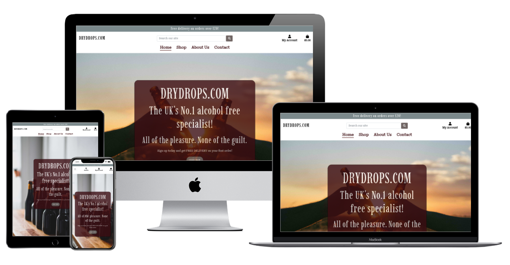

## User Experience (UX)

A list of my user stories and their tasks can be found [here](https://github.com/delboy/drydrops/issues).

### EPIC | Navigation
- As a shopper, I can navigate around the site so that I can easily view the desired content.
- As a shopper, I can view a list of products so that I can choose what products to purchase.
- As a shopper, I can click on a product to see its details so that I can view the description, price and any customer reviews.
- As a shopper, I can easily identify different product categories so that I can quickly view the type of products I'm looking for.
- As a shopper, I can search for products so that I can find the products I'm specifically looking for.
- As a shopper, I can sort the products so that I can easily find products based on price, reviews, category, or title.
- As a shopper, I can view products I have saved so that I can navigate to them easily without having to find them again.

### EPIC | Accounts
- As a User, I can register for an account so that I can use the features afforded to members.
- As a user, I can receive a confirmation email when creating an account so that I know the registration was successful.
- As a user, I can easily log in and out so that I can access my account.
- As a user, I can easily see my login status so that I know if I'm logged in or out.
- As a user, I can view my previous orders so that I can keep a record of what purchases I've made.
- As a user, I can save my delivery information so that I do not have to refill it out for future orders.
- As a user, I can recover my password in case I forget it so that I can regain access to my account.

### EPIC | Admin
- As an admin, I can add products so that I can update the site's inventory.
- As an admin, I can edit a product so that I can keep the products information up to date.
- As an admin, I can delete a product so that I can remove products no longer available.
- As an admin, I can feature products so that I can display them on the home page.

### EPIC | Purchasing
- As a shopper, I can add items to my bag in different quantities so that I can store the items until I'm ready to buy.
- As a shopper, I can view my bag so that I can identify the total cost of the transaction and the items I will be purchasing.
- As a shopper, I can adjust the quantity of the items in my bag so that I can easily make changes before I purchase.
- As a shopper, I can always see a running subtotal so that I can keep an eye on how much I'm spending.
- As a shopper, I can see a summary of my purchase before I buy so that I know exactly what I'm ordering and how much it all costs.
- As a shopper, I can pay for goods as a guest so that I can still use the site without having to sign up for an account.
- As a shopper, I can easily enter my payment details so that I can checkout quickly with no problems.
- As a shopper, I can view confirmation of my purchases so that I know the order was received and can review what I've purchased.
- As a shopper, I can receive an email of my order so that I can keep it for my records.


### EPIC | Interaction
- As a user, I can save my favourite products so that they are easily accessible for future purchases.
- As a user, I can leave reviews on products so that I can share my experience with others.
- As a user, I can sign up for the website's newsletter so that I can keep up to date with new products and promotions.
- As a user, I can connect to the site's social media pages so that I can follow them and keep up to date with their products and promotions.
- As a user, I can contact the business so that I can find out any information that I require.

## Design

### Business Model

The business model for this store would be a B2C (Business to Customer) model, as the business would be selling products directly from themselves to the customer.  

### Colour Scheme

- I wanted the colour scheme to be similar to the colour of dark ales and wines to fit in with the site's theme, so the main colour I chose was a dark reddish-brown, along with a lighter shade and a couple more neutral tones to balance it out.  

 

### Typography 

I will be using two fonts from Google Fonts.
- Imbue for the logo and headers.
- Roboto Serif for paragraphs and general text.

### Imagery

All the static images on the site are centered around alcoholic beverages and follow the colour scheme as close as I could. 

### Wireframes

Wireframes for each page are linked here:

* [Home Page](assets/documents/home.pdf)
* [Products](assets/documents/products.pdf)
* [Product Details](assets/documents/product-details.pdf)
* [About](assets/documents/about.pdf)
* [Contact](assets/documents/contact.pdf)
* [Register](assets/documents/register.pdf)
* [Account](assets/documents/account.pdf)
* [Sign in/out](assets/documents/log.pdf)
* [Bag](assets/documents/bag.pdf)
* [Checkout](assets/documents/checkout.pdf)
* [Success](assets/documents/success.pdf)
* [Product Management](assets/documents/product-management.pdf)

### Database Schema

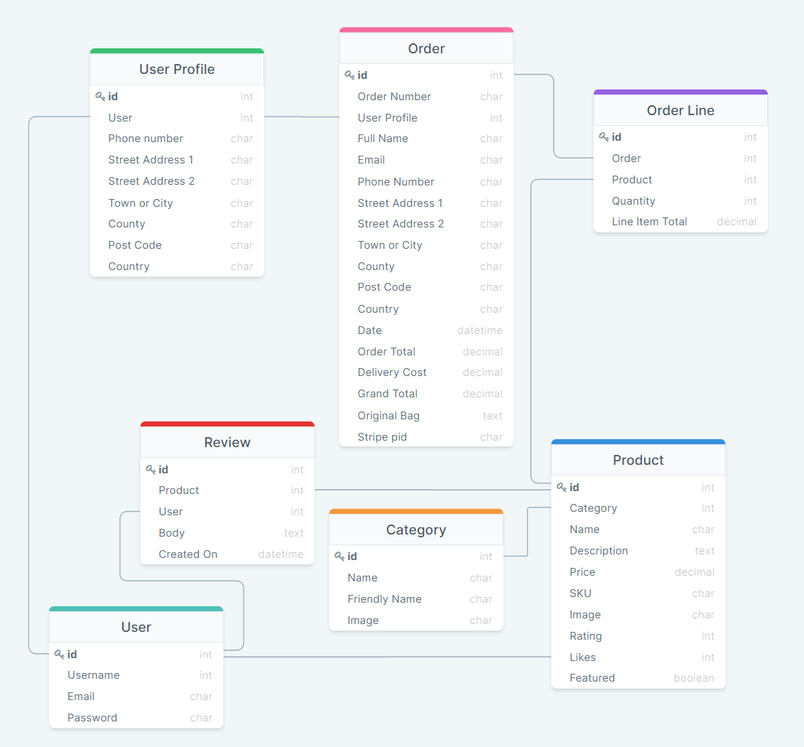

### Marketing 

The site uses two different marketing strategies. Social media, and a newsletter that users can sign up to.

- Links to all the social media sites can be found both inside the footer and on the contact page.

- The facebook link takes you to the Dry Drops business page which can be found [here](https://www.facebook.com/Drydropscom-105548042197433)*.
<br>
<i>*Note, this link may be broken as facebook regulary deletes inactive business pages.</i>

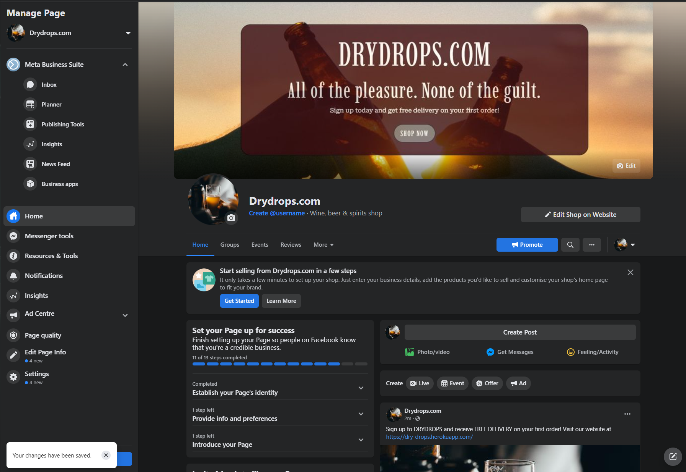

- The newsletter sign up form can also be found in the footer. This service is powered by [Mailchimp](https://mailchimp.com/en-gb/).

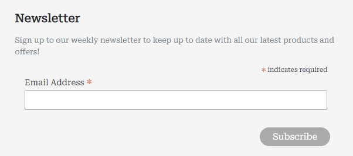

### Search Engine Optimisation

I have created a sitemap.xml and robots.txt file to help aid search engines locate the site. To keep users information safe, any pages that could contain sensitive information has been disallowed in the robots.txt.

The purpose of the About Us page was not so much designed in mind to inform the user, but more so to have an opportunity to use some keywords, and link the user to any other relevant website, all to help boost the site's ranking in search engine results. 

The initial keywords and phrases I came up with were:

## Short Tail Keywords
- Alcohol-Free
- Teetotal Drinks
- 0% Alcohol
- Zero Alcohol
- 0% Beer/Wine/Cider/Spirits
- Dry Drinks
- Low alcohol
- No alcohol
- Halal drinks
- Quitting Alcohol

## Long Tail Keywords
- Drinks for quitting alcohol
- Drinks for designated drivers
- Drinks for recovering alcoholics
- Alcohol-free beverages
- Alcohol-free drinks for pregnant women
- Drinks that are suitable for people practising sobriety
- Drinks that are suitable for people who are straight edge

These phrases can also be used in the metadata at the head of the page.

## Features

### Nav Bar

- #### Links
    - To help navigate the user around, four links to the main sections of the site are present at the top of every page.
    - The links collapse into a hamburger menu once the screen size becomes too small to fit all the elements comfortably. 
    - The link to the current page will be highlighted by an underline to help users understand what page they are on.
    - The Shop link drops down into a sub-menu where the user can navigate to all products or choose from one of the four product categories.

    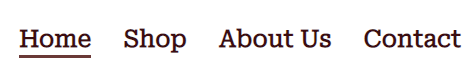 

- #### Search Bar
    - The search bar is located in the middle of the navbar and can be used to search all products.
    - Using the search bar will search both the product's title and description for a match.
    - On smaller screens, the bar collapses into a search Icon that upon clicking drops down into the full search bar.

    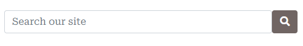 

- #### Account
    - Located on the right side of the navbar is the account Icon where the user can manage their account.
    - Clicking the account Icon opens a dropdown menu with options for the user to register or sign in.
    - If a user is signed in, the dropdown options change to 'My Profile' and 'Logout'.
    - If a user is signed in, the Icons text changes from 'sign in/up' to 'My Account'.
    - If the user signed in is a super user then a third option of 'Product Management' is available. 

    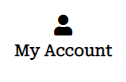 

- #### Bag Icon
    - Located on the right side of the navbar next to the accounts menu is the bag Icon.
    - Beneath the bag icon users can find a running total of the cost of all the items in their bag.
    - Once a product is added to the bag, a number displaying the total quantity of items appears, located at the top right of the bag icon.
    - Clicking the bag icon navigates the user to the shopping bag page which displays a summary of what's been added.

    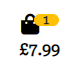

- #### Banner 
    - A banner running across the top of the navbar informs the user of any current offers.
    - The banner message will change to reflect how close the user is to achieving the offer.
    - The banner sticks to the top of the page at all times to keep the user constantly aware of how far they are from achieving the offer. 

    


### Home Page
    
- #### Hero Image
    - The hero image welcomes the user with a short message advertising what the site sells along with the website's slogan.
    - A message informing the user that they receive free delivery on their first order when if sign up is also present.
    - A button labelled 'Shop Now' takes the user to the products page.
    - The image will change depending on the size of the screen.

    
    
- #### Categories
    - The categories section lists the four categories of products that are stocked.
    - Clicking one of the categories takes the user to the shop displaying only products from that category. 

    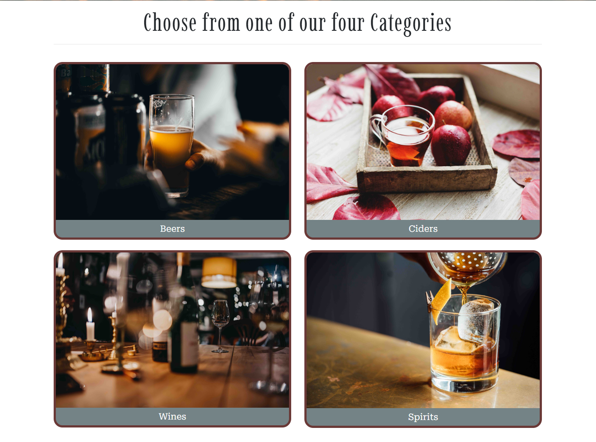

- #### Top Products
    - The Top products section lists the top 4 products based on customer reviews.
    - The list will be ordered by the highest rated first. If any products have the same rating they will be put in order of how many reviews they have received.   

    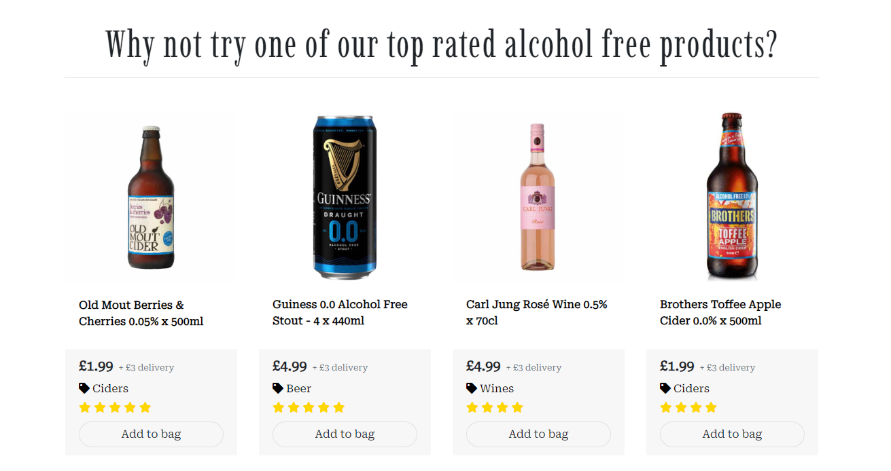

- #### Hot Products
    - The hot products section lists any products that have been featured by an admin.
    - On large screens, this section will display as a list, whereas smaller screens will display the items in a carousel.

    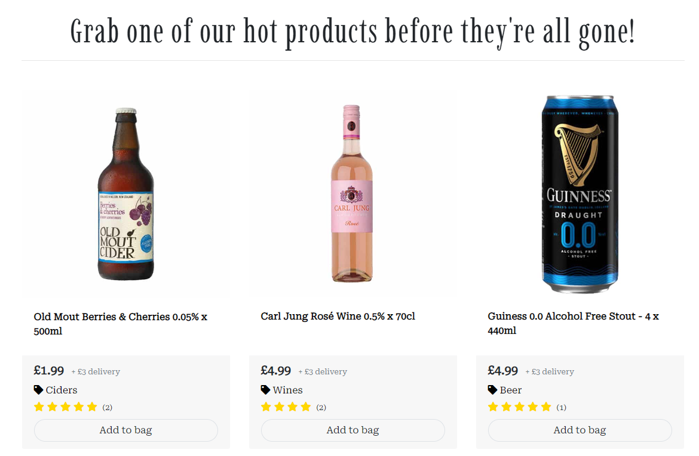

- #### Footer 
    - The footer appears at the bottom of every page.
    - The footer is broken up into 4 sections. The logo, quick links, Contact Us, and Newsletter.
    - The Quick Links section has links to all parts of the site.
    - The Contact Us section lists the company's address, phone number, email and social media account.
    - Clicking the phone number will call it, clicking the email address will open your default email programme and clicking the social media links will take you to the relevant website.
    - The Newsletter section has an option to input your email and sign up for the weekly newsletter.

    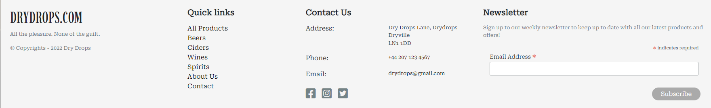

### Accounts

- #### Register Page
    - The register page is used to create an account.
    - Once submitting the form an authentication link will be emailed to the address the user provided. 

    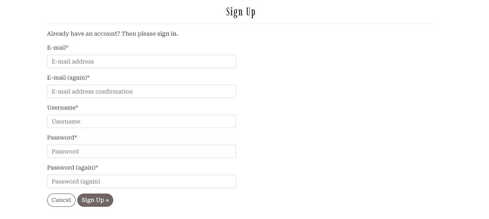

- #### Login Page
    - The login page is used to log in users with an existing account.
    - A Forgot Password link is also present that enables users to recover their password.

    

- #### Log out Page
    - The logout page is used to log out users who are signed in.

    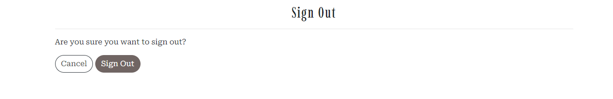

### Profile

- #### Delivery Details
    - The delivery details section stores the user's delivery address and phone number.
    - The information provided here is used to autofill the delivery address when placing an order.

    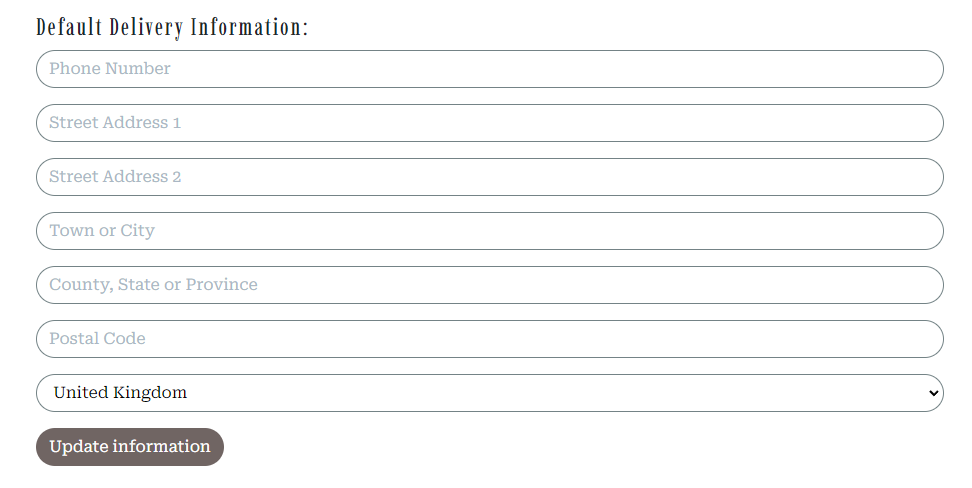

- #### Order History
    - The order history section is a table that keeps a record of every order the user has placed.
    - The table displays the order number, date it was ordered, items ordered, quantities of items and the order total.
    - Hovering over the truncated order number reveals the whole order number.
    - Clicking the order number will take the user to a more detailed summary of the order.
    - A scroll bar appears once the user has more orders than the box can contain. 

    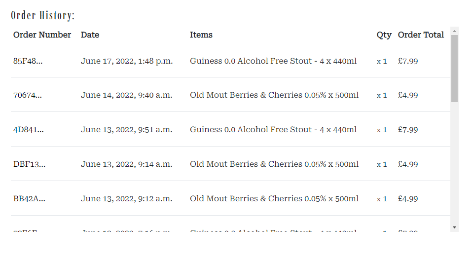

- #### Favourite Items
    - The favourite items section keeps a list of all products that the user has liked.

    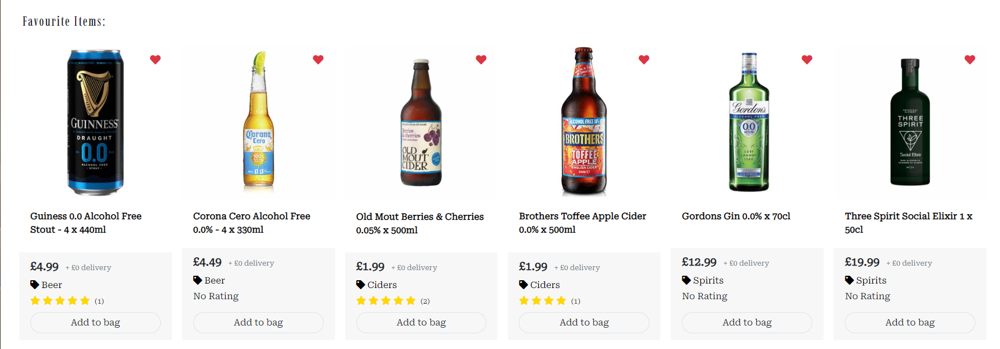

### All Products

- #### Categories Side-nav
    - The category side-nav section only appears on large screens and lists all the product categories.
    - Clicking any of the categories in this section filters the products to that option.

    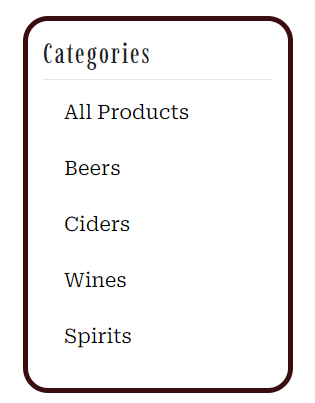

- #### What's Hot Carousel
    - The What's hot carousel displays any product that an admin has selected to be featured.
    - Clicking the product will take the user to that product's detail page.
    - Buttons on the edge of the carousel enable the user to scroll through all the featured products.

    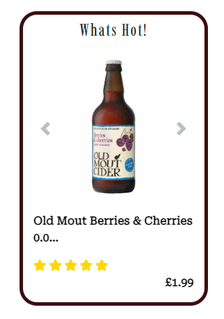

- #### Sorting
    - The sort-by box is located to the top right of the products section on medium and large screens, and centered on smaller screens.
    - Clicking the box opens up a dropdown menu with various options on how to sort the products. 

    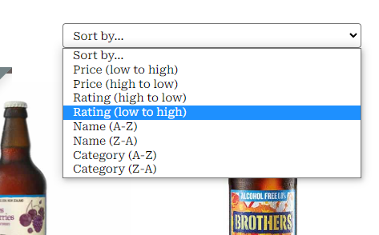

- #### Products
    - The products page is fully responsive, adjusting how many products are on each row depending on the user's screen size.
    - Each product card shows an image of the product, its title, price, category, and rating.
    - An 'Add to Bag' button can be used to add the item to the bag.
    - Any products that have been liked by the user displays a red heart in the top right corner. 
    - If the user is a superuser, admin buttons will appear at the bottom of the product card.
    - If the user is a superuser and the product has been featured, a featured banner will appear across the product card. 

    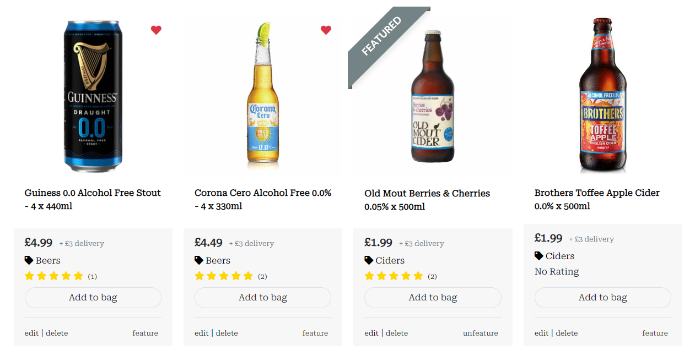

### Products Details

- #### Product Info
    - The product info section shows information about the product along with buttons to add the item to the user's favourite list, and buttons to add the item to the bag in multiple quantities.
    - The product's rating is an average of all the product's reviews and displays the result in stars. Next to the stars is also a number indicating how many reviews the product has received in total. 
    - Clicking the products category will take users to the products page showing only items from that category.
    - If the user is a super user, admin buttons will appear underneath the image.

    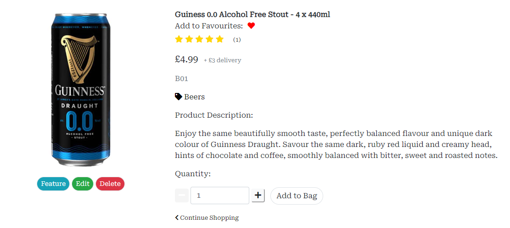

- #### Like Button
    - The like button is located underneath the product's title.
    - The heart button renders as empty if either the user is signed out or the product is not liked by the user.
    - Liking a product fills in the heart and adds the product to the user's favourite items list on their profile page.
    - Unliking a product unfills the heart and removes the product from the user's favourite items list on their profile page.
    - If the heart is clicked when no user is signed in, an 'Account Required' modal pops up informing the user that they need to either sign in or create an account to use that feature.
     
    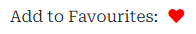

- #### Quantity Buttons
    - The quantity buttons are located underneath the product details and are used to add items to the bag.
    - The plus and minus buttons increase and decrease the input value. 
    - If the value is set to 1 the minus quantity will be disabled. Respectively if the value is set to 99 the plus button is disabled.
    - Clicking the 'Add to Bag' button takes the number in the input field and adds that amount of products to the bag.
    - Clicking the 'Add to Bag' button when the input is blank adds one item to the bag.
    - Trying to add an amount less than one or above 99, renders an error message informing the user of the parameters needed to be successful.
    - Underneath the input is a link that takes users back to the store.  

    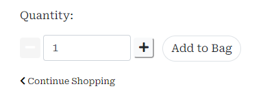


- #### Customer Reviews
    - If the product has received any reviews they will appear underneath the product details.
    - The reviews consist of the number of stars awarded by the user, their written comment, followed by the user name and how long ago the comment was left.
    - If the user is signed in and they have left a review on a product, that review will also have edit and delete buttons. Users can use these to manage their reviews.

     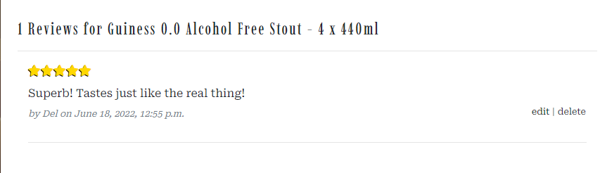

- #### Add Review
    - The add review form is located next to the product's reviews on large screens or underneath on small screens.
    - The form consists of two fields, rating and review.
    - Leaving out either the rating or the review notifies the user that the fields are required.  
    - The user can rate the product between 1 and 5 stars. Clicking a star fills the star and every star before it.
    - Any profanity in the review will cause the form to fail and a toast will inform the user.
    - To stop users leaving multiple reviews on one product, the form only renders when no reviews for that product from that user exist.

    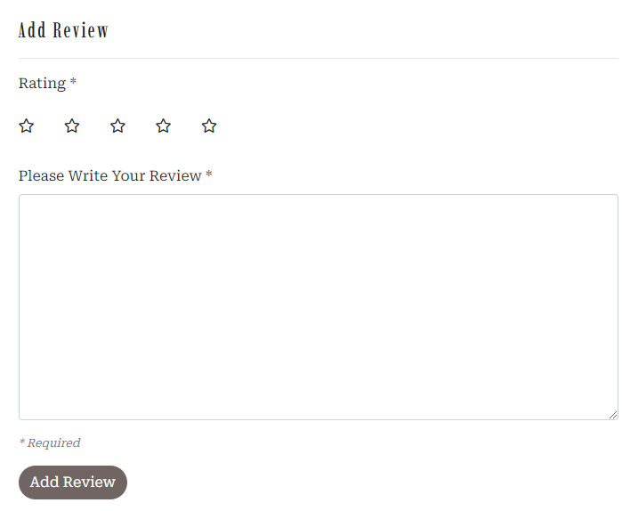

### Product Management

- #### Add Product
    - The add product page is accessed by the account dropdown menu, under product management. It is only accessible by superusers.
    - The form lists all the necessary fields to create a new product. 
    - The user must fill out all the fields that are labelled 'required' with an Asterix. If the form is submitted with any of these fields left blank then an error message will appear above that particular field, notifying the user of the issue.
    - The SKU field must be unique. An error message will appear if an already existing SKU is attempted.
    - If a price is added with more than 6 digits the form will fail and an error message will appear under the price field.
    - The featured checkbox can be checked so that the item will appear in the 'What's Hot' section on the products page.
    - The user has the option to add an image. If none is chosen then a default image is used.
    - Clicking the 'Add Product' button at the bottom of the form will create the product providing there are no errors on the form.

    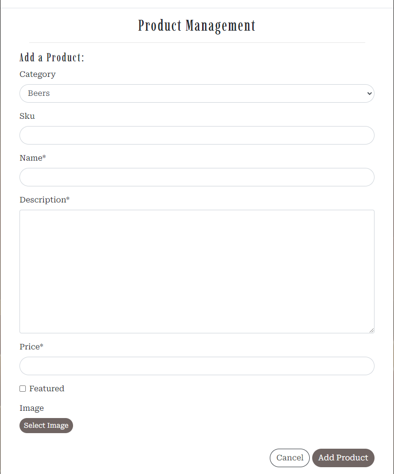

- #### Edit Product
    - The Edit Product page can be accessed from two places. By clicking the 'edit' button at the bottom of the product's card. Or by clicking the edit button located under the image on the products detail page.
    - Accessing the page loads what is essentially the add product page, with the details of the product already filled in. 
    - The image field displays a thumbnail of the current image and has a checkbox option to remove it. Checking this will change the image to the default image.
    - Clicking the 'Update Product' button will save any changes made to the existing product.  

    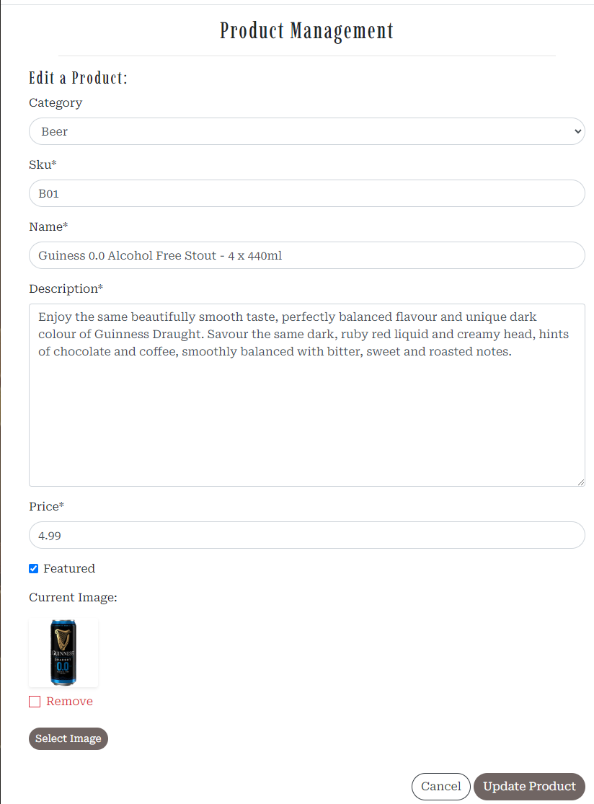

- #### Delete Product
    - The Delete Product button can be found in two places. One is next to the 'edit' button at the bottom of the product's card. The second is to the right of the 'edit' button on the products detail page. 
    - Clicking either of the delete buttons will bring up a warning modal, asking the user if they are sure they want to delete the product, and informing them that it is irreversible. 
    - Once the warning modal has been activated, if the user then clicks the delete button the product will be removed from the database. 
    - If however, the user presses the cancel button, the modal is closed and no effect has taken place. 

    

### Bag

- #### Items
    - The bag page displays all items that the user has added to it. 
    - The page will list the items added with its image, followed by its title and SKU.
    - Clicking either the image or the product's title will take you to that product's detail page. 

    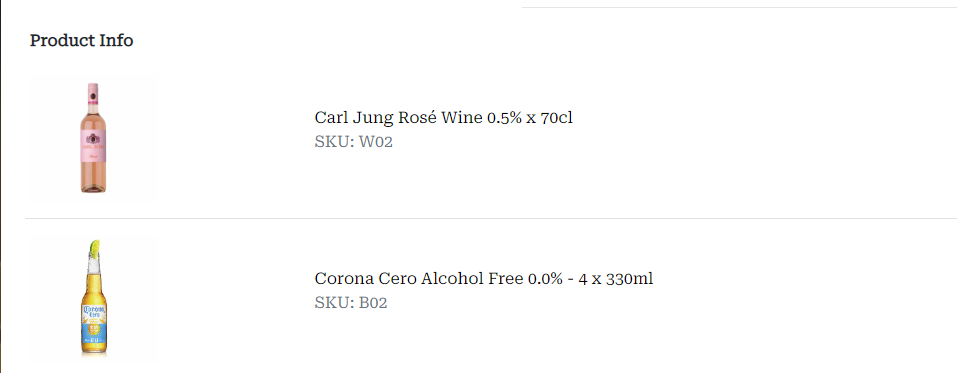

- #### Quantity and Price
    - The price and quantity section has three elements, the product's price, the quantity in the bag, and the subtotal of that item's line.
    - The quantity element has buttons either side for the user to increase or decrease the total of that item in the bag.
    - The minus quantity button will be disabled if the quantity of the item is one. Respectively the plus button will also be disabled if the quantity of the item is 99.
    - Next to the subtotal on large screens, or under the input buttons on smaller screens, is the update and delete buttons.
    - Clicking the 'update' button saves any changes to the quantity and updates the item's subtotal.
    - Clicking the red trash can icon removes the item completely from the user's bag. 
    - Manually inputting the number zero or anything below and clicking 'update' will remove the item from the bag. 
    - Manually inputting a number above 99 and clicking 'update' will result in an error message informing the user of the correct parameters. 
    
    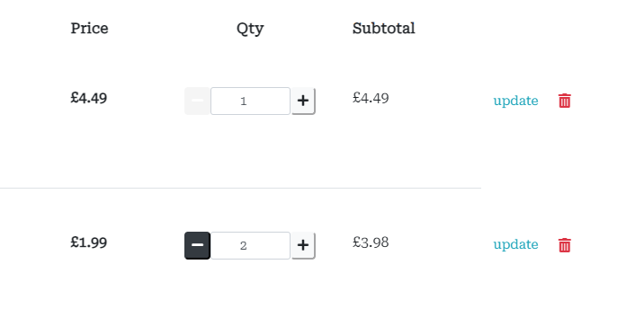
    
- #### Totals and messaging
    - At the end of the line items is a summary of the costs.
    - The summary features the bags total, delivery charges and the grand total to pay.
    - In between the bag total and the delivery total, users will either find a message informing them of how much more they need to spend to receive free delivery, or it will show how much delivery they would have paid if they didn't receive the offer. This message will also be different if it is the user's first ever order, in which case it will display 'FREE DELIVERY on your first order!'. 
    - Beneath the grand total is two buttons. From here the user can either continue to the checkout or return to the products page by clicking 'Continue Shopping'.

    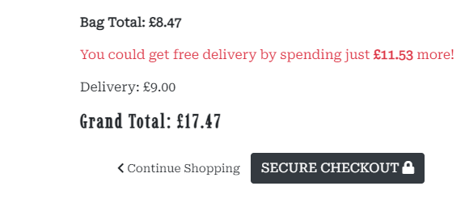

### Checkout

- #### Details
    - The details section appears on the left on large screens or underneath the order summary on smaller screens.
    - Here the user fills out his or her contact details, delivery address, and card number.
    - If the user is anonymous, a link to create an account or login will be present.
    - If the user is signed in a checkbox to save the delivery information can be checked.
    - If the user is signed in and has delivery information saved, the delivery details and email address will be automatically filled in. 
    - Any field with an Asterix is required. If a user tries to complete the form with any of these fields left blank the affected field will highlight that it needs to be filled in.   

    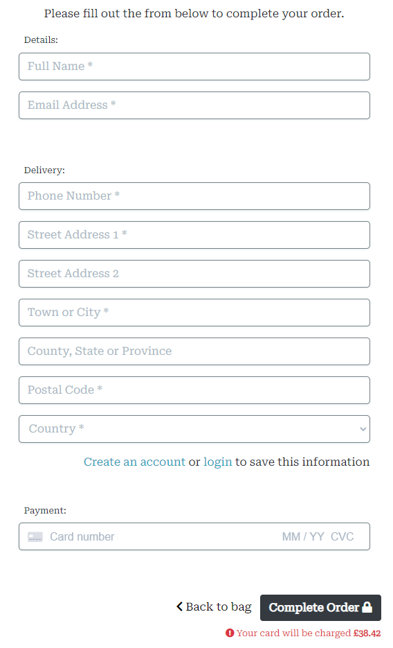

- #### Order Summary
    - The order summary section appears on the right on large screens or at the top on smaller screens. 
    - This section lists all the items about to be purchased, along with the quantity, subtotal and a grand total.
    - Next to the order summary title will be a number reflecting the total number of items that appear in the order. 
    - Clicking the image or title of any items in the summary will take the user to that product's detail page. 

    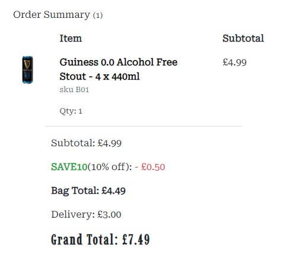

- #### Payment
    - Underneath the delivery details is the card payment box which is run by [Stripe](https://dashboard.stripe.com/login). 
    - Only numbers can be entered into the card payment box. Incorrect card numbers will automatically show an invalid card number error.
    - The site can be tested by using the dummy card number 4242 4242 4242 4242 with the expiry date 04/24 and the CVC code 242.
    - At the end of the section is a button to complete the order or to return back to the bag. There is also a warning message informing the user of how much their card is about to be charged.

    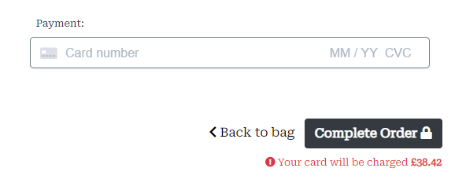


- #### Loading Spinner
    - Upon clicking the complete order button, as long as the form is valid, a loading spinner will render until the information is processed completely. 
    
    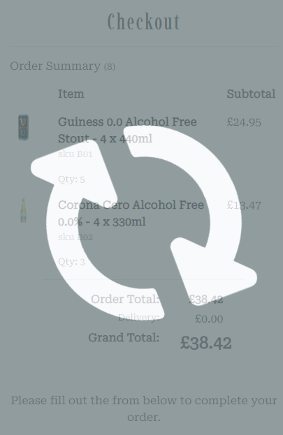

- #### Confirmation 
    - Once the order has been processed the user is taken to the checkout success page.
    - This page summarises the completed order. It lists the order number, order date, the items ordered with their quantities, the delivery address, and the billing info. 
    - A confirmation email is also sent to the email address provided, and this is noted at the top of the page. 
    - At the end of the summary is a button that the user can use to take them back to the main shop.
    
     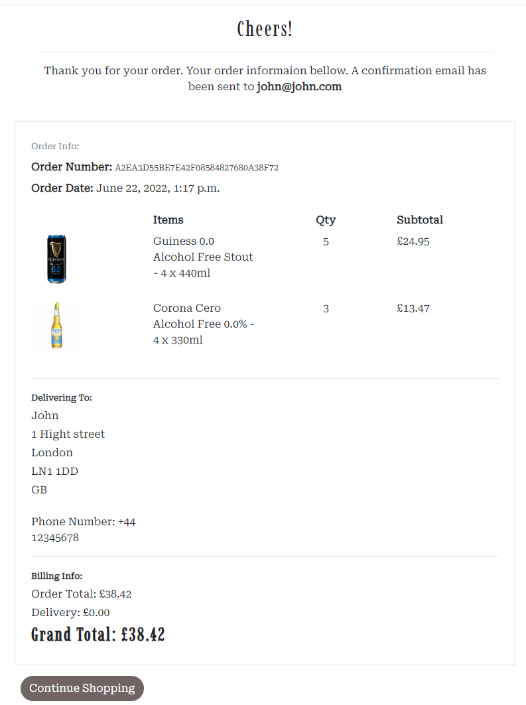

- #### Webhooks
    - Using the [Stripe](https://stripe.com/en-gb) website, webhooks have been set up to confirm an order goes through after payment.
    - Once an order is placed, a webhook will search the database to confirm the order exists. If it cannot find the original order, it will create one using the information provided by the user in the original instance.

    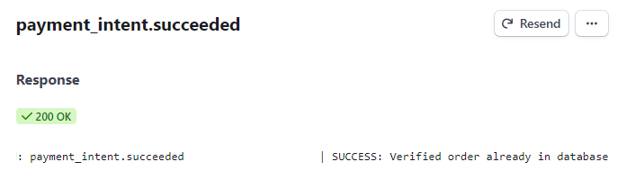

### About Us

- #### Image
    - The about us page features an image of the fictional founder of Dry Drops, Jack Daniels.
    - Underneath the image is a link to both the contact us page, and the products page.

    

- #### Bio
    - The bio section runs next to the image, or underneath if on a small screen.
    - The bio gives a fictional account of how Dry Drops was founded. This was used to create an opportunity to use keywords related to the site's business to help boost search ratings.

    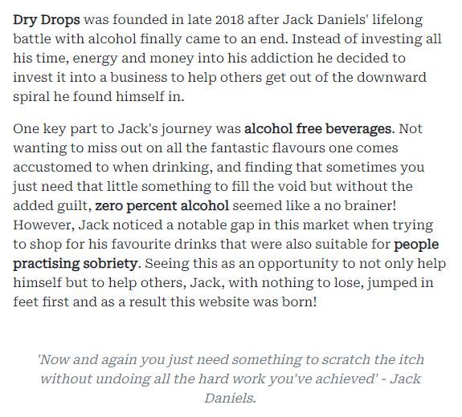

- #### Links
    - At the bottom of the page are links to 3 different alcohol and substance abuse charities.
    - These links were included to increase the search rating of the website. 
    - Hovering over these links will lighten their appearance.
    - Clicking the links will open up the respective website in another tab. This is to stop the user from being taken away from the main site.  

    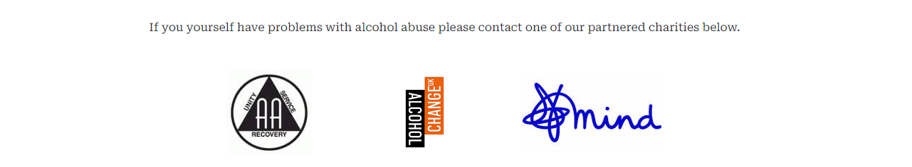

### Contact

- #### Contact Info 
    - The contact info has all of Dry Drops contact information, including their address, phone number, email address and social media links. 
    - Hovering over the social media links changes their colour. Clicking the links takes you to the respective website which opens in a new tab.
    - The facebook link particularly takes you to the websites business page on facebook. 

    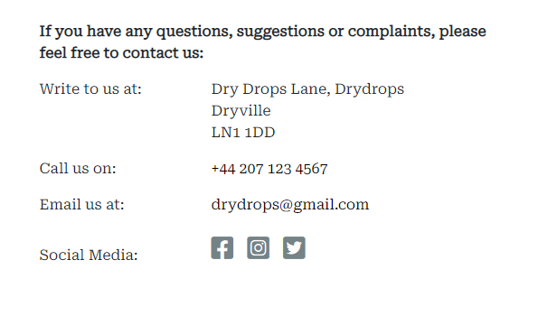

- #### Messaging
    - The message section enables the user to send an email directly to dry drops.
    - All the fields are required. Failing to fill out any field will result in a message highlighting which field has been left blank.
    - Once all the fields are completed, hitting the 'Send Message' button will send the message. 
    - Both Dry Drops and the user will receive an email on completion, laying out who sent the message and what was said.  

    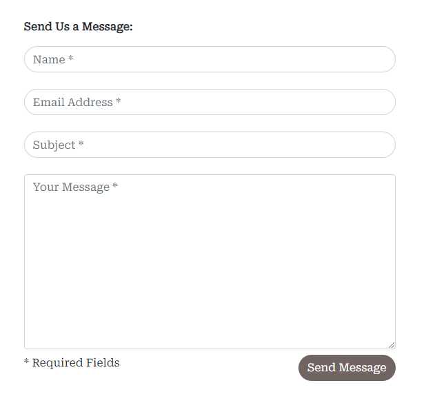

### Toasts, Pop-ups, and scroll arrow

- #### Toasts
    - Toasts appear in the top right-hand corner of the display informing the user of any actions they have performed.
    - The bottom right corner of the toast box will change colour depending on whether the message is portraying a successful action, general info, warning, or an error. 

    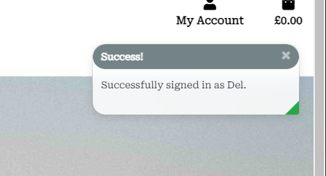

- #### Pop-ups
    - If there is no user signed in, the session is new, and 8 seconds elapse, a pop-up will appear one time.
    - The pop-up message informs the user of the free delivery offer for any new user's first order and has a link to the registration page. 

    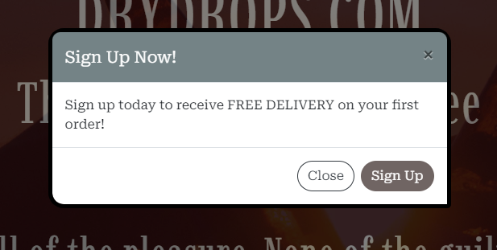

- #### Scroll Arrow
    - On medium screens and smaller, once the user has scrolled past a certain point, an arrow will appear at the bottom center of the screen.
    - Clicking the arrow scrolls the user back to the top of the page. 

## Technologies

### Languages used

- [HTML5](https://en.wikipedia.org/wiki/HTML5)
- [CSS3](https://en.wikipedia.org/wiki/Cascading_Style_Sheets)
- [Javascript](https://en.wikipedia.org/wiki/JavaScript)
- [Python](https://www.python.org/)

### Libraries and Programs Used

- [Git](https://git-scm.com/)
    - Version control.
- [GitHub](https://github.com/)
    - For storing code and deploying the site.
- [Gitpod](https://www.gitpod.io/)
    - Used for building and editing my code.
- [Django](https://www.djangoproject.com/)
    - A python based framework that was used to develop the site.
- [Bootstrap](https://getbootstrap.com/)
    - For help designing the html templates.
- [Google Fonts](https://fonts.google.com/)
    - Used to style the website's logo.
- [Font Awesome](https://fontawesome.com/)
    - Used to obtain the icons used.
- [Google Developer Tools](https://developers.google.com/web/tools/chrome-devtools)
    - Used to help fix problem areas and identify bugs.
- [AWS](https://aws.amazon.com/)
    - Used to store static files and images.
- [Favicon.io](https://favicon.io/)
    - Used to generate the site's favicon.
- [SQlite](https://www.sqlite.org/index.html)
    - Used for debugging.
- [PostgreSQL](https://www.postgresql.org/)
    - Database used through heroku.
- [SmartDraw](https://cloud.smartdraw.com/)
    - To draw out the database schema.
- [Balsamiq](https://balsamiq.com/)
    - To create the wireframes.
- [W3C Markup Validation Service](https://validator.w3.org/) 
    - Used to validate HTML code.
- [W3C CSS Validation Service](https://jigsaw.w3.org/css-validator/#validate_by_input)
    - Used to validate CSS code.
- [Pep8](http://pep8online.com/)
    - Used to validate Python code.
- [JSHint](https://jshint.com/)
    - Used to validate JS code.
- [Crispy forms](https://django-crispy-forms.readthedocs.io/en/latest/)
    - Used to help render forms.
- [Profanity Filter](https://github.com/ReconCubed/django-profanity-filter)
    - App used to remove profanity from comments.
- [Tinyjpg](https://tinyjpg.com/)
    - Used to compress images.
- [Screen to Gif](https://www.screentogif.com/)
    - Used to create gifs for my readme.
- [Stripe](https://stripe.com/en-gb)
    - Used to take payments and generate webhooks.
- [Heroku](https://www.heroku.com/)
    - To deploy the project.

## Testing 

Testing and results can be found [here](TESTING.md)

## Deployment

### Github

First you will need to create a new repository.

    1. Log into Github.
    2. On the 'Repositories' tab click 'New'. This takes you to the create a new repository page.
    3. Name the repository and click 'Create repositry'.
    4. Your new repsoitory is now set up and ready to use.

### Django

This project uses the Django frame work. To install django, follow these steps:

1. In your IDE type the command:  
    `pip3 install django`
2. Then to name your project type:  
    `django-admin startproject *Your project name here*`  
This will add your django project folder to your file explorer
3. Next you will need to add a gitignore file. To do this enter the command line:  
    `touch .gitignore`
4. Inside this file add these 3 lines:  
    ``` 
    *.sqlite3
    *.pyc
    __pycache__
    ```
5. To check everything is up and running, run the command:  
    `python3 manage.py runserver`
    This should expose port 8000. Open that port and you should be welcomed by Django's success page.
6. Next you need to perform the initial migrations. This is done by running the command:
    `python3 manage.py migrate`
7. Finally, in order to have access to the admin panel you will need to create a superuser. This is done by running the command:
    `python3 manage.py createsuperuser`
    This will then ask you to create a username and password with an optional email address.
8. Once these steps are completed you can push your changes to github by running the commands, in order:
    ```
    git add .
    git commit -m "initial commit"
    git push
    ```

#### All Auth

Inside the django framework is a package called Allauth. This package handles all the registration and sign in processes. The steps to install Allauth can be found [here](https://django-allauth.readthedocs.io/en/latest/installation.html).

### Heroku

Heroku is used to deploy the final project.

1. First you will need to sign in to Heroku. If you do not have an account you can sign up for free [here](https://signup.heroku.com/).
2. Once you are logged in, click the button 'New' and select 'Create new app'.
3. Name the app, then select what region is closest to you and click 'Create App'.
4. Then on the resources tab, navigate to the 'Add-ons' section and search for 'Heroku Postgres'.
5. Select 'Heroku Postgres', then under 'Plan name' choose 'Hobby Dev - Free' and click 'Submit Order Form'.

To use Postgres you will need to install dj_database_url and psycopg2. This should be done in whatever IDE you are using.

1. In your IDE type the command:  
    `pip3 install dj_database_url`
2. Then once that is installed type the command:  
    `pip3 install psycopg2-binary`
3. Then, to make sure heroku installs all your apps requirements when you deploy it, run the command:  
    `pip3 freeze > requirements.txt`
4. Next, navigate to your setting.py file in your main project folder. At the top of the file add the line:  
    ```
    import dj_database_url
    ```
5. Then scroll down the file till you find your database settings. Comment out the default configuration and underneath insert the code:  
    ```
    DATABASES = {
        'defualt': dj_database_url.parse(*Enter Database URL here*)
    }
    ```
    The database URL can be found in the settings tab of your app in heroku, under Config Vars. Make sure to have the link in quotation marks.  
    **Important!** If you want to migrate any data from your current database to the postgress database in heroku, make sure you run this line before connecting to herokus database:  
    `./manage.py dumpdata --exclude auth.permission --exclude contenttypes > db.json`  
6. Once thats saved, you will now need to run migrations because you have connected to a new database. This is done by running the command:  
    `python3 manage.py migrate`
    If you had previously saved your data to import into the postgres database, you can now run the command:  
    `./manage.py loaddata db.json`
7. Now that's setup you will now need to create a superuser for the new database. The command is:  
    `python3 manage.py createsuperuser`
    *Note, once the superuser is created, it's a good idea to sign into the admin panel, locate the user, and check the option that says their email is verified. This is needed otherwise Allauth won't allow the user to sign into the store.* 
8. Before you commit these changes, you will need to remove the Databases section in the settings.py and uncomment the original database. This is to stop your Postgres database URL from ending up in version control.
9. Now we can create an if statement in our settings.py to run the postgres database when using the app on heroku or sqlite if not. Scroll back to the database section and refactor the code to look like this:  
    ```
    if 'DATABASE_URL' in os.environ:
        DATABASES = {
            'default': dj_database_url.parse(os.environ.get('DATABASE_URL'))
        }
    else:
        DATABASES = {
            'default': {
                'ENGINE': 'django.db.backends.sqlite3',
                'NAME': BASE_DIR / 'db.sqlite3',
            }
    }
    ```
10. Next we will have to install another package called gunicorn, which will act as our webserver. To do so, run the commmand:  
    `pip3 install gunicorn`
    And then remember to freeze the requirements with:  
    `pip3 freeze > requirements.txt`
11. Now we can create our Procfile to tell Heroku to create a web dyno. In your root directory create a file named 'Procfile' and inside insert the code:  
    `web: gunicorn **'your_projects_name_here'**.wsgi:application
12. Then, back in heroku, navigate to settings and in the config vars input the key DISABLE_COLLECTSTATIC with the value 1, and click 'Add'.
This is to stop heroku from collecting any static files when you deploy.
13. You will also need to add heroku to your allowed hosts in your settings.py. Back in your project, in the settings file, scroll down to ALLOWED_HOSTS, and inside the brackets insert the url to your app, followed by 'localhost'. It should look something like this:     
    ```
    ALLOWED_HOSTS = ['your-project-name.herokuapp.com', 'localhost']
    ```
14. Now add, commit and push these changes, followed by a push to heroku with the command:  
    `git push heroku main'
    Your app will now be deployed, all be it without any static files, but this will be fixed when setting up AWS, documented bellow. 
15. If you want your project to be automatically deployed to heroku when pushing your work to github you can. To do so, In heroku go to the deploy tab, and in the 'deployment method' section connect it to github. You will need to search for your repository and once found click 'connect'. Then scroll down and click 'Enable automatic deploys'. Now when you push to github your code will automatically deploy to heroku aswel. 

### AWS

Amazon web services is used to store all our static and media files. 

#### S3

1. Fist you will need to sign up to AWS which you can do [here](https://aws.amazon.com/).
2. Once you have created an account and logged in, under the All Services>Storage menu, click the link the says S3.
3. On the S3 page you will need to create a new bucket. To do this click the orange button that says 'Create Bucket'.
4. Name the bucket and select the closest region to you. To keep things simple I recommend naming the bucket after your projects name.
5. Under 'Object Ownership' select 'ACLs enabled' and leave the Object Ownership as Bucket owner preferred. 
6. Uncheck the 'Block all public access' checkbox and check the warning box to acknowledge that the bucket will be made public, then click create bucket. 
7. Once created, click the buckets name and navigate to the properties tab. Scroll to the bottom and under 'Static website hosting' click 'edit' and change the Static website hosting option to 'enabled'. Copy the default values for the index and error documents and click 'save changes'.
8. Now navigate to the perimissions tab, scroll down to th Cross-origin resource sharing (CORS) section, click edit and paste in the following code:  
    ```
    [
        {
            "AllowedHeaders": [
            "Authorization"
            ],
            "AllowedMethods": [
            "GET"
            ],
            "AllowedOrigins": [
            "*"
            ],
            "ExposeHeaders": []
        }
    ]
    ```
9. Then scroll back up to the 'Bucket Policy' section. Click 'edit' and then 'Policy generator'. This should open the AWS policy generator page.
10. From here under the 'select type of policy' dropdown menu, select 'S3 Bucket Policy'. Then inside 'Principle' allow all principals by typing a *.
11. From the 'Actions dropdown menu select 'Get object'. Then head back to the previous tab and locate the Bucket ARN number. Copy that, return to the policy generator and paste it in the field labelled Amazon Resource Name (ARN).
12. Once thats compeleted click 'Add statment', then 'Generate Policy'. Copy the policy thats been generated and paste it in the bucket policy editor.
13. Before you click save, add a '/*' at the end of your resource key. This is to allow accss to all resources in this bucket.
14. Once those changes are saved, scroll down to the Access control list (ACL) section and click 'edit'.
15. Next to 'Everyone (public access)', check the 'list' checkbox. This will pop up a warning box that you will also have to check. Once thats done click 'save'. 

#### IAM

1. Now that your bucket is ready we need to create a user to access it. In the search bar at the top of the window, search for IAM and select it.
2. Once on the IAM page, click 'User Groups' from the side bar, then click 'Create group'.
3. Name the group 'manage-*your-project-name*' and click 'Create group' at the bottom of the page. 
4. Then from the sidebar click 'Polices', then 'Create policy'.
5. Go to the JSON tab and click 'import managed policy'. Search for 'S3' and select 'AmazonS3FullAccess' and click import.
6. Once this is imported you will need to edit it slightly. Go back to your bucket and copy your ARN number. Head back to this policy and update the Resource key to include your ARN, and another line with your ARN followed by a /*. It should end up looking something like this: 
    ```
    {
        "Version": "2012-10-17",
        "Statement": [
            {
                "Effect": "Allow",
                "Action": [
                    "s3:*",
                    "s3-object-lambda:*"
                ],
                "Resource": [
                    "YOUR-ARN-NO-HERE",
                    "YOUR-ARN-NO-HERE/*"
                ]
            }
        ]
    }
    ```
7. Click 'Next: Tags', 'Next: Review', and on this page give the policy a name. This could be something as simple as the project name followed by the word policy, and then a short description eg: Access to S3 bucket for 'YOUR PROJECT' static files. Then click 'Create policy'. 
8. This will take you back to the policy page where you should be able to see your newly created policy. Now we need to attach it to the group we created.  
9. Click 'User groups', and click the group you created earlier. Go to the permissions tab and click 'Add permission' and from the dropdown click 'Attach policies'. 
10. Find the policy you just created, select it and click 'Add permissions'.
11. Finally you need to create a user to put in the group. Select users from the sidebar and click 'Add user'.  
12. Give your user a user name, check 'Programmatic Access', then click 'Next: Permissions'. 
13. Select your group that has the policy attached and click 'Next: Tags', 'Next: Review', then 'Create user'.
14. On the next page, download the CSV file. This contains the user's access key and secret access key which you will need later. 

#### Connecting AWS to django

Now that you have created a S3 bucket with it's user group attached, we need to connect it to django.

1. First you will need to install two packages. Boto3 and Django storages. Do this by running these commands:  
    ```
    pip3 install boto3
    pip3 install django-storages
    ```
    And remember to freeze the requirements with:  
    ```
    pip3 freeze > requirements.txt
    ```
2. You will then need to add 'storages' to your installed apps section inside your settings.py file. Do that now. 
3. Next, we will need to add some additional settings to the same file to let django know what bucket it's communicating with. 
4. Somewhere near the bottom of the file you should write an if statement to check if there is an environment variable called USE_AWS. This variable does not exist yet but we will add it later. Inside the if statement, write the following settings so it looks like this:  
    ```
    if 'USE_AWS' in os.environ:
        AWS_STORAGE_BUCKET_NAME = 'insert-your-bucket-name-here'
        AWS_S3_REGION_NAME = 'insert-your-region-here'
        AWS_ACCESS_KEY_ID = os.environ.get('AWS_ACCESS_KEY_ID')
        AWS_SECRET_ACCESS_KEY = os.environ.get('AWS_SECRET_ACCESS_KEY')
    ```
5. Next, hop back to heroku and in the settings tab, under config vars, you will need to add some keys with values that were downloaded earlier in the CSV file.
6. Add the key, AWS_ACCESS_KEY_ID with the value that was generated in the CSV file earlier. Then add the key AWS_SECRET_ACCESS_KEY, and again add the value that was generated in the CSV file. Once they have both been added, add the key USE_AWS, and set the value to True.
7. You can now also remove the DISABLE_COLLECTSTAIC variable, since django should now collect static files automatically and upload them to S3.
8. Now head back to the settings.py file in your django project and head back to the if statement we wrote earlier and inside the statement add this line setting:  
    ```
    AWS_S3_CUSTOM_DOMAIN = f'{AWS_STORAGE_BUCKET_NAME}.s3.amazonaws.com'
    ```
    This is to tell django where our static files will be coming from in production.
9. Next we need to create a file to tell django that we want to use S3 to store our static files whenever someone runs collectstaticm and that we want any uploaded product images to go there also.
10. In the root directory of your project create a file called 'custom_storages.py'. Inside this file you will need to import your settings as well as the s3boto3 storage class. So at the top of the file insert the code:  
    ```
    from django.conf import settings
    from storages.backends.s3boto3 import S3Boto3Storage
    ```
11. Then underneath the imports insert these two classes:  
    ```
    class StaticStorage(S3Boto3Storage):
        location = settings.STATICFILES_LOCATION


    class MediaStorage(S3Boto3Storage):
        location = settings.MEDIAFILES_LOCATION
    ```
    The STATICFILES_LOCATION and MEDIAFILES_LOCATION have yet to be defined, so lets do that now.
12. Back in the settings.py file, underneath the bucket config settings but still inside the if statement, add these lines:  
    ```
    STATICFILES_STORAGE = 'custom_storages.StaticStorage'
    STATICFILES_LOCATION = 'static'
    DEFAULT_FILE_STORAGE = 'custom_storages.MediaStorage'
    MEDIAFILES_LOCATION = 'media'
    ```
13. Next, you will also need to override and explicitly set the URLs for static and media files using your custom domain and new locations. To do this add these two lines inside the same if statement:  
    ```
    STATIC_URL = f'https://{AWS_S3_CUSTOM_DOMAIN}/{STATICFILES_LOCATION}/'
    MEDIA_URL = f'https://{AWS_S3_CUSTOM_DOMAIN}/{MEDIAFILES_LOCATION}/'
    ```
14. If you now save, add, commit and push your changes, you should see that your S3 bucket now has a static folder with all your static files inside. Next, we need to handle the Media files but first, inside the if statement add the following code. This helps to speed things up by letting the browser know that its ok to cache static files for a long time:    
    ```
    AWS_S3_OBJECT_PARAMETERS = {
        'Expires': 'Thu, 31 Dec 2099 20:00:00 GMT',
        'CacheControl': 'max-age=94608000',
    }
    ```
15. Back in S3, go to your bucket and click 'Create folder'. Name the folder 'media' and click 'Save'. 
16. Inside the new media folder you just created, click 'Upload', 'Add files', and then select all the images that you are using on your site.
17. Then under 'Permissions' select the option 'Grant public-read access' and click upload. You may need to also check an acknowledgment warning checkbox too. 
18. Once that is finished you're all set. All your static files and media files should be automatically linked from django to your S3 bucket.

### Stripe

For payments and webhooks to work, you will need a stripe account which you can sign up for [here](https://stripe.com/en-gb).

1. To set up stripe payments you can follow their guide [here](https://stripe.com/docs/payments/accept-a-payment#web-collect-card-details).

#### Webhooks

1. To set up a webhook, sign into your stripe account and click 'Developers' located in the top right of the navbar.
2. Then in the sidenav under the Developers title, click on 'Webhooks', then 'Add endpoint'.
3. On the next page you will need to input the link to your heroku app followed by /checkout/wh/. It should look something like this:  
    ```
    https://your-app-name.herokuapp.com/checkout/wh/
    ```
4. Then click '+ Select events' and check the 'Select all events' checkbox at the top before clicking 'Add events' at the bottom. Once this is done finish the form by clicking 'Add endpoint'.
5. Your webhook is now created and you should see that it has generated a secret key. You will need this to add to your heroku config vars.
6. Head over to your app in heroku and navigate to the convig vars section under settings. You will need the secret key you just generated for your webhook, in addition to your Publishable key and secret key that you can find in the API keys section back in stripe.
7. Add these values under these keys:  
    ```
    STRIPE_PUBLIC_KEY = 'insert your stripe publishable key'
    STRIPE_SECRET_KEY = 'insert your secret key'
    STRIPE_WH_SECRET = 'insert your webhooks secret key'
    ```
8. Finally, back in your setting.py file in django, insert the following near the bottom of the file:  
    ```
    STRIPE_PUBLIC_KEY = os.getenv('STRIPE_PUBLIC_KEY', '')
    STRIPE_SECRET_KEY = os.getenv('STRIPE_SECRET_KEY', '')
    STRIPE_WH_SECRET = os.getenv('STRIPE_WH_SECRET', '')
    ```


