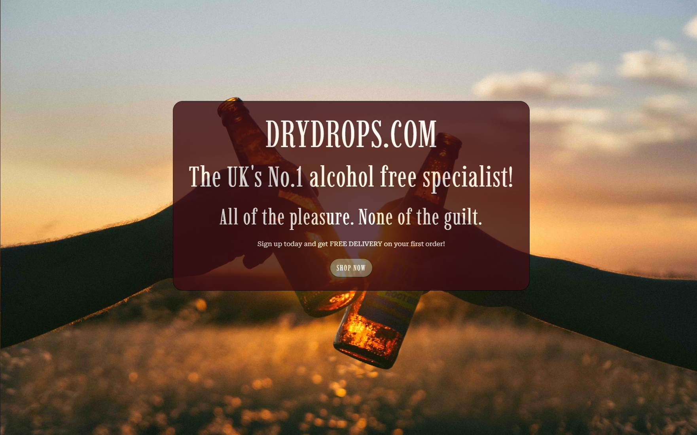
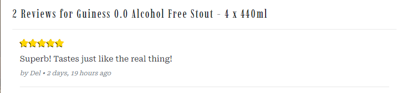

# Dry Drops

Dry Drops is an e-commerce website operating in the field of alcohol-free beverages.

This fully responsive website was built using the Django framework in Python.

The payment system uses a service called Stripe. To test this system, dummy card details can be used. A list of these can be found [here](https://stripe.com/docs/testing#cards).

## User Experience (UX)

A list of my user stories and their tasks can be found [here](https://github.com/delboy/drydrops/issues).

### EPIC | Navigation
- As a shopper, I can navigate around the site so that I easily view the desired content.
- As a shopper, I can view a list of products so that I can choose what products to purchase.
- As a shopper, I can click on a product to see its details so that I can view the description, price and any customer reviews.
- As a shopper, I can easily identify different product categories so that I can quickly view the type of products I'm looking for.
- As a shopper, I can search for products so that I can find the products I'm specifically looking for.
- As a shopper, I can sort the products so that I can easily find products based on price, reviews, category, or title.
- As a shopper, I can view products I have saved so that I can navigate to them easily without having to find them again.

### EPIC | Accounts
- As a User, I can register for an account so that I can use the features afforded to members.
- As a user, I can receive a confirmation email when creating an account so that I know the registration was successful.
- As a user, I can easily log in and out so that I can access my account.
- As a user, I can easily see my login status so that I know if I'm logged in or out.
- As a user, I can view my previous orders so that I can keep a record of what purchases I've made.
- As a user, I can save my delivery information so that I do not have to refill it out for future orders.
- As a user, I can recover my password in case I forget it so that I can regain access to my account.

### EPIC | Admin
- As an admin, I can add products so that I can update the site's inventory.
- As an admin, I can edit a product so that I can keep the products information up to date.
- As an admin, I can delete a product so that I can remove products no longer available.
- As an admin, I can feature products so that I can display them on the home page.

### EPIC | Purchasing
- As a shopper, I can add items to my bag in different quantities so that I can store the items until I'm ready to buy.
- As a shopper, I can view my bag so that I can identify the total cost of the transaction and the items I will be purchasing.
- As a shopper, I can adjust the quantity of the items in my bag so that I can easily make changes before I purchase.
- As a shopper, I can always see a running subtotal so that I can keep an eye on how much I'm spending.
- As a shopper, I can see a summary of my purchase before I buy so that I know exactly what I'm ordering and how much it all costs.
- As a shopper, I can pay for goods as a guest so that I can still use the site without having to sign up for an account.
- As a shopper, I can easily enter my payment details so that I can checkout quickly with no problems.
- As a shopper, I can view confirmation of my purchases so that I know the order was received and can review what I've purchased.
- As a shopper, I can receive an email of my order so that I can keep it for my records.

### EPIC | Interaction
- As a user, I can save my favorite products so that they are easily accessible for future purchases.
- As a user, I can leave reviews on products so that I can share my experience with others.
- As a user, I can sign up for the website's newsletter so that I can keep up to date with new products and promotions.
- As a user, I can connect to the site's social media pages so that I can follow them and keep up to date with their products and promotions.
- As a user, I can contact the business so that I can find out any information that I require.

## Design

### Colour Scheme

- I wanted the color scheme to be similar to the color of dark ales and wines to fit in with the site's theme, so the main color I chose was a dark reddish-brown, along with a lighter shade and a couple more neutral tones to balance it out.  

 

### Typography 

I will be using two fonts from Google Fonts.
- Imbue for the logo and headers.
- Roboto Serif for paragraphs and general text.

### Imagery

### Wireframes

Wireframes for each page are linked here:

* [Home Page](assets/documents/home.pdf)
* [Products](assets/documents/products.pdf)
* [Product Details](assets/documents/product-details.pdf)
* [About](assets/documents/about.pdf)
* [Contact](assets/documents/contact.pdf)
* [Register](assets/documents/register.pdf)
* [Account](assets/documents/account.pdf)
* [Sign in/out](assets/documents/log.pdf)
* [Bag](assets/documents/bag.pdf)
* [Checkout](assets/documents/checkout.pdf)
* [Success](assets/documents/success.pdf)
* [Product Management](assets/documents/product-management.pdf)

### Database Schema

### Search Engine Optimisation

The purpose of the About Us page was not so much designed in mind to inform the user, but more so to have an opportunity to use some keywords, and link the user to any other relevant website, all to help boost the site's ranking in search engine results. 

The initial keywords and phrases I came up with were:

## Short Tail Keywords
- Alcohol-Free
- Teetotal Drinks
- 0% Alcohol
- Zero Alcohol
- 0% Beer/Wine/Cider/Spirits
- Dry Drinks
- Low alcohol
- No alcohol
- Halal drinks
- Quitting Alcohol

## Long Tail Keywords
- Drinks for quitting alcohol
- Drinks for designated drivers
- Drinks for recovering alcoholics
- Alcohol-free beverages
- Alcohol-free drinks for pregnant women
- Drinks that are suitable for people practicing sobriety
- Drinks that are suitable for people who are straight edge

These phrases can also be used in the metadata at the head of the page.

## Features

### Nav Bar

- #### Links
    - To help navigate the user around, four links to the main sections of the site are present at the top of every page.
    - The links collapse into a hamburger menu once the screen size becomes too small to fit all the elements comfortably. 
    - The link to the current page will be highlighted by an underline to help users understand what page they are on.
    - The Shop link drops down into a sub-menu where the user can navigate to all products or choose from one of the four product categories.

     

- #### Search Bar
    - The search bar is located in the middle of the navbar and can be used to search all products.
    - Using the search bar will search both the product's title and description for a match.
    - On smaller screens, the bar collapses into a search Icon that upon clicking drops down into the full search bar.

     

- #### Account
    - Located on the right side of the navbar is the account Icon where the user can manage their account.
    - Clicking the account Icon opens a dropdown menu with options for the user to register or sign in.
    - If a user is signed in the dropdown options change to 'My Profile' and 'Logout'.
    - If a user is signed in the Icons text changes from 'My Account' to '*The user's name*'s account.
    - If the user signed in is a super user then a third option of 'Product Management' is available. 

     

- #### Bag
    - Located on the right side of the navbar next to the accounts menu is the bag Icon.
    - Beneath the bag icon users can find a running total of the cost of all the items in their bag.
    - Once a product is added to the bag, a number displaying the total quantity of items appears, located at the top right of the bag icon.
    - Clicking the bag icon navigates the user to the shopping bag page which displays a summary of what's been added.

    

- #### Banner 
    - A banner running across the top of the navbar informs the user of any current offers.

    

### Home Page
    
- #### Hero Image
    - The hero image welcomes the user with a short message advertising what the site sells along with the website's slogan.
    - A message informing the user that they receive free delivery on their first order when if sign up is also present.
    - A button labeled 'Shop Now' takes the user to the products page.
    - The image will change depending on the size of the screen.

    
    
- #### Categories
    - The categories section lists the four categories of products that are stocked.
    - Clicking one of the categories takes the user to the shop displaying only products from that category. 

    

- #### Top Products
    - The Top products section lists the top 4 products based on customer reviews.
    - The list will order by the highest rating first. If any products have the same rating they will be put in order of how many reviews they have received.   

    

- #### Footer 
    - The footer appears at the bottom of every page.
    - The footer is broken up into 4 sections. The logo, quick links, Contact Us, and Newsletter.
    - The Quick Links section has links to all parts of the site.
    - The Contact Us section lists the company's address, phone number, email and social media account.
    - Clicking the phone number will call it, clicking the email address will open your default email programme and clicking the social media links will take you to the relevant website.
    - The Newsletter section has an option to input your email and sign up for the weekly newsletter.

    

### Accounts

- #### Register Page
    - The register page is used to create an account.
    - Once submitting the form an authentication link will be emailed to the address the user provided. 

    

- #### Login Page
    - The login page is used to log in users with an existing account.
    - A Forgot Password link is also present that enables users to recover their password.

    

- #### Log out Page
    - The logout page is used to log out users who are signed in.

    

### Profile

- #### Delivery Details
    - The delivery details section stores the user's delivery address and phone number.
    - The information provided here is used to autofill the delivery address when placing an order.

    

- #### Order History
    - The order history section is a table that keeps a record of every order the user has placed.
    - The table displays the order number, date it was ordered, items ordered, quantities of items and the order total.
    - Clicking the order number will take the user to a more detailed summary of the order.
    - A scroll bar appears once the user has more orders than the box can contain. 

    

- #### Favorite Items
    - The favorite items section keeps a list of all products that the user has liked.

    

### All Products

- #### Categories Side-nav
    - The category side-nav section only appears on large screens and lists all the product categories.
    - Clicking any of the categories in this section filters the products to that option.

    

- #### What's Hot Carousel
    - The Whats hot carousel displays any product that an admin has selected to be featured.
    - Clicking the product will take the user to that product's detail page.
    - Buttons on the edge of the carousel enable the user to scroll through all the featured products.

    

- #### Sorting
    - The sort-by box is located to the top right of the products section on medium and large screens, and centered on smaller screens.
    - Clicking the box opens up a dropdown menu with various options on how to sort the products. 

    

- #### Products
    - The products page is fully responsive, adjusting how many products are on each row depending on the user's screen size.
    - Each product card shows an image of the product, its title, price, category, and rating.
    - An 'Add to Bag' button can be used to add the item to the bag.
    - Any products that have been liked by the user displays a red heart in the top right corner. 
    - If the user is a superuser, admin buttons will appear at the bottom of the product card.
    - If the user is a superuser and the product has been featured, a featured banner will appear across the product card. 

    

### Products Details

- #### Product Info
    - The product info section shows information about the product along with buttons to add the item to the user's favorite list, and buttons to add the item to the bag in multiple quantities.
    - The product's rating is an average of all the product's reviews and displays the result in stars. Next to the stars is also a number indicating how many reviews the product has received in total. 
    - Clicking the products category will take users to the products page showing only items from that category.
    - If the user is a super user, admin buttons will appear underneath the image.

    

- #### Like Button
    - The like button is located underneath the product's title.
    - The heart button renders as empty if either the user is signed out or the product is not liked by the user.
    - Liking a product fills in the heart and adds the product to the user's favorite items list on their profile page.
    - Unliking a product unfills the heart and removes the product from the user's favourite items list on their profile page.
    - If the heart is clicked when no user is signed in, an 'Account Required' modal pops up informing the user that they need to either sign in or create an account to use that feature.
     
    

- #### Quantity Buttons
    - The quantity buttons are located underneath the product details and are used to add items to the bag.
    - The plus and minus buttons increase and decrease the input value. 
    - If the value is set to 1 the minus quantity will be disabled. Respectively if the value is set to 99 the plus button is disabled.
    - Clicking the 'Add to Bag' button takes the number in the input field and adds that amount of products to the bag.
    - Trying to add an amount less than one or above 99, renders an error message informing the user of the parameters needed to be successful.
    - Underneath the input is a link that takes users back to the store.  

    

- #### Customer Reviews
    - If the product has received any reviews they will appear underneath the product details.
    - The reviews consist of the number of stars awarded by the user, their written comment, followed by the user name with the date and time of when they added the comment.
    - If the user is signed in and they have left a review on a product, that review will also have edit and delete buttons. Users can use these to manage their reviews.

     

- #### Add Review
    - The add review form is located next to the product's reviews on large screens or underneath on small screens.
    - The form consists of two fields, rating and review.
    - Leaving out either the rating or the review notifies the user that the fields are required.  
    - The user can rate the product between 1 and 5 stars. Clicking a star fills the star and every star before it.
    - Any profanity in the review will cause the form to fail and a toast will inform the user.
    - To stop users leaving multiple reviews on one product, the form only renders when no reviews for that product from that user exist.

    

### Product Management

- #### Add Product

- #### Edit Product

- #### Delete Product

### Bag

- #### Items

- #### Quantity and Price

- #### Update and delete buttons

- #### Totals and messaging

### Checkout

- #### Details

- #### Order Summary

- #### Payment

- #### Loading Spinner

- #### Confirmation 

### About Us

- #### Image

- #### Bio

- #### Links

### Contact

- #### Contact Info 

- #### Messaging

### Toasts and Pop-ups

- #### Toasts

- #### Pop-ups
