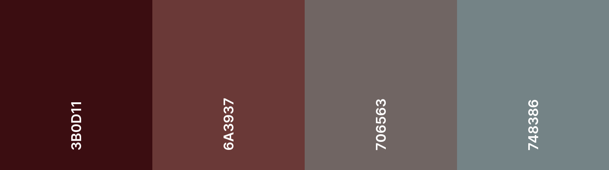
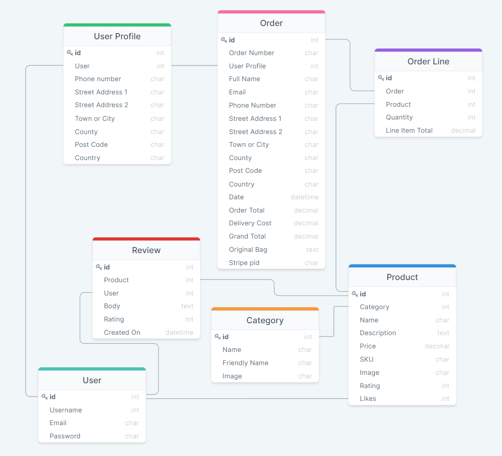

# Dry Drops

Dry Drops is a e-commerce website operating in the field of alcohol free beverages.

This fully responsive website was built using the Django framework in Python.

The payment system uses a service called Stripe. To test this system, dummy card details can be used. A list of these can be found [here](https://stripe.com/docs/testing#cards).

## User Experience (UX)

A list of my user stories and theri tasks can be found [here](https://github.com/delboy/drydrops/issues).

### EPIC | Navigation
- As a shopper I can navigate around the site so that I easily view the desired content.
- As a shopper I can view a list of products so that I can choose what products to purchase.
- As a shopper I can click on a product to see its details so that I can view the descirption, price and any customer reviews.
- As a shopper I can easily identify different product categories so that I can quickly view the type of products I'm looking for.
- As a shopper I can search for products so that I can find the products I'm specifically looking for.
- As a shopper I can sort the products so that I can easily find products based on price, reviews, category, or title.
- As a shopper I can view products I have saved so that I can navigate to them easily without having to find them again.

### EPIC | Accounts
- As a User I can register for an account so that I can use the features afforded to members.
- As a user I can receive a confirmation email when creating an account so that I know the registration was successful.
- As a user I can easily log in and out so that I can access my personal account.
- As a user I can easily see my login status so that I know if I'm logged in or out.
- As a user I can view my previous orders so that I can keeep record of what purchases I've made.
- As a user I can save my delivery information so that I do not have to refill it out for future orders.
- As a user I can recover my password in case I forget it so that I can regain access to my account.

### EPIC | Admin
- As a admin I can add products so that I can update the sites inventory.
- As a admin I can edit a product so that I can keep the products information up to date.
- As a admin I can delete a product so that I can remove products no longer available.
- As a admin I can feature products so that I can display them on the home page.

### EPIC | Purchasing
- As a shopper I can add items to my bag in different quantitys so that I can store the items untill I'm willing to buy.
- As a shopper I can view my bag so that I can identify the total cost of the transaction and the items I will be purchasing.
- As a shopper I can adjust the quantity of the items in my bag so that I can easily make changes before I purchase.
- As a shopper I can always see a running subtotal so that I can keep an eye on how much I'm spending.
- As a shopper I can see a summary of my purchase before I buy so that I know exactly what I'm ordering and how much it all costs.
- As a shopper I can pay for goods as a guest so that I can still use the site without having to sign up for an account.
- As a shopper I can easily enter my payment details so that I can checkout quickly with no problems.
- As a shopper I can view confirmation of my purchases so that I know the order was received and can review what I've purchased.
- As a shopper I can receive an email of my order so that I can keep it for my records.

### EPIC | Interaction
- As a user I can save my favourite products so that they are easily accessible for future purchases.
- As a user I can leave reviews on products so that I can share my experience with others.
- As a user I can sign up to the websites newsletter so that I can keep up to date with new products and promotions.
- As a user I can connect to the sites social media pages so that I can follow them and keep up to date with their products and promotions.
- As a user I can contact the business so that I can find out any information that I require.

## Design

### Colour Scheme

- I wanted the colour scheme to be similar to the colour of dark ales and wines to fit in with the sites's theme, so the main colour I chose was a dark redish brow, along with a lighter shade and a couple more neutral tones to balance it out.  

 

### Typography 

I will be using two fonts from Google Fonts.
- Roboto Serif for titles and headers.
- Source Sans 3 for paragraphs and general text.

### Imagery

### Wireframes

Wireframes for each page are linked here:

* [Home Page](assets/documents/home.pdf)
* [Products](assets/documents/products.pdf)
* [Product Details](assets/documents/product-details.pdf)
* [About](assets/documents/about.pdf)
* [Contact](assets/documents/contact.pdf)
* [Register](assets/documents/register.pdf)
* [Account](assets/documents/account.pdf)
* [Sign in/out](assets/documents/log.pdf)
* [Bag](assets/documents/bag.pdf)
* [Checkout](assets/documents/checkout.pdf)
* [Success](assets/documents/success.pdf)
* [Product Management](assets/documents/product-management.pdf)

### Database Schema

