# Dry Drops - Testing

## User Story Testing

### EPIC | Navigation
*As a shopper, I can navigate around the site so that I can easily view the desired content*
- The navigation bar is located at the top of every page. From here users can access all pages on the site.

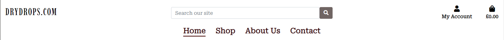

- On smaller screens, the navbar is located in a hamburger menu that shows when clicked. 

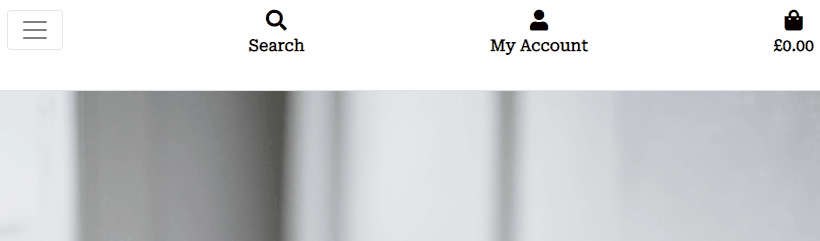

- Also located in the footer is a quick links section, which has links to all pages.

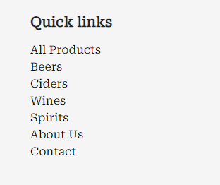

*As a shopper, I can view a list of products so that I can choose what products to purchase*
- From the navbar, users can click the 'Shop' link and in the dropdown menu choose 'All Products' to be taken to the product's page, which will list every product on the store.

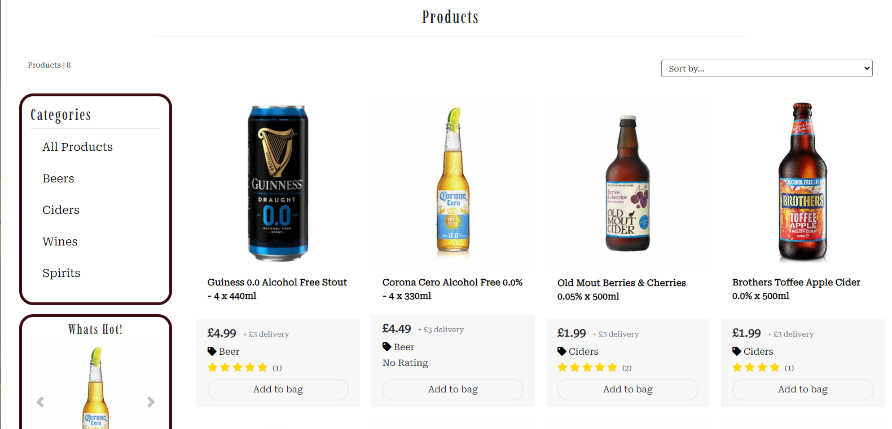

*As a shopper, I can click on a product to see its details so that I can view the description, price and any customer reviews*
- By clicking either the product's image or title, the user is taken directly to the product's detail page, where the description, price, customer reviews and more are on display.

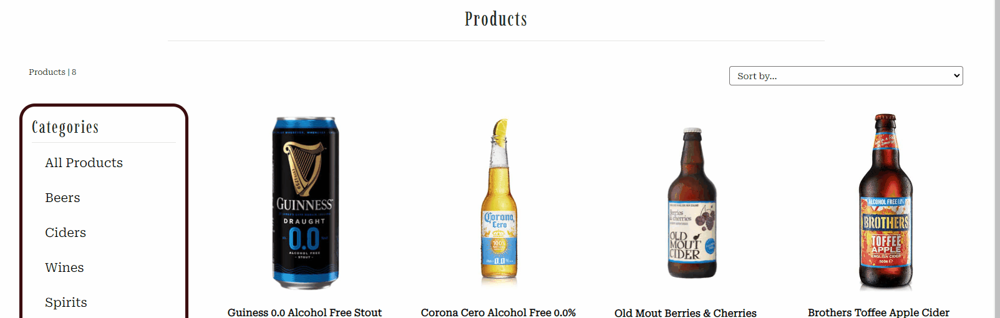

*As a shopper, I can easily identify different product categories so that I can quickly view the type of products I'm looking for*
- When clicking the 'Shop' link in the navbar the dropdown menu will feature all the different categories. Clicking any of these will take the user to the products page, showing only items from the category selected.

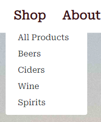

- On larger screens, if on the products page, a side navigation bar will be visible that lists all the categories. Clicking any of these will filter the results to that particular category.

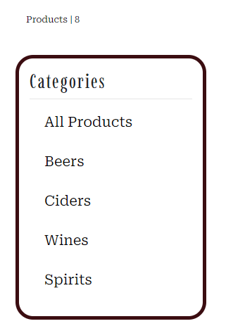

- On each product's card, underneath the price, the item's category will also be listed. This is a clickable link that will filter the products page to items of the same category.

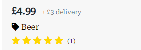

- Within the product's detail page, underneath the SKU, is the item's category. This is a clickable link that will take the user back to the products page, showing only items in that same category. 

- From the home page, users can also find a section where the categories are listed. Clicking either of these images takes the user to the products page, showing only items in that category.

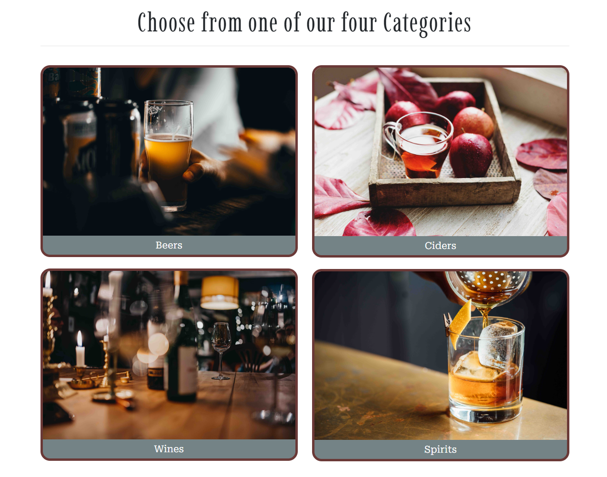

- A link to each category can also be found in the footer.

*As a shopper, I can search for products so that I can find the products I'm specifically looking for*
- Located above the navbar is a search bar. On smaller screens, this bar becomes a search icon which when clicked will drop down the full bar. Any searched word will match itself to any text in the product's title, or description and display the results on the product's page. 

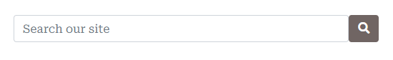
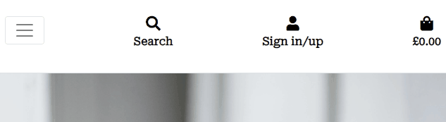

*As a shopper, I can sort the products so that I can easily find products based on price, reviews, category, or title*
- A sort box is located on the products page where users can sort all products by price, rating, name, and category, in ascending or descending order.

*As a shopper, I can view products I have saved so that I can navigate to them easily without having to find them again*
- Liked products will appear in the user's favorite items list, located on the user's profile page.

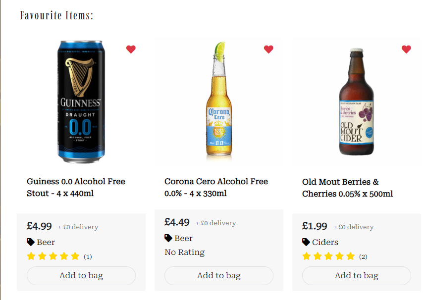

### EPIC | Accounts
*As a User, I can register for an account so that I can use the features afforded to members*
- Users can click the 'Sign in/up' accounts icon located in the header of the page, and from there click the link 'Register'. 
- Once on the registration page, users can fill in a short form to sign up for an account. 

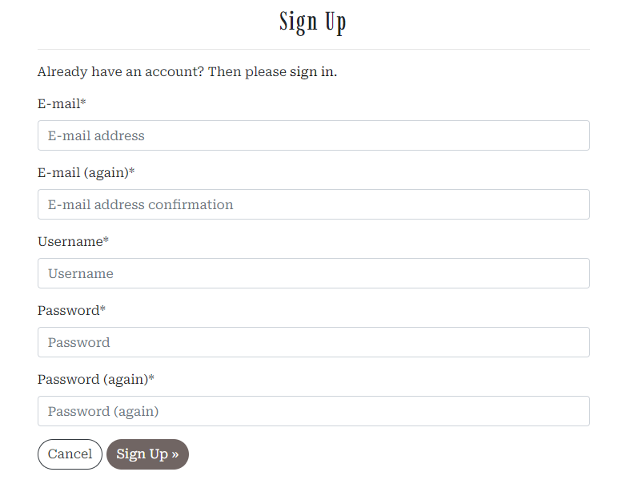

*As a user, I can receive a confirmation email when creating an account so that I know the registration was successful*
- When submitting the form on the registration page, users will be sent a confirmation email which contains a link that the users will have to follow to confirm the account. 

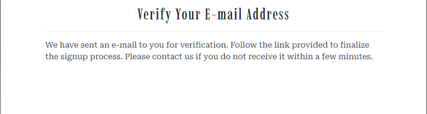
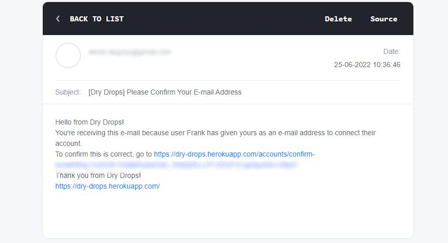

*As a user, I can easily log in and out so that I can access my account*
- Once a user has created an account they can use the log-in feature which is located in the 'Sign in/up' accounts menu.

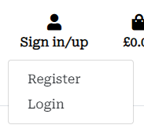

- When signed in the accounts menu's label will change to 'My Account'. Clicking this will drop down an option to log out.

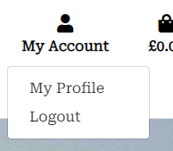

*As a user, I can easily see my login status so that I know if I'm logged in or out*
- Whenever a user logs in or logs out a toast message will appear notifying the user or their action.
- When signed in the accounts menu's label will change to 'My Account'.

*As a user, I can view my previous orders so that I can keep a record of what purchases I've made*
- Once a user has created an account and placed an order, they can view the order in their profile section located under the accounts menu. 
- Clicking the user's order number will take you to a summary page of that order.

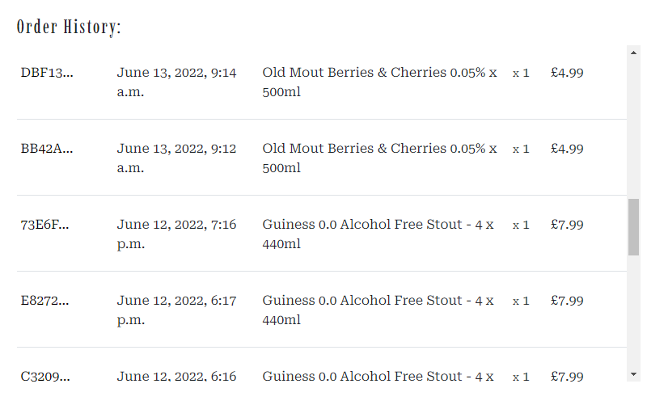

*As a user, I can save my delivery information so that I do not have to refill it out for future orders*
- Users can fill in their delivery information on their profile page. This information will autofill out any future orders.

- When placing an order a checkbox under the delivery information can be checked to save the information just added.

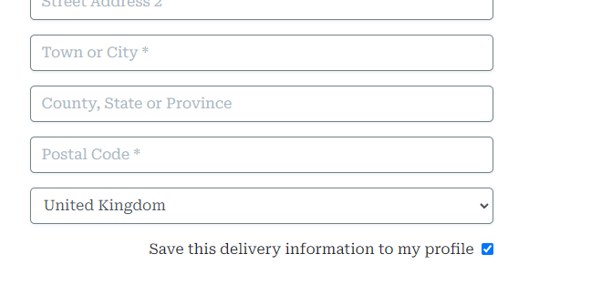

*As a user, I can recover my password in case I forget it so that I can regain access to my account*
- On the sign-in page, a link to recover your password is located underneath the sign-in button. 

### EPIC | Admin
*As an admin, I can add products so that I can update the site's inventory*
- Admins can navigate to the 'Product Management' page under the accounts menu.

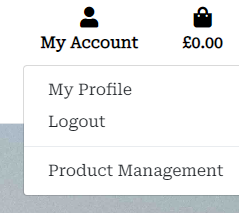

- On this page, the user can add new products by filling out a short form. 

*As an admin, I can edit a product so that I can keep the products information up to date*
- If an admin is logged in, products will show an 'Edit' button on both their product card and their details page.
- Clicking either of these buttons will take the admin to the 'Edit Product' page where admins can update the product's info.

*As an admin, I can delete a product so that I can remove products no longer available*
- If an admin is logged in, the products will show a 'Delete' button on both their product card and their details page.
- Clicking this button will prompt a modal, asking the user if they are sure they want to delete the product.
- Clicking delete on the modal will remove the product from the database.

*As an admin, I can feature products so that I can display them on the home page*
- If an admin is logged in, the products will show a 'feature' button on both their product card and their details page.
- Clicking this button will toggle the item's 'Featured' status.
- Featured products will appear in the 'Whats Hot' section on the home and products page.
- Featured items will have a banner around the product's image, only visible by admins.

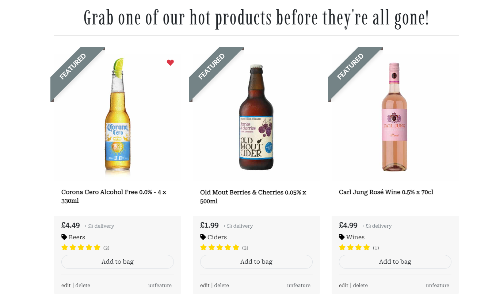

### EPIC | Purchasing
*As a shopper, I can add items to my bag in different quantities so that I can store the items until I'm ready to buy*
- On the product's detail page, shoppers can adjust the quantity by using the buttons located on either side of the input, or by typing in the amount and clicking the 'Add to bag' button, to add the item to the bag.

- At the bottom of the products card, is an 'Add to Bag' button which adds 1 item to the bag. 

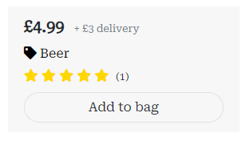

*As a shopper, I can view my bag so that I can identify the total cost of the transaction and the items I will be purchasing*
- Clicking the bag icon in the top right corner will take shoppers to their bag.
- The Shopping bag page lists the items stored, along with the subtotal of each item, delivery costs, and the grand total to pay. 

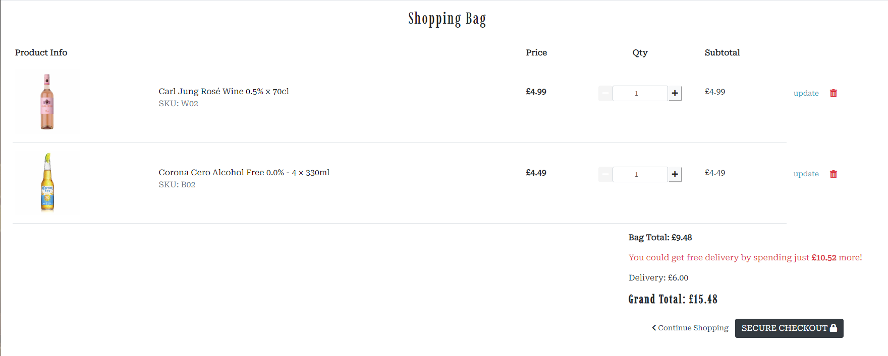

*As a shopper, I can adjust the quantity of the items in my bag so that I can easily make changes before I purchase*
- On the shopping bag page, shoppers can adjust the product's quantity by adjusting it with the buttons located on either side of the input, or by typing in the amount, and then clicking the 'update' button.
- Alternatively, shoppers can remove the item by clicking the red trash can icon. 

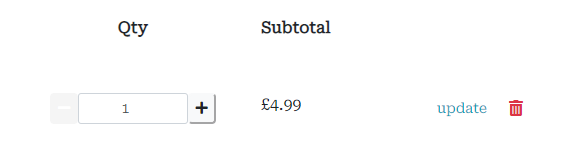

*As a shopper, I can always see a running subtotal so that I can keep an eye on how much I'm spending*
- The bag icon will update automatically to reflect the total, along with how many items are in the bag.

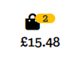

*As a shopper, I can see a summary of my purchase before I buy so that I know exactly what I'm ordering and how much it all costs*
- Once shoppers are happy with the items in the bag they can proceed to the secure checkout. This will list a summary of their purchases and a run down of the costs before the shopper pays. 

*As a shopper, I can pay for goods as a guest so that I can still use the site without having to sign up for an account*
- Shoppers do not need an account to purchase any items. Regardless of whether a user is signed in, the checkout process remains the same. 

*As a shopper, I can easily enter my payment details so that I can check out quickly with no problems*
 - Paying for goods is as simple as entering the user's card details into the payment box on the checkout page and clicking the 'Complete Order' button. 

 

*As a shopper, I can view confirmation of my purchases so that I know the order was received and can review what I've purchased*
- After an order has been completed, the user will be taken to a confirmation page with a summary of the order.
- In addition to the confirmation page, users will be sent an email detailing the order.

*As a shopper, I can receive an email of my order so that I can keep it in my records*
- Once an order is completed, the user will receive a confirmation email detailing the order.

### EPIC | Interaction
*As a user, I can save my favorite products so that they are easily accessible for future purchases*
- Users can click a 'Add to Favourites' heart-shaped button, which is underneath the product's title on the product's detail page.
- Clicking the heart will render the product 'liked' and subsequently fill in the heart. Alternatively clicking the heart when the product is already liked will empty the heart and remove its liked status.
<!-- - Liked products will render a small red heart in the top right corner of the product's image.
- Clicking the heart when the user does not have an account or is not signed in, will prompt a modal that asks the user to sign up or to sign in to use that feature.  -->

*As a user, I can leave reviews on products so that I can share my experience with others*
- A review section is located at the bottom of each product's detail page. Here the user can leave a rating and review.
- Once a review has been left, it will be visible in the review section for everyone to see. 

 

*As a user, I can sign up for the website's newsletter so that I can keep up to date with new products and promotions*
- In the footer is a 'Newsletter' section. Here the user can input their email address to sign up.

*As a user, I can connect to the site's social media pages so that I can follow them and keep up to date with their products and promotions*
- On the 'Contact Us' page, users can find links to all the company's social media links.
- These links can also be found in the 'Contact Us' section located in the footer.

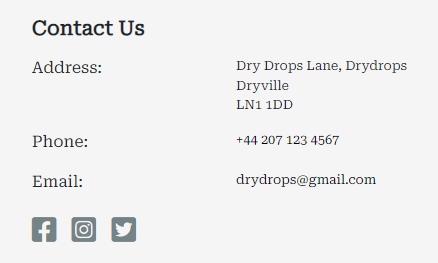

*As a user, I can contact the business so that I can find out any information that I require*
- The contact us page lists the company's address, phone number, email, and social media links. 
- The contact us page also features a messaging form that users can fill out to send a direct email to the company.

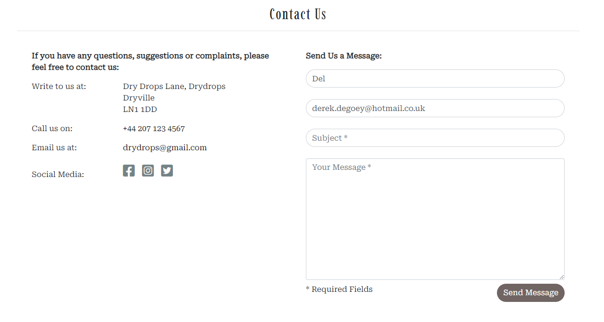

## Feature Testing

### Nav Bar

- #### Links
    Checked that:
    - The links change color when hovered over.
    - The link to the current page is highlighted by an underline.
    - The Shop link drops down into a sub-menu displaying all products and the four product categories.
    - The links collapse into a hamburger menu once the screen size becomes too small. 

    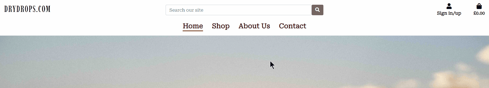

- #### Search Bar
    Checked that:
    - The search bar will search both the product's title and description for a match.
    - On smaller screens, the bar collapses into a search Icon that upon clicking drops down into the full search bar.

    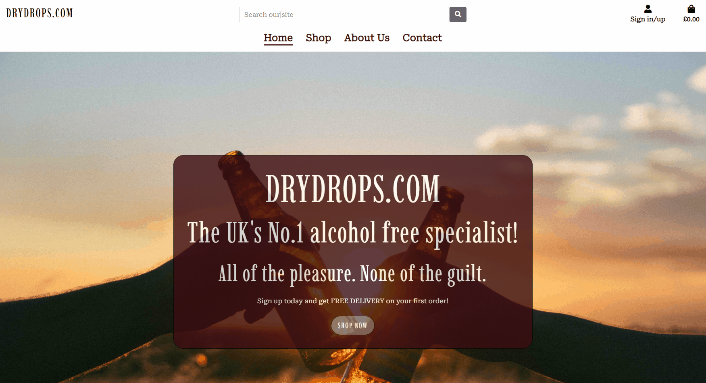

- #### Account
    Checked that:
    - Hovering over the account icon changes its color.
    - Clicking the account Icon opens a dropdown menu with options for the user to register or sign in.
    - If a user is signed in the dropdown options change to 'My Profile' and 'Logout'.
    - If a user is signed in the Icons text changes from 'sign in/up' to 'My Account'.
    - If the user signed in is a super user then a third option of 'Product Management' is available. 

    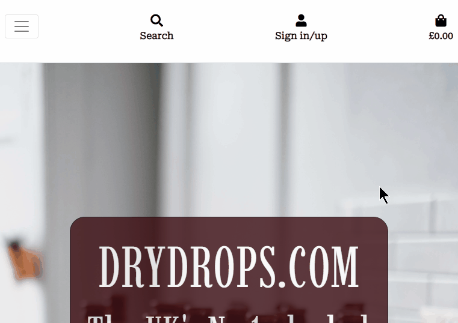

- #### Bag
    Checked that:
    - Beneath the bag icon is a running total of the cost of all the items in the bag.
    - Once a product is added to the bag, a number displaying the total quantity of items appears, located at the top right of the bag icon.
    - Clicking the bag icon navigates the user to the shopping bag page which displays a summary of what's been added.

    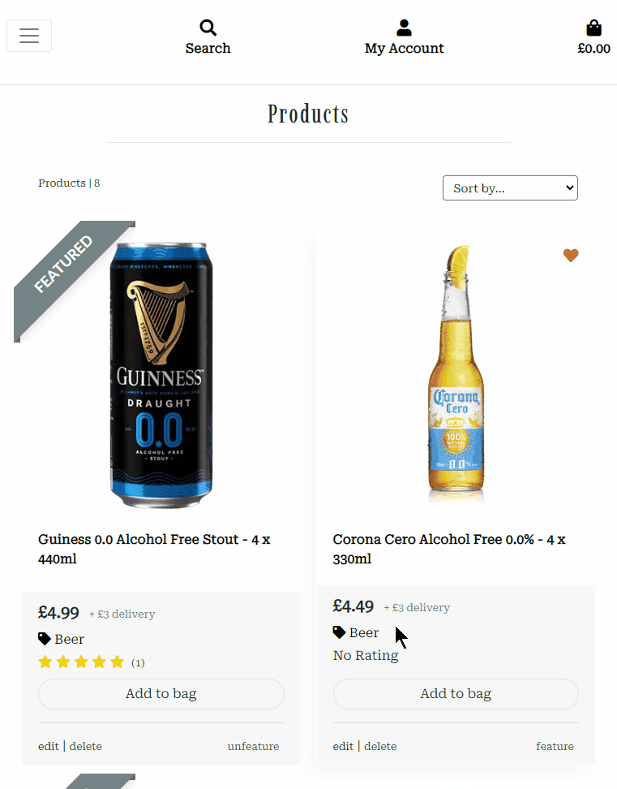

- #### Banner 
    Checked that:
    - The banner message will change to reflect how close the user is to achieving the offer. 

    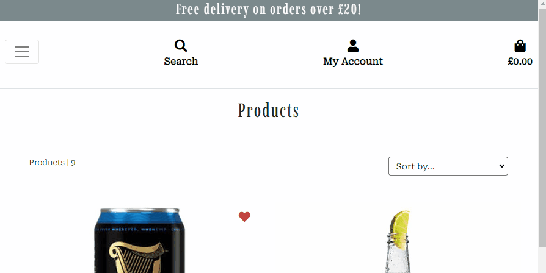

### Home Page
    
- #### Hero Image
    Checked that:
    - The button labeled 'Shop Now' takes the user to the products page.
    - Hovering over the 'Shop Now' button changes its color.
    - The image changes depending on the size of the screen.

    

- #### Categories
    Checked that:
    - Hovering over the categories lightens the image.
    - Clicking one of the categories takes the user to the shop displaying only products from that category. 

    

- #### Top Products
    Checked that:
    - The list orders by the highest rating first. 
    - If any products have the same rating they will be put in order of how many reviews they have received.
    - Clicking the product takes you to its detail page.

    

- #### Hot Products
    Checked that:
    - The hot products section lists any products that have been featured by an admin.
    - On large screens, the section displays as a list, whereas smaller screens displays the items in a carousel.
    - Clicking the products takes you to its detail page.

    

- #### Footer
    Checked that:
    - All the links change color when hovered over.
    - All the links in the Quick Links section work.
    - Clicking the phone number will call it, clicking the email address opens your default email programme, and clicking the social media links takes you to the relevant website.
    - The Newsletter section has an option to input your email and sign up for the weekly newsletter.

    

### Accounts

- #### Register Page
    Checked that:
    - Submitting the registration form sends an authentication link to the email provided.
    - Clicking the confirmation link confirms the account.
    - After creating an account the user can use his details to sign in. 

    

- #### Login Page
    Checked that:
    - The login page is can be used to log in users with an existing account.
    - Users can sign in with either their username or their email address.
    - Toast messages inform the user of their status.
    - The 'Forgot Password' link enables the user to recover their password.
    - When logged in the account icon label turns from 'Sign in/up' to 'My Account'.

    

- #### Log out Page
    Checked that:
    - The logout page logs out users who are signed in.
    - The account icon label turns from 'My Account' to 'Sign in/up'.
    - Toast messages inform the user of their status.

    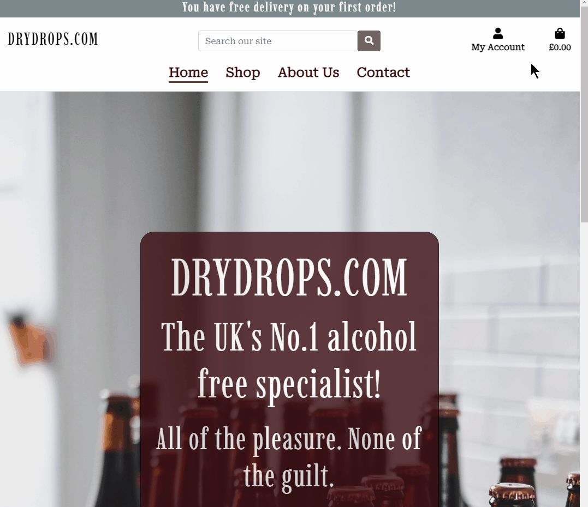

### Profile

- #### Delivery Details
    Checked that:
    - The delivery details section stores the user's delivery address and phone number.
    - The saved delivery details auto-fill the delivery form at the checkout.
    - A toast message informs the user that the delivery details have been updated.

    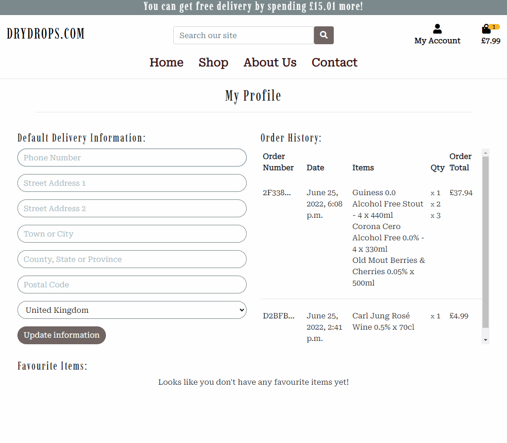
   
- #### Order History
    Checked that:
    - The table displays the order number, date it was ordered, items ordered, quantities of items and the order total.
    - Clicking the order number will take the user to a more detailed summary of the order.
    - Hovering over the truncated order number reveals the whole order number.
    - A scroll bar appears once the user has more orders than the box can contain.
    - The order summary page has a button to take the user back to their profile page. 

    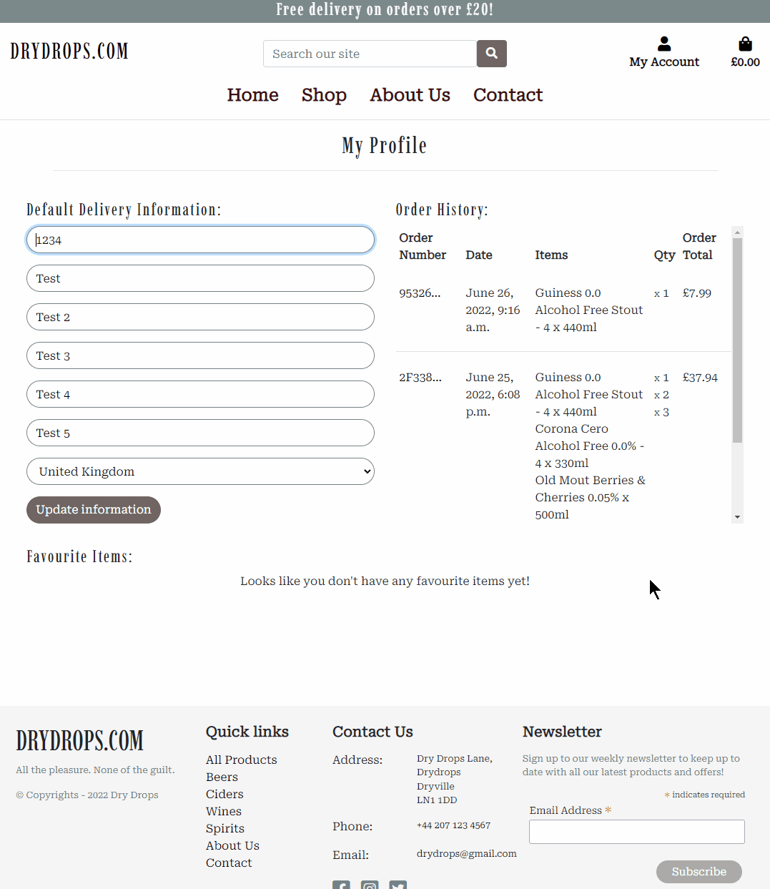

- #### Favorite Items
    Checked that:
    - The favorite items section keeps a list of all products that the user has liked.

    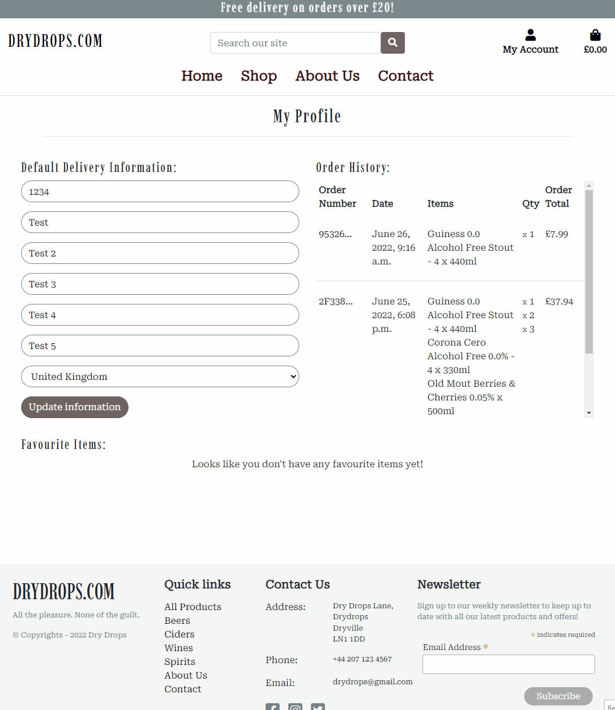

### All Products

- #### Categories Side-nav
    Checked that:
    - The category side-nav section only appears on large screens and lists all the product categories.
    - Clicking any of the categories in this section filters the products to that option.

    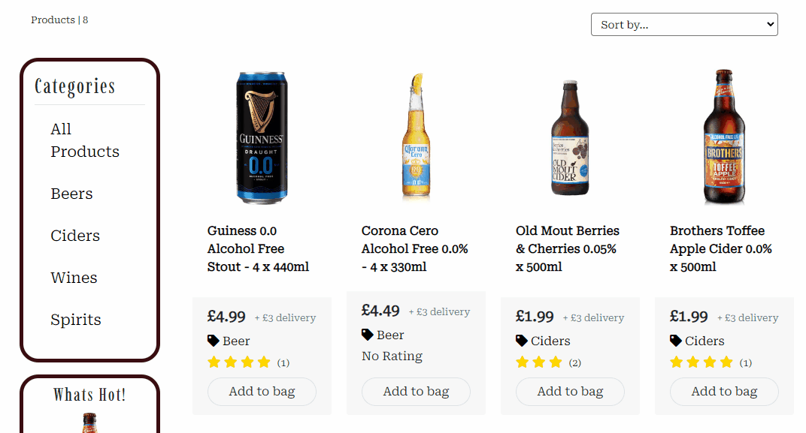

- #### What's Hot Carousel
    Checked that:
    - The Whats hot carousel displays any product that an admin has selected to be featured.
    - Clicking the product will take the user to that product's detail page.
    - Buttons on the edge of the carousel enable the user to scroll through all the featured products.

    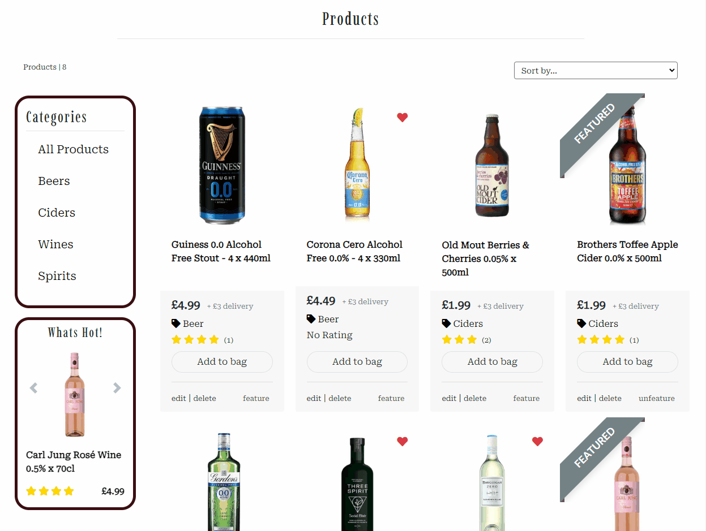

- #### Sorting
    Checked that:
    - Clicking the box opens up a dropdown menu with various options on how to sort the products.
    - Clicking each option sorts the products in the way described.

    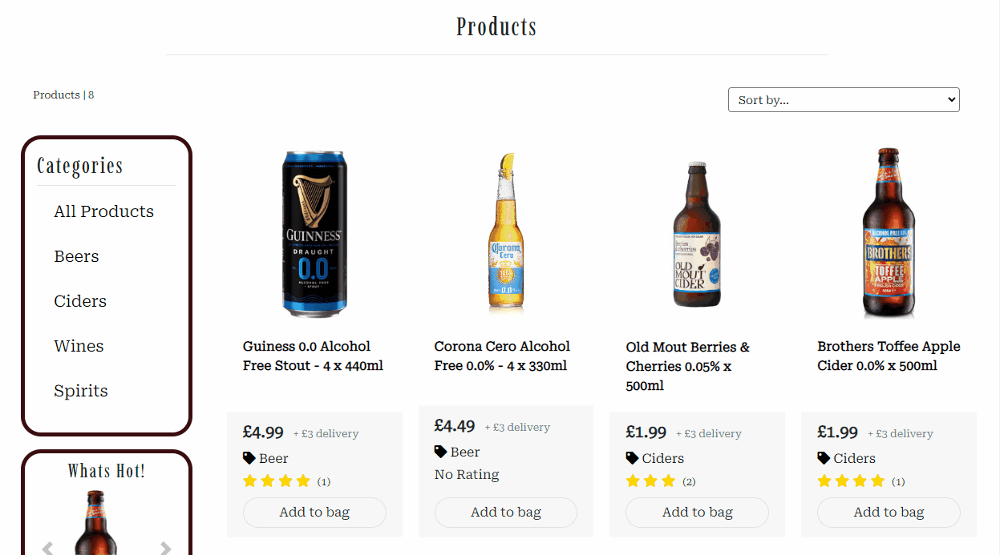

- #### Products
    Checked that:
    - The products page is fully responsive, adjusting how many products are on each row depending on the screen size.
    - Each product card shows an image of the product, its title, price, category, and rating.
    - An 'Add to Bag' button can be used to add the item to the bag.
    - Any products that have been liked by the user displays a red heart in the top right corner. 
    - If the user is a superuser, admin buttons will appear at the bottom of the product card.
    - If the user is a superuser and the product has been featured, a featured banner will appear across the product card. 

    

### Products Details

- #### Product Info
    - The product info section shows information about the product along with buttons to add the item to the user's favorite list, and buttons to add the item to the bag in multiple quantities.
    - The product's rating is an average of all the product's reviews and displays the result in stars. Next to the stars is also a number indicating how many reviews the product has received in total. 
    - Clicking the products category will take users to the products page showing only items from that category.
    - If the user is a super user, admin buttons will appear underneath the image.

- #### Like Button
    - The heart button renders as empty if either the user is signed out or the product is not liked by the user.
    - Liking a product fills in the heart and adds the product to the user's favorite items list on their profile page.
    - Unliking a product unfills the heart and removes the product from the user's favourite items list on their profile page.
    - If the heart is clicked when no user is signed in, an 'Account Required' modal pops up informing the user that they need to either sign in or create an account to use that feature.

- #### Quantity Buttons
    - The plus and minus buttons increase and decrease the input value. 
    - If the value is set to 1 the minus quantity will be disabled. Respectively if the value is set to 99 the plus button is disabled.
    - Clicking the 'Add to Bag' button takes the number in the input field and adds that amount of products to the bag.
    - Trying to add an amount less than one or above 99, renders an error message informing the user of the parameters needed to be successful.
    - Underneath the input is a link that takes users back to the store.  

- #### Customer Reviews
    - If the product has received any reviews they will appear underneath the product details.
    - The reviews consist of the number of stars awarded by the user, their written comment, followed by the user name and how long ago the comment was left.
    - If the user is signed in and they have left a review on a product, that review will also have edit and delete buttons. Users can use these to manage their reviews.

- #### Add Review
    - Leaving out either the rating or the review notifies the user that the fields are required.  
    - The user can rate the product between 1 and 5 stars. Clicking a star fills the star and every star before it.
    - Any profanity in the review will cause the form to fail and a toast will inform the user.
    - To stop users leaving multiple reviews on one product, the form only renders when no reviews for that product, from that user exist.

### Product Management

- #### Add Product
    - The add product page is accessed by the account dropdown menu, under product management. It is only accessible by superusers.
    - The user must fill out all the fields that are labeled 'required' with an Asterix. If the form is submitted with any of these fields left blank then an error message will appear above that particular field, notifying the user of the issue.
    - The SKU field must be unique. An error message will appear if an already existing SKU is attempted.
    - If a price is added with more than 6 digits the form will fail and an error message will appear under the price field.
    - The featured checkbox can be checked so that the item will appear in the 'What's Hot' section on the products page.
    - The user has the option to add an image. If none is chosen then a default image is used.
    - Clicking the 'Add Product' button at the bottom of the form will create the product providing there are no errors on the form.

    

- #### Edit Product
    - The Edit Product page can be accessed from two places. By clicking the 'edit' button at the bottom of the product's card. Or by clicking the edit button located under the image on the products detail page.
    - Accessing the page loads what is essentially the add product page, with the details of the product already filled in. 
    - The image field displays a thumbnail of the current image and has a checkbox option to remove it. Checking this will change the image to the default image.
    - Clicking the 'Update Product' button will save any changes made to the existing product.  

- #### Delete Product
    - The Delete Product button can be found in two places. One is next to the 'edit' button at the bottom of the product's card. The second is to the right of the 'edit' button on the products detail page. 
    - Clicking either of the delete buttons will bring up a warning modal, asking the user if they are sure they want to delete the product, and informing them that it is irreversible. 
    - Once the warning modal has been activated if the user then clicks the delete button the product will be removed from the database. 
    - If however, the user presses the cancel button, the modal is closed and no effect has taken place. 

### Bag

- #### Items
    - Clicking either the image or the product's title will take you to that product's detail page. 

- #### Quantity and Price
    - The quantity element has buttons either side for the user to increase or decrease the total of that item in the bag.
    - The minus quantity button will be disabled if the quantity of the item is one. Respectively the plus button will also be disabled if the quantity of the item is 99.
    - Clicking the 'update' button saves any changes to the quantity and updates the item's subtotal.
    - Clicking the red trash can icon removes the item completely from the user's bag. 
    - Manually inputting the number zero or anything below and clicking 'update' will remove the item from the bag. 
    - Manually inputting a number above 99 and clicking 'update' will result in an error message informing the user of the correct parameters. 
    
- #### Totals and messaging
    - In between the bag total and the delivery total, users will either find a message informing them of how much more they need to spend to receive free delivery, or it will show how much delivery they would of paid if they didn't receive the offer. This message will also be different if it is the user's first ever order, in which case it will display 'FREE DELIVERY on your first order!'. 
    - Beneath the grand total is two buttons. From here the user can either continue to the checkout or return to the products page by clicking 'Continue Shopping'.

### Checkout

- #### Details
    - If the user is anonymous, a link to create an account or login will be present.
    - If the user is signed in a checkbox to save the delivery information can be checked.
    - If the user is signed in and has delivery information checked the delivery details and email address will be automatically filled in. 
    - Any field with an Asterix is required. If a user tries to complete the form with any of these fields left blank the affected field will highlight that it needs to be filled in.   

- #### Order Summary
    - Clicking the image or title of any items in the summary will take the user to that product's detail page. 

- #### Payment
    - Only numbers can be entered into the card payment box. Incorrect card numbers will automatically show an invalid card number error.
    - The site can be tested by using the dummy card number 4242 4242 4242 4242 with the expiry date 04/24 and the CVC code 242.
    - At the end of the section is a button to complete the order or to return back to the bag. There is also a warning message informing the user of how much their card is about to be charged.

- #### Loading Spinner
    - Upon clicking the complete order button, as long as the form is valid, a loading spinner will render until the information is processed completely. 
    
- #### Confirmation 
    - Once the order has been processed the user is taken to the checkout success page. 
    - A confirmation email is also sent to the email address provided, and this is noted at the top of the page. 
    - At the end of the summary is a button that the user can use to take them back to the main shop.
    
### About Us

- #### Image
    - Underneath the image is a link to both the contact us page, and the products page.

- #### Links
    - Hovering over these links will lighten their appearance.
    - Clicking the links will open up the respective website in another tab. This is to stop the user from being taken away from the main site.  

### Contact

- #### Contact Info  
    - Hovering over the social media links changes their color. Clicking the links takes you to the respective website which opens in a new tab.
    - The facebook link particularly takes you to the websites business page on facebook. 

- #### Messaging
    - All the fields are required. Failing to fill out any field will result in a message highlighting which field has been left blank.
    - Once all the fields are completed, hitting the 'Send Message' button will send the message. 
    - Both Dry Drops and the user will receive an email on completion, laying out who send the message and what was said.  

### Toasts and Pop-ups

- #### Toasts
    - Toasts appear in the top right-hand corner of the display informing the user of any actions they have performed.
    - The bottom right corner of the toast box will change color depending on whether the message is portraying a successful action, general info, warning, or an error. 

- #### Pop-ups
    - If there is no user signed in, the session is new, and 8 seconds elapse, a pop-up will appear one time.
    
## Validators