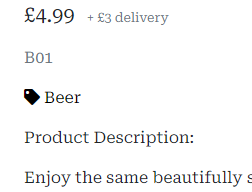
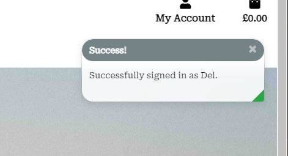
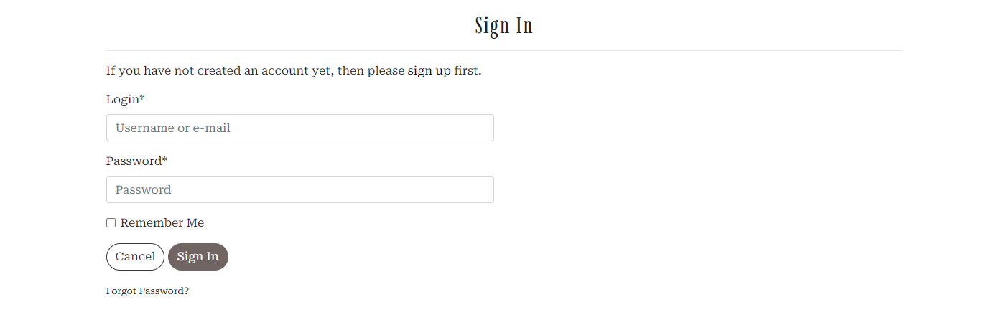
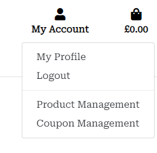
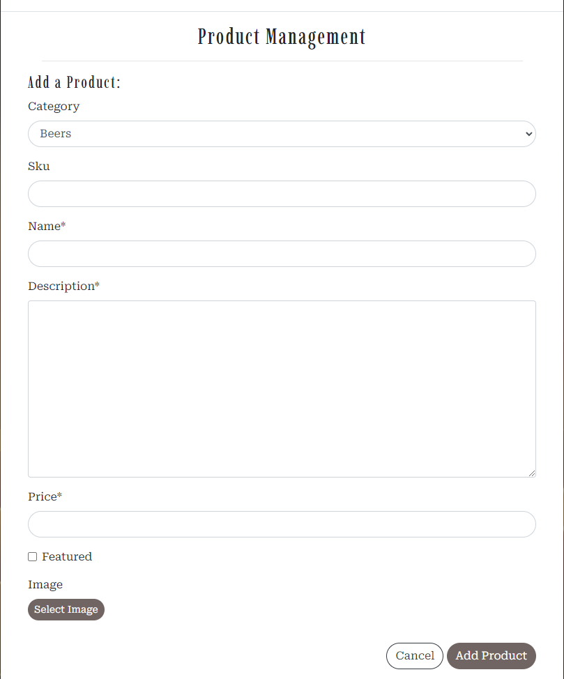
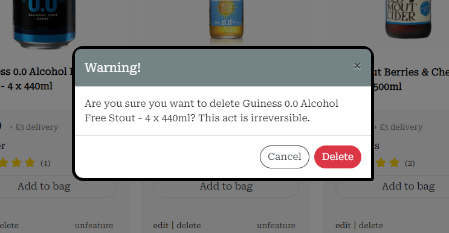
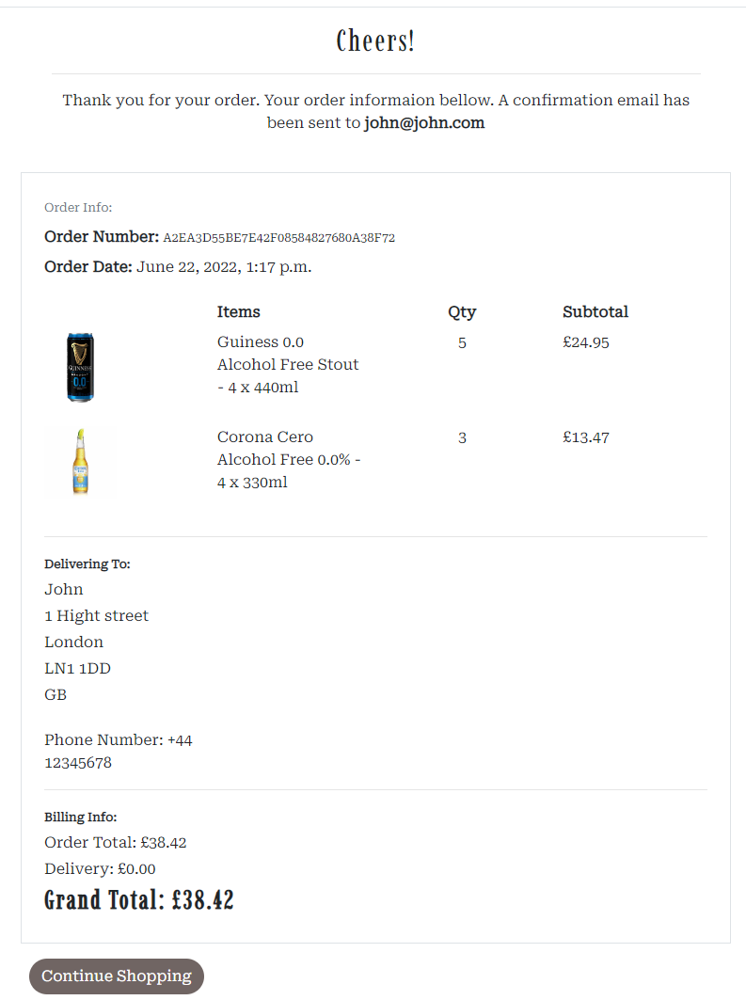

# Dry Drops - Testing

## User Story Testing

### EPIC | Navigation
*As a shopper, I can navigate around the site so that I can easily view the desired content*
- The navigation bar is located at the top of every page. From here users can access all pages on the site.

- On smaller screens, the navbar is located in a hamburger menu that shows when clicked. 

- Also located in the footer is a quick links section, which has links to all pages.

*As a shopper, I can view a list of products so that I can choose what products to purchase*
- From the navbar, users can click the 'Shop' link and in the dropdown menu choose 'All Products' to be taken to the product's page, which will list every product on the store.

*As a shopper, I can click on a product to see its details so that I can view the description, price and any customer reviews*
- By clicking either the product's image or title, the user is taken directly to the product's detail page, where the description, price, customer reviews and more are on display.

*As a shopper, I can easily identify different product categories so that I can quickly view the type of products I'm looking for*
- When clicking the 'Shop' link in the navbar the dropdown menu will feature all the different categories. Clicking any of these will take the user to the products page, showing only items from the category selected.

- On larger screens, if on the products page, a side navigation bar will be visible that lists all the categories. Clicking any of these will filter the results to that particular category.

- On each product's card, underneath the price, the item's category will also be listed. This is a clickable link that will filter the products page to items of the same category.

- Within the product's detail page, underneath the SKU, is the item's category. This is a clickable link that will take the user back to the products page, showing only items in that same category. 

- From the home page, users can also find a section where the categories are listed. Clicking either of these images takes the user to the products page, showing only items in that category.

- A link to each category can also be found in the footer.

*As a shopper, I can search for products so that I can find the products I'm specifically looking for*
- Located above the navbar is a search bar. On smaller screens, this bar becomes a search icon which when clicked will drop down the full bar. Any searched word will match itself to any text in the product's title, or description and display the results on the product's page. 

*As a shopper, I can sort the products so that I can easily find products based on price, reviews, category, or title*
- A sort box is located on the products page where users can sort all products by price, rating, name, and category, in ascending or descending order.

*As a shopper, I can view products I have saved so that I can navigate to them easily without having to find them again*
- Liked products will appear in the user's favorite items list, located on the user's profile page.

### EPIC | Accounts
*As a User, I can register for an account so that I can use the features afforded to members*
- Users can click the 'Sign in/up' accounts icon located in the header of the page, and from there click the link 'Register'. 
- Once on the registration page, users can fill in a short form to sign up for an account. 

*As a user, I can receive a confirmation email when creating an account so that I know the registration was successful*
- When submitting the form on the registration page, users will be sent a confirmation email which contains a link that the users will have to follow to confirm the account. 

*As a user, I can easily log in and out so that I can access my account*
- Once a user has created an account they can use the log-in feature which is located in the 'Sign in/up' accounts menu.

- When signed in the accounts menu's label will change to 'My Account'. Clicking this will drop down an option to log out.

*As a user, I can easily see my login status so that I know if I'm logged in or out*
- Whenever a user logs in or logs out a toast message will appear notifying the user or their action.
- When signed in the accounts menu's label will change to 'My Account'.

*As a user, I can view my previous orders so that I can keep a record of what purchases I've made*
- Once a user has created an account and placed an order, they can view the order in their profile section located under the accounts menu. 
- Clicking the user's order number will take you to a summary page of that order.

*As a user, I can save my delivery information so that I do not have to refill it out for future orders*
- Users can fill in their delivery information on their profile page. This information will autofill out any future orders.

- When placing an order a checkbox under the delivery information can be checked to save the information just added.

*As a user, I can recover my password in case I forget it so that I can regain access to my account*
- On the sign-in page, a link to recover your password is located underneath the sign-in button. 

### EPIC | Admin
*As an admin, I can add products so that I can update the site's inventory*
- Admins can navigate to the 'Product Management' page under the accounts menu.

- On this page, the user can add new products by filling out a short form. 

*As an admin, I can edit a product so that I can keep the products information up to date*
- If an admin is logged in, products will show an 'Edit' button on both their product card and their details page.
- Clicking either of these buttons will take the admin to the 'Edit Product' page where admins can update the product's info.

*As an admin, I can delete a product so that I can remove products no longer available*
- If an admin is logged in, the products will show a 'Delete' button on both their product card and their details page.
- Clicking this button will prompt a modal, asking the user if they are sure they want to delete the product.
- Clicking delete on the modal will remove the product from the database.

*As an admin, I can feature products so that I can display them on the home page*
- If an admin is logged in, the products will show a 'feature' button on both their product card and their details page.
- Clicking this button will toggle the item's 'Featured' status.
- Featured products will appear in the 'Whats Hot' section on the home and products page.
- Featured items will have a banner around the product's image, only visible by admins.

### EPIC | Purchasing
*As a shopper, I can add items to my bag in different quantities so that I can store the items until I'm ready to buy*
- On the product's detail page, shoppers can adjust the quantity by using the buttons located on either side of the input, or by typing in the amount and clicking the 'Add to bag' button, to add the item to the bag.

- At the bottom of the products card, is an 'Add to Bag' button which adds 1 item to the bag. 

*As a shopper, I can view my bag so that I can identify the total cost of the transaction and the items I will be purchasing*
- Clicking the bag icon in the top right corner will take shoppers to their bag.
- The Shopping bag page lists the items stored, along with the subtotal of each item, delivery costs, and the grand total to pay. 

*As a shopper, I can adjust the quantity of the items in my bag so that I can easily make changes before I purchase*
- On the shopping bag page, shoppers can adjust the product's quantity by adjusting it with the buttons located on either side of the input, or by typing in the amount, and then clicking the 'update' button.
- Alternatively, shoppers can remove the item by clicking the red trash can icon. 

*As a shopper, I can always see a running subtotal so that I can keep an eye on how much I'm spending*
- The bag icon will update automatically to reflect the total, along with how many items are in the bag.

*As a shopper, I can see a summary of my purchase before I buy so that I know exactly what I'm ordering and how much it all costs*
- Once shoppers are happy with the items in the bag they can proceed to the secure checkout. This will list a summary of their purchases and a run down of the costs before the shopper pays. 

*As a shopper, I can pay for goods as a guest so that I can still use the site without having to sign up for an account*
- Shoppers do not need an account to purchase any items. Regardless of whether a user is signed in, the checkout process remains the same. 

*As a shopper, I can easily enter my payment details so that I can check out quickly with no problems*
 - Paying for goods is as simple as entering the user's card details into the payment box on the checkout page and clicking the 'Complete Order' button. 

 

*As a shopper, I can view confirmation of my purchases so that I know the order was received and can review what I've purchased*
- After an order has been completed, the user will be taken to a confirmation page with a summary of the order.
- In addition to the confirmation page, users will be sent an email detailing the order.

*As a shopper, I can receive an email of my order so that I can keep it in my records*
- Once an order is completed, the user will receive a confirmation email detailing the order.

### EPIC | Interaction
*As a user, I can save my favorite products so that they are easily accessible for future purchases*
- Users can click a 'Add to Favourites' heart-shaped button, which is underneath the product's title on the product's detail page.
- Clicking the heart will render the product 'liked' and subsequently fill in the heart. Alternatively clicking the heart when the product is already liked will empty the heart and remove its liked status.
<!-- - Liked products will render a small red heart in the top right corner of the product's image.
- Clicking the heart when the user does not have an account or is not signed in, will prompt a modal that asks the user to sign up or to sign in to use that feature.  -->

*As a user, I can leave reviews on products so that I can share my experience with others*
- A review section is located at the bottom of each product's detail page. Here the user can leave a rating and review.
- Once a review has been left, it will be visible in the review section for everyone to see. 

 

*As a user, I can sign up for the website's newsletter so that I can keep up to date with new products and promotions*
- In the footer is a 'Newsletter' section. Here the user can input their email address to sign up.

*As a user, I can connect to the site's social media pages so that I can follow them and keep up to date with their products and promotions*
- On the 'Contact Us' page, users can find links to all the company's social media links.
- These links can also be found in the 'Contact Us' section located in the footer.

*As a user, I can contact the business so that I can find out any information that I require*
- The contact us page lists the company's address, phone number, email, and social media links. 
- The contact us page also features a messaging form that users can fill out to send a direct email to the company.

## Feature Testing

## Validators