# Dry Drops - Testing

## User Story Testing

### EPIC | Navigation
*As a shopper, I can navigate around the site so that I can easily view the desired content*
- The navigation bar is located at the top of every page. From here users can access all pages on the site.

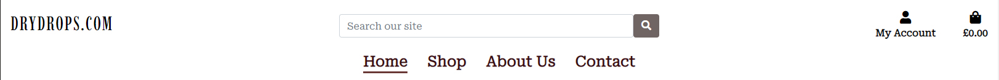

- On smaller screens, the navbar is located in a hamburger menu that shows when clicked. 

- Also located in the footer is a quick links section, which has links to all pages.

*As a shopper, I can view a list of products so that I can choose what products to purchase*
- From the navbar, users can click the 'Shop' link and in the dropdown menu choose 'All Products' to be taken to the product's page, which will list every product on the store.

*As a shopper, I can click on a product to see its details so that I can view the description, price and any customer reviews*
- By clicking either the product's image or title, the user is taken directly to the product's detail page, where the description, price, customer reviews and more are on display.

*As a shopper, I can easily identify different product categories so that I can quickly view the type of products I'm looking for*
- When clicking the 'Shop' link in the navbar the dropdown menu will feature all the different categories. Clicking any of these will take the user to the products page, showing only items from the category selected.

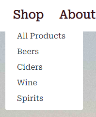

- On larger screens, if on the products page, a side navigation bar will be visible that lists all the categories. Clicking any of these will filter the results to that particular category.

- On each product's card, underneath the price, the item's category will also be listed. This is a clickable link that will filter the products page to items of the same category.

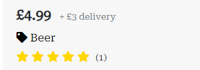

- Within the product's detail page, underneath the SKU, is the item's category. This is a clickable link that will take the user back to the products page, showing only items in that same category. 

- From the home page, users can also find a section where the categories are listed. Clicking either of these images takes the user to the products page, showing only items in that category.

- A link to each category can also be found in the footer.

*As a shopper, I can search for products so that I can find the products I'm specifically looking for*
- Located above the navbar is a search bar. On smaller screens, this bar becomes a search icon which when clicked will drop down the full bar. Any searched word will match itself to any text in the product's title, or description and display the results on the product's page. 

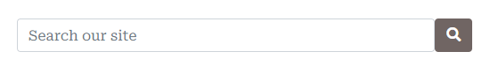
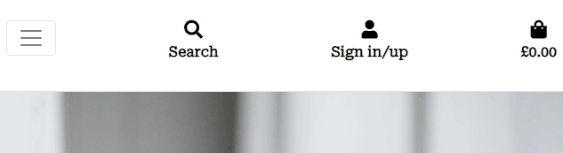

*As a shopper, I can sort the products so that I can easily find products based on price, reviews, category, or title*
- A sort box is located on the products page where users can sort all products by price, rating, name, and category, in ascending or descending order.

*As a shopper, I can view products I have saved so that I can navigate to them easily without having to find them again*
- Liked products will appear in the user's favourite items list, located on the user's profile page.

### EPIC | Accounts
*As a User, I can register for an account so that I can use the features afforded to members*
- Users can click the 'Sign in/up' accounts icon located in the header of the page, and from there click the link 'Register'. 
- Once on the registration page, users can fill in a short form to sign up for an account. 

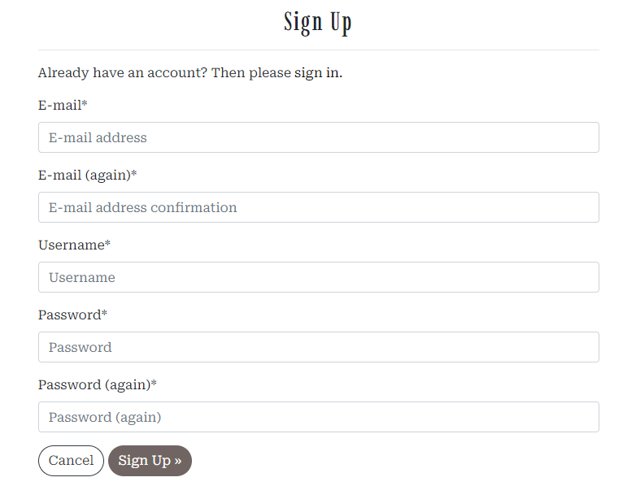

*As a user, I can receive a confirmation email when creating an account so that I know the registration was successful*
- When submitting the form on the registration page, users will be sent a confirmation email which contains a link that the users will have to follow to confirm the account. 

*As a user, I can easily log in and out so that I can access my account*
- Once a user has created an account they can use the log-in feature which is located in the 'Sign in/up' accounts menu.

- When signed in the accounts menu's label will change to 'My Account'. Clicking this will drop down an option to log out.

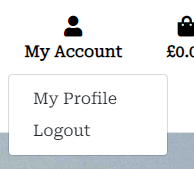

*As a user, I can easily see my login status so that I know if I'm logged in or out*
- Whenever a user logs in or logs out a toast message will appear notifying the user or their action.
- When signed in the accounts menu's label will change to 'My Account'.

*As a user, I can view my previous orders so that I can keep a record of what purchases I've made*
- Once a user has created an account and placed an order, they can view the order in their profile section located under the accounts menu. 
- Clicking the user's order number will take you to a summary page of that order.

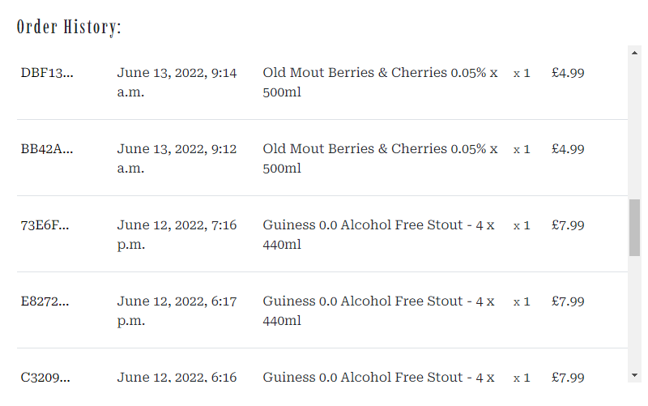

*As a user, I can save my delivery information so that I do not have to refill it out for future orders*
- Users can fill in their delivery information on their profile page. This information will autofill out any future orders.

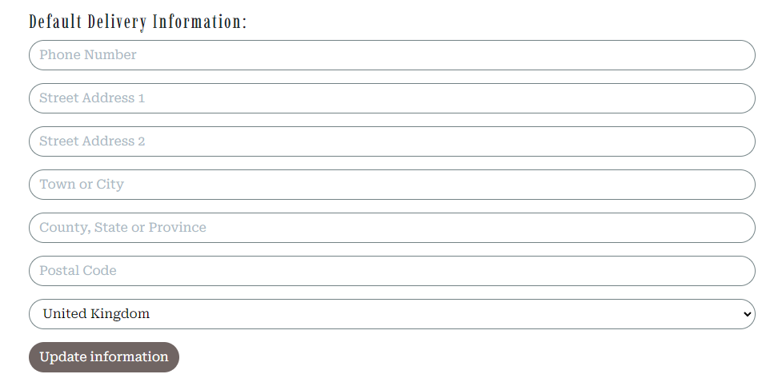

- When placing an order a checkbox under the delivery information can be checked to save the information just added.

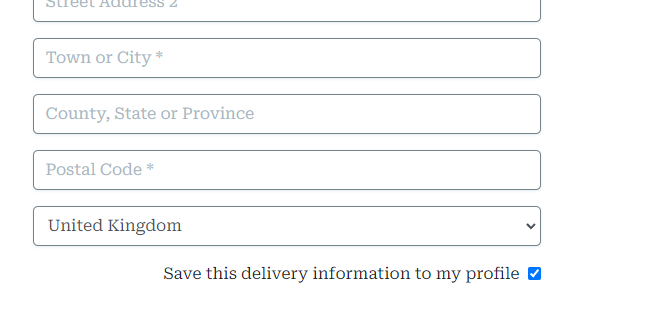

*As a user, I can recover my password in case I forget it so that I can regain access to my account*
- On the sign-in page, a link to recover your password is located underneath the sign-in button. 

### EPIC | Admin
*As an admin, I can add products so that I can update the site's inventory*
- Admins can navigate to the 'Product Management' page under the accounts menu.

- On this page, the user can add new products by filling out a short form. 

*As an admin, I can edit a product so that I can keep the products information up to date*
- If an admin is logged in, products will show an 'Edit' button on both their product card and their details page.
- Clicking either of these buttons will take the admin to the 'Edit Product' page where admins can update the product's info.

*As an admin, I can delete a product so that I can remove products no longer available*
- If an admin is logged in, the products will show a 'Delete' button on both their product card and their details page.
- Clicking this button will prompt a modal, asking the user if they are sure they want to delete the product.
- Clicking delete on the modal will remove the product from the database.

*As an admin, I can feature products so that I can display them on the home page*
- If an admin is logged in, the products will show a 'feature' button on both their product card and their details page.
- Clicking this button will toggle the item's 'Featured' status.
- Featured products will appear in the "What's Hot" section on the home and products page.
- Featured items will have a banner around the product's image, only visible by admins.

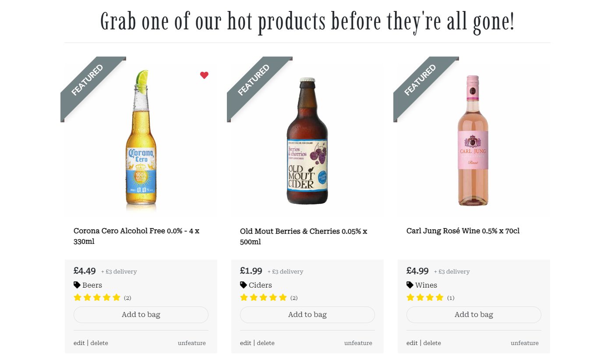

### EPIC | Purchasing
*As a shopper, I can add items to my bag in different quantities so that I can store the items until I'm ready to buy*
- On the product's detail page, shoppers can adjust the quantity by using the buttons located on either side of the input, or by typing in the amount and clicking the 'Add to bag' button, to add the item to the bag.

- At the bottom of the products card, is an 'Add to Bag' button which adds 1 item to the bag. 

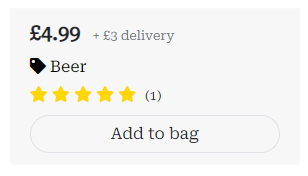

*As a shopper, I can view my bag so that I can identify the total cost of the transaction and the items I will be purchasing*
- Clicking the bag icon in the top right corner will take shoppers to their bag.
- The Shopping bag page lists the items stored, along with the subtotal of each item, delivery costs, and the grand total to pay. 

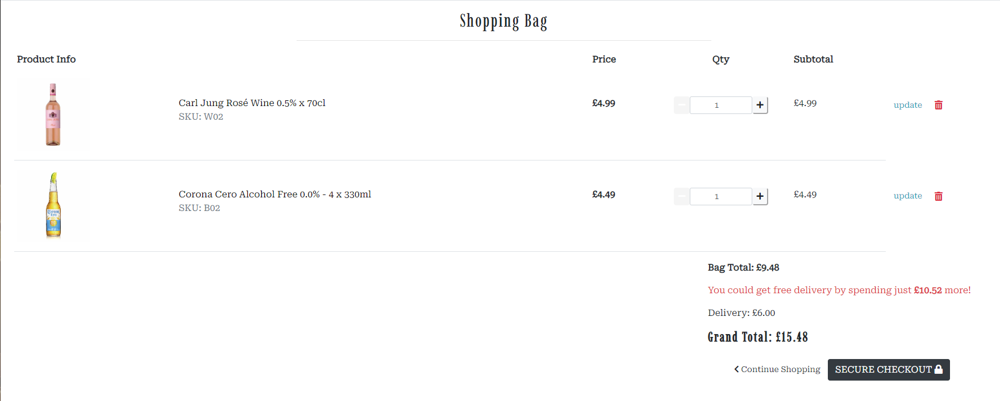

*As a shopper, I can adjust the quantity of the items in my bag so that I can easily make changes before I purchase*
- On the shopping bag page, shoppers can adjust the product's quantity by adjusting it with the buttons located on either side of the input, or by typing in the amount, and then clicking the 'update' button.
- Alternatively, shoppers can remove the item by clicking the red trash can icon. 

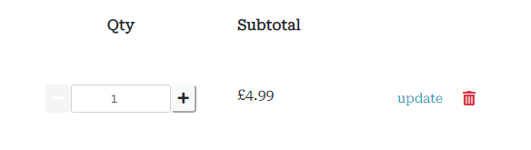

*As a shopper, I can always see a running subtotal so that I can keep an eye on how much I'm spending*
- The bag icon will update automatically to reflect the total, along with how many items are in the bag.

*As a shopper, I can see a summary of my purchase before I buy so that I know exactly what I'm ordering and how much it all costs*
- Once shoppers are happy with the items in the bag they can proceed to the secure checkout. This will list a summary of their purchases and a run down of the costs before the shopper pays. 

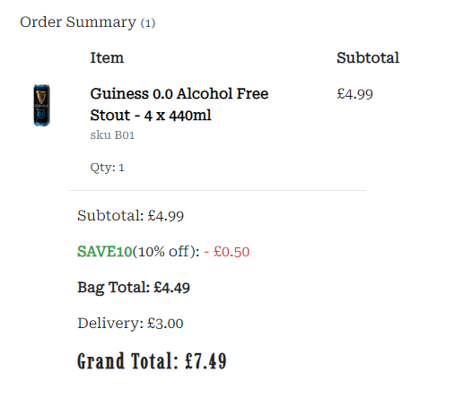

*As a shopper, I can pay for goods as a guest so that I can still use the site without having to sign up for an account*
- Shoppers do not need an account to purchase any items. Regardless of whether a user is signed in, the checkout process remains the same. 

*As a shopper, I can easily enter my payment details so that I can check out quickly with no problems*
 - Paying for goods is as simple as entering the user's card details into the payment box on the checkout page and clicking the 'Complete Order' button. 

 

*As a shopper, I can view confirmation of my purchases so that I know the order was received and can review what I've purchased*
- After an order has been completed, the user will be taken to a confirmation page with a summary of the order.
- In addition to the confirmation page, users will be sent an email detailing the order.

*As a shopper, I can receive an email of my order so that I can keep it in my records*
- Once an order is completed, the user will receive a confirmation email detailing the order.

### EPIC | Interaction
*As a user, I can save my favourite products so that they are easily accessible for future purchases*
- Users can click a 'Add to Favourites' heart-shaped button, which is underneath the product's title on the product's detail page.
- Clicking the heart will render the product 'liked' and subsequently fill in the heart. Alternatively clicking the heart when the product is already liked will empty the heart and remove its liked status.

*As a user, I can leave reviews on products so that I can share my experience with others*
- A review section is located at the bottom of each product's detail page. Here the user can leave a rating and review.
- Once a review has been left, it will be visible in the review section for everyone to see. 

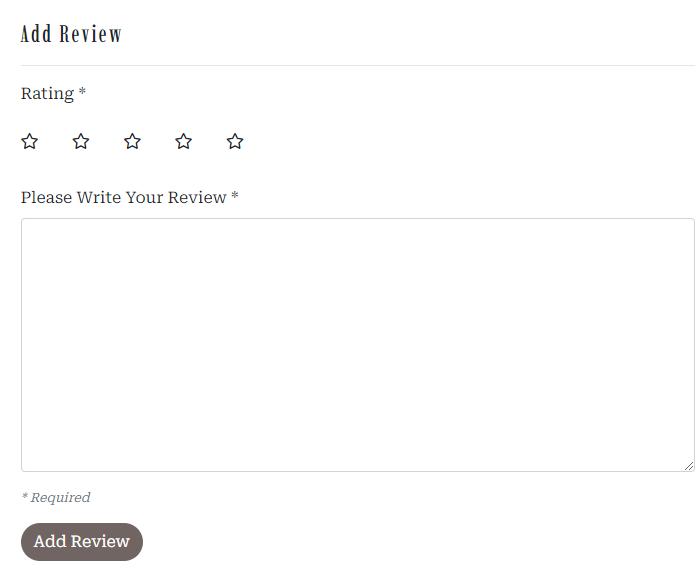
 

*As a user, I can sign up for the website's newsletter so that I can keep up to date with new products and promotions*
- In the footer is a 'Newsletter' section. Here the user can input their email address to sign up.

*As a user, I can connect to the site's social media pages so that I can follow them and keep up to date with their products and promotions*
- On the 'Contact Us' page, users can find links to all the company's social media links.
- These links can also be found in the 'Contact Us' section located in the footer.

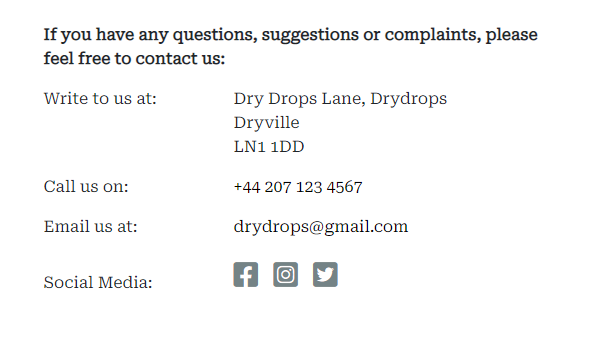

*As a user, I can contact the business so that I can find out any information that I require*
- The contact us page lists the company's address, phone number, email, and social media links. 
- The contact us page also features a messaging form that users can fill out to send a direct email to the company.

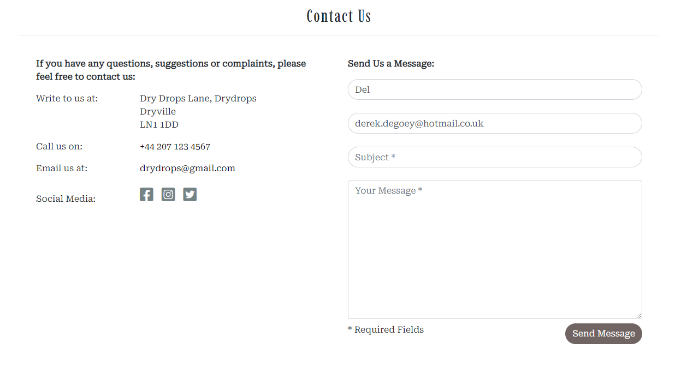

## Feature Testing

### Nav Bar

- #### Links
    Checked that:
    - The links change colour when hovered over.
    - The link to the current page is highlighted by an underline.
    - The Shop link drops down into a sub-menu displaying all products and the four product categories.
    - The links collapse into a hamburger menu once the screen size becomes too small. 

    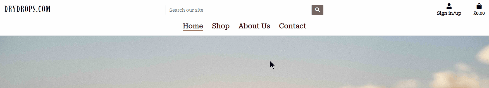

- #### Search Bar
    Checked that:
    - The search bar will search both the product's title and description for a match.
    - On smaller screens, the bar collapses into a search Icon that upon clicking drops down into the full search bar.

    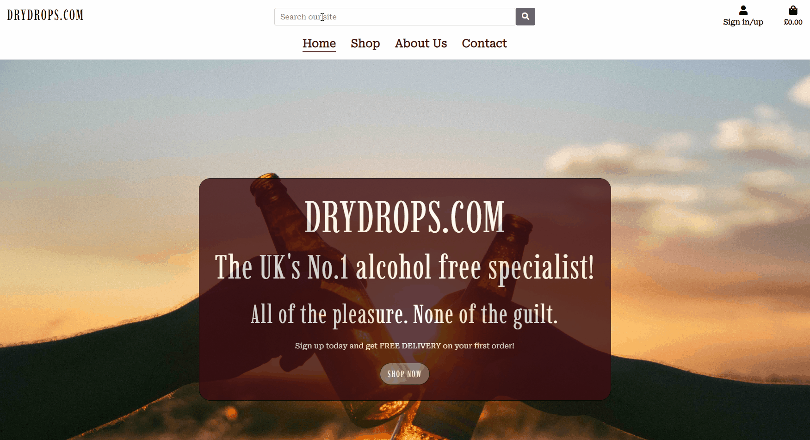

- #### Account
    Checked that:
    - Hovering over the account icon changes its colour.
    - Clicking the account Icon opens a dropdown menu with options for the user to register or sign in.
    - If a user is signed in the dropdown options change to 'My Profile' and 'Logout'.
    - If a user is signed in the Icons text changes from 'sign in/up' to 'My Account'.
    - If the user signed in is a super user then a third option of 'Product Management' is available. 

    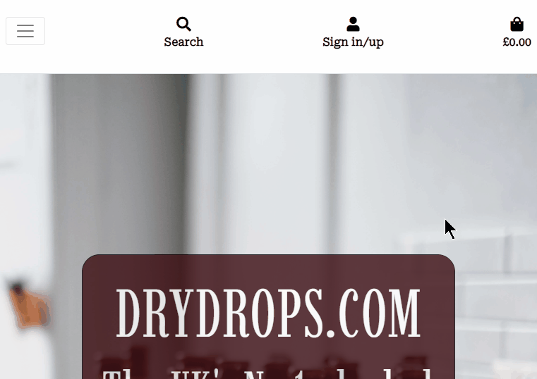

- #### Bag
    Checked that:
    - Beneath the bag icon is a running total of the cost of all the items in the bag.
    - Once a product is added to the bag, a number displaying the total quantity of items appears, located at the top right of the bag icon.
    - Clicking the bag icon navigates the user to the shopping bag page which displays a summary of what's been added.

    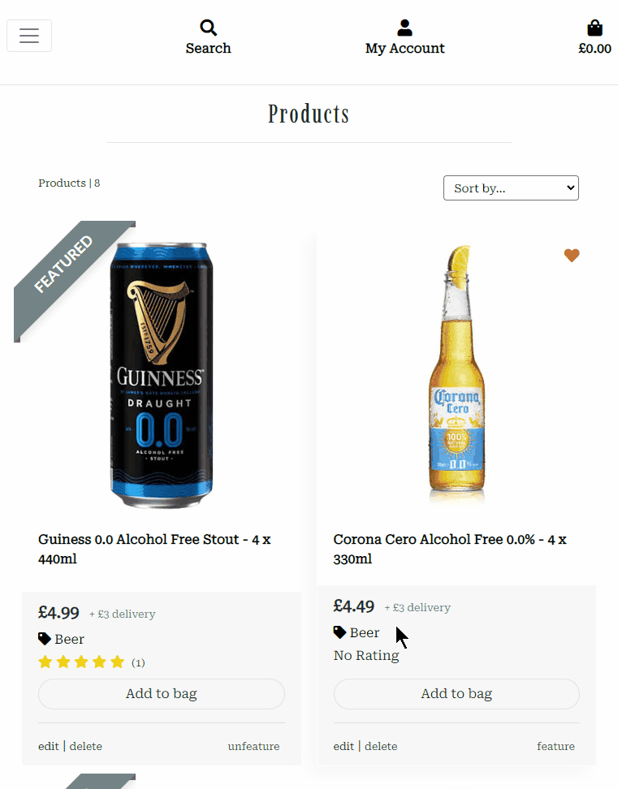

- #### Banner 
    Checked that:
    - The banner message will change to reflect how close the user is to achieving the offer. 

    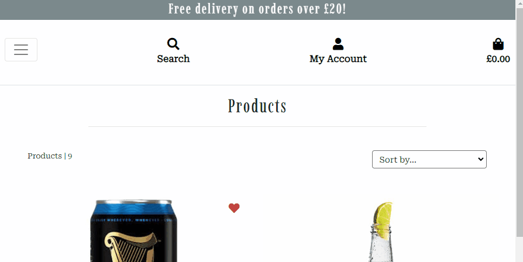

### Home Page
    
- #### Hero Image
    Checked that:
    - The button labelled 'Shop Now' takes the user to the products page.
    - Hovering over the 'Shop Now' button changes its colour.
    - The image changes depending on the size of the screen.

    

- #### Categories
    Checked that:
    - Hovering over the categories lightens the image.
    - Clicking one of the categories takes the user to the shop displaying only products from that category. 

    

- #### Top Products
    Checked that:
    - The list orders by the highest rating first. 
    - If any products have the same rating they will be put in order of how many reviews they have received.
    - Clicking the product takes you to its detail page.

    

- #### Hot Products
    Checked that:
    - The hot products section lists any products that have been featured by an admin.
    - On large screens, the section displays as a list, whereas smaller screens displays the items in a carousel.
    - Clicking the products takes you to its detail page.

    

- #### Footer
    Checked that:
    - All the links change colour when hovered over.
    - All the links in the Quick Links section work.
    - Clicking the phone number will call it, clicking the email address opens your default email programme, and clicking the social media links takes you to the relevant website.
    - The Newsletter section has an option to input your email and sign up for the weekly newsletter.

    

### Accounts

- #### Register Page
    Checked that:
    - Submitting the registration form sends an authentication link to the email provided.
    - Clicking the confirmation link confirms the account.
    - After creating an account the user can use his details to sign in. 

    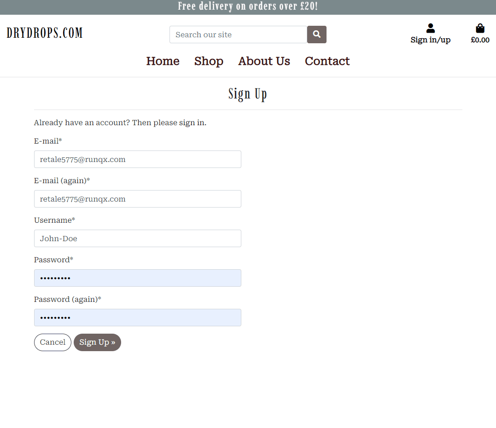

- #### Login Page
    Checked that:
    - The login page can be used to log in users with an existing account.
    - Users can sign in with either their username or their email address.
    - Toast messages inform the user of their status.
    - The 'Forgot Password' link enables the user to recover their password.
    - When logged in the account icon label turns from 'Sign in/up' to 'My Account'.

    

- #### Log out Page
    Checked that:
    - The logout page logs out users who are signed in.
    - The account icon label turns from 'My Account' to 'Sign in/up'.
    - Toast messages inform the user of their status.

    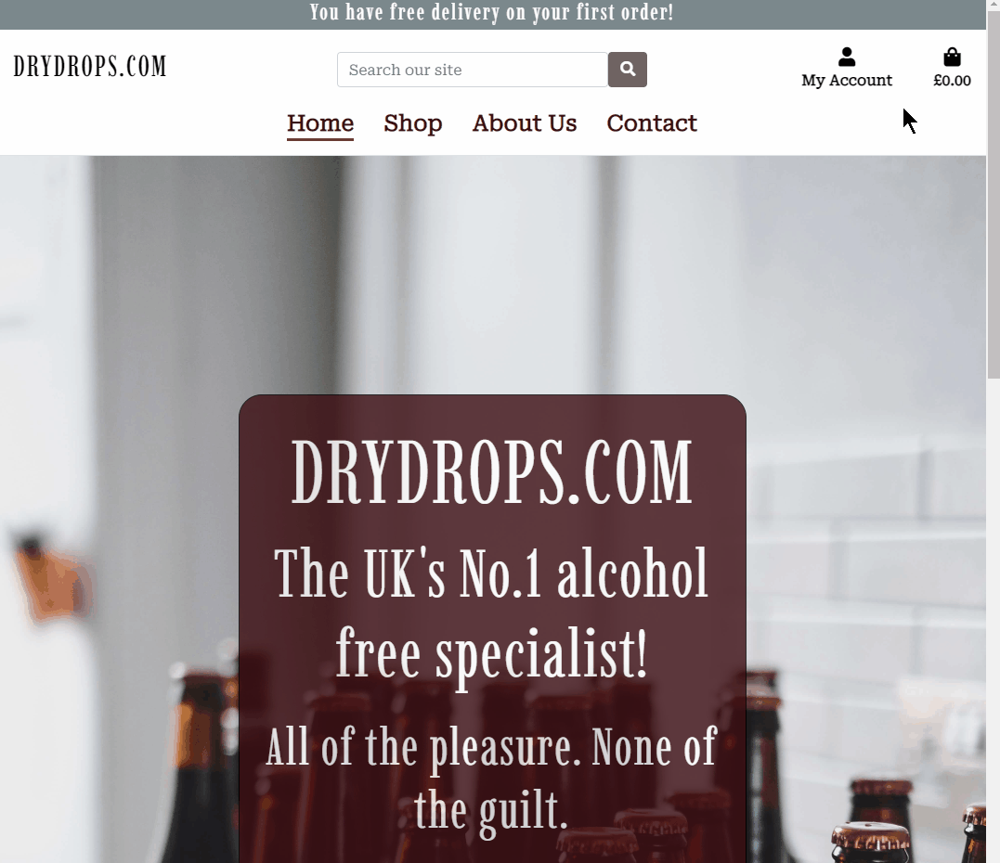

### Profile

- #### Delivery Details
    Checked that:
    - The delivery details section stores the user's delivery address and phone number.
    - The saved delivery details auto-fill the delivery form at the checkout.
    - A toast message informs the user that the delivery details have been updated.

    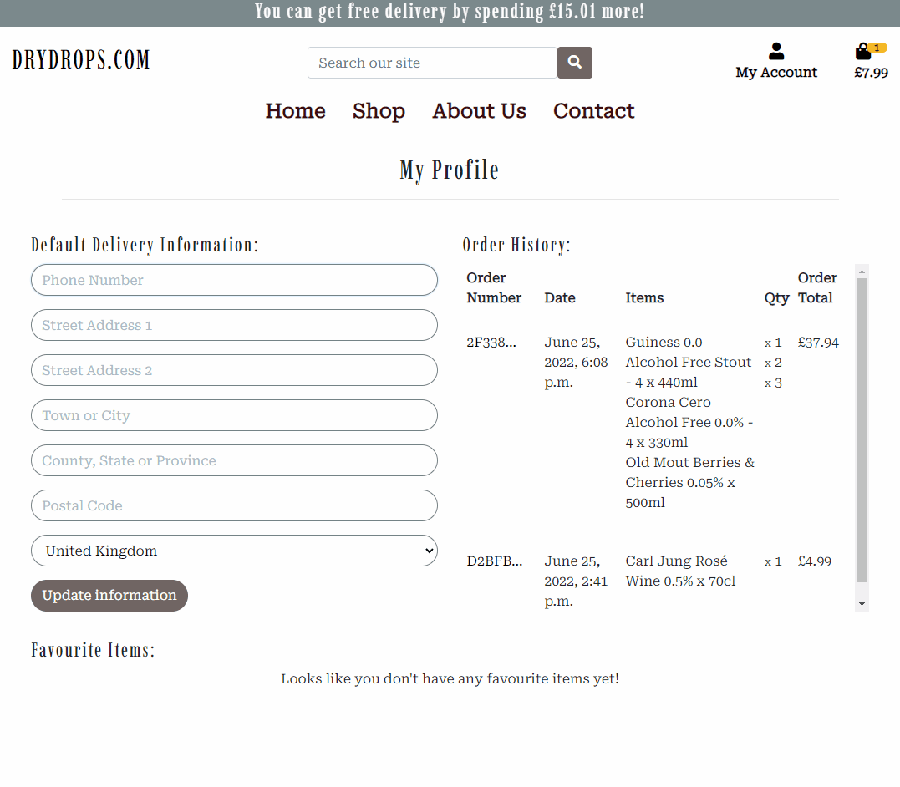
   
- #### Order History
    Checked that:
    - The table displays the order number, date it was ordered, items ordered, quantities of items and the order total.
    - Clicking the order number will take the user to a more detailed summary of the order.
    - Hovering over the truncated order number reveals the whole order number.
    - A scroll bar appears once the user has more orders than the box can contain.
    - The order summary page has a button to take the user back to their profile page. 

    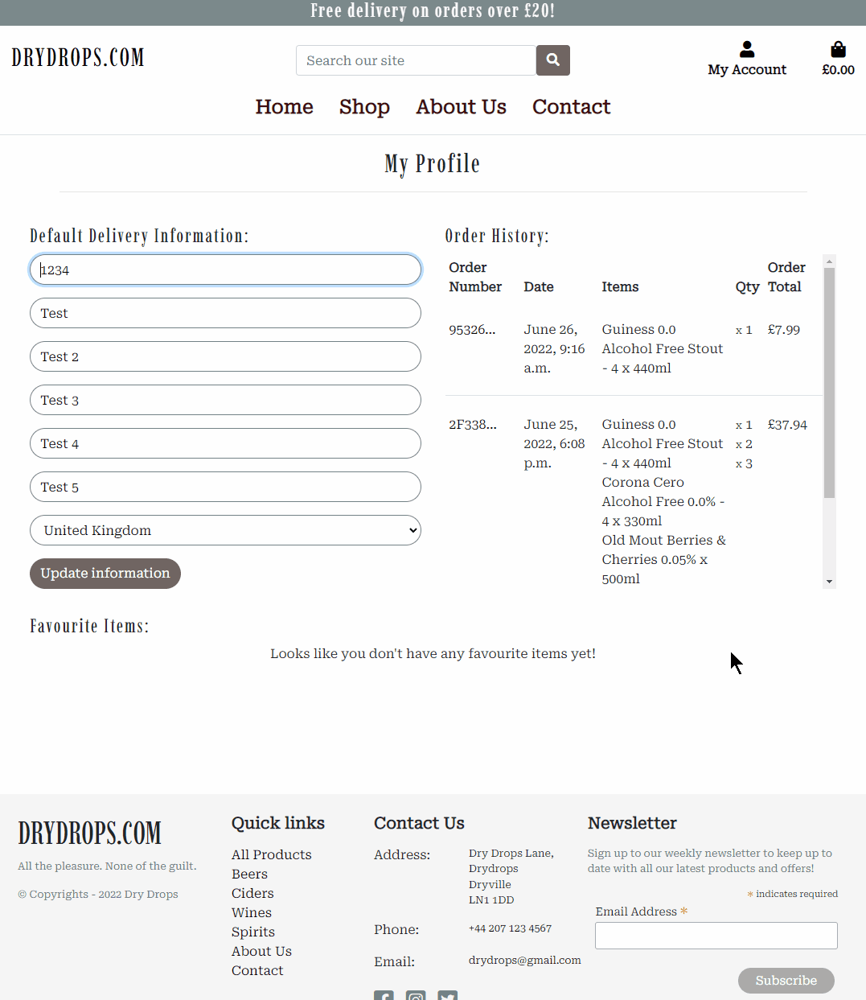

- #### Favourite Items
    Checked that:
    - The favourite items section keeps a list of all products that the user has liked.

    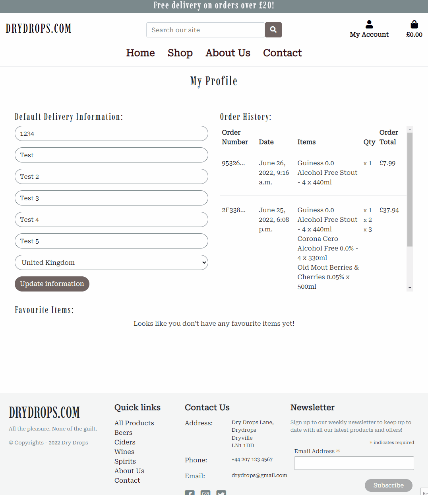

### All Products

- #### Categories Side-nav
    Checked that:
    - The category side-nav section only appears on large screens and lists all the product categories.
    - Clicking any of the categories in this section filters the products to that option.

    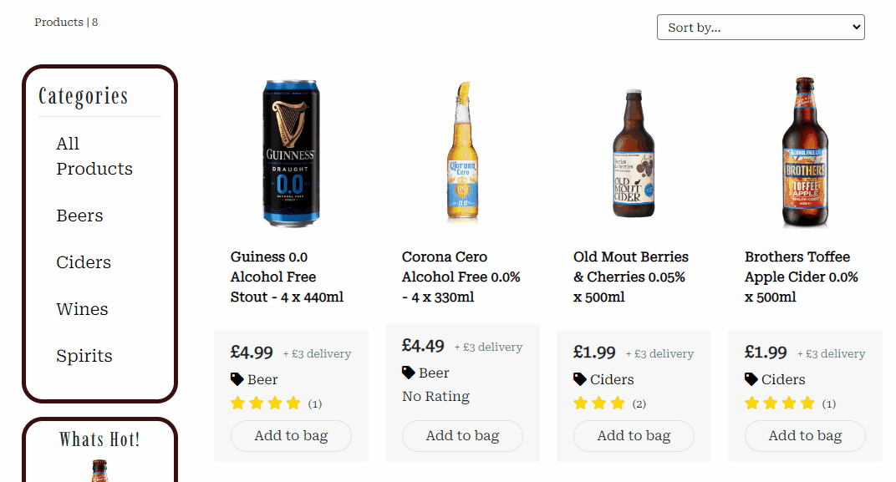

- #### What's Hot Carousel
    Checked that:
    - The What's hot carousel displays any product that an admin has selected to be featured.
    - Clicking the product will take the user to that product's detail page.
    - Buttons on the edge of the carousel enable the user to scroll through all the featured products.

    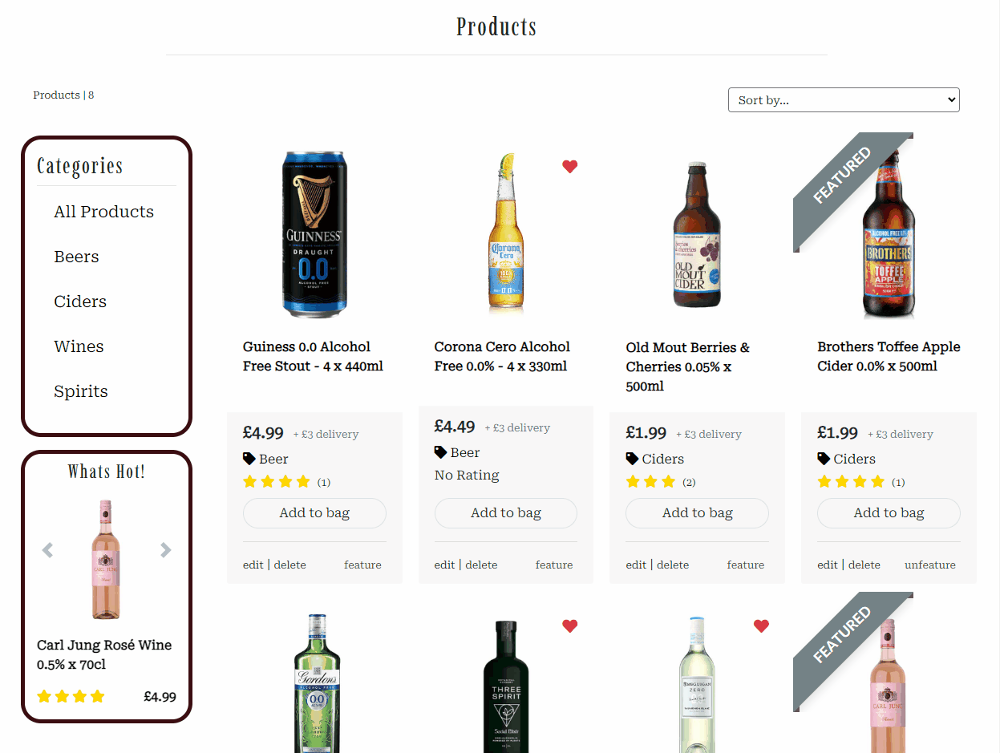

- #### Sorting
    Checked that:
    - Clicking the box opens up a dropdown menu with various options on how to sort the products.
    - Clicking each option sorts the products in the way described.

    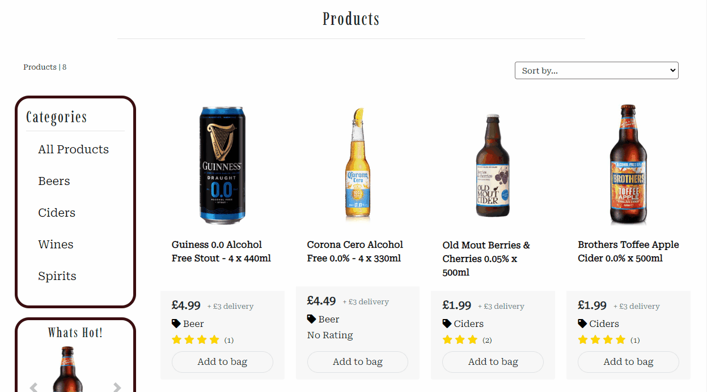

- #### Products
    Checked that:
    - The products page is fully responsive, adjusting how many products are on each row depending on the screen size.
    - Each product card shows an image of the product, its title, price, category, and rating.
    - An 'Add to Bag' button can be used to add the item to the bag.
    - Any products that have been liked by the user displays a red heart in the top right corner. 
    - If the user is a superuser, admin buttons will appear at the bottom of the product card.
    - If the user is a superuser and the product has been featured, a featured banner will appear across the product card. 

    

### Products Details

- #### Product Info
    Checked that:
    - The product info section shows information about the product along with buttons to add the item to the user's favourite list, and buttons to add the item to the bag in multiple quantities.
    - The product's rating is an average of all the product's reviews and displays the result in stars. 
    - A number indicating how many reviews the product has received in total is next to the rating. 
    - Clicking the products category will take users to the products page showing only items from that category.
    - If the user is a super user, admin buttons will appear underneath the image.

    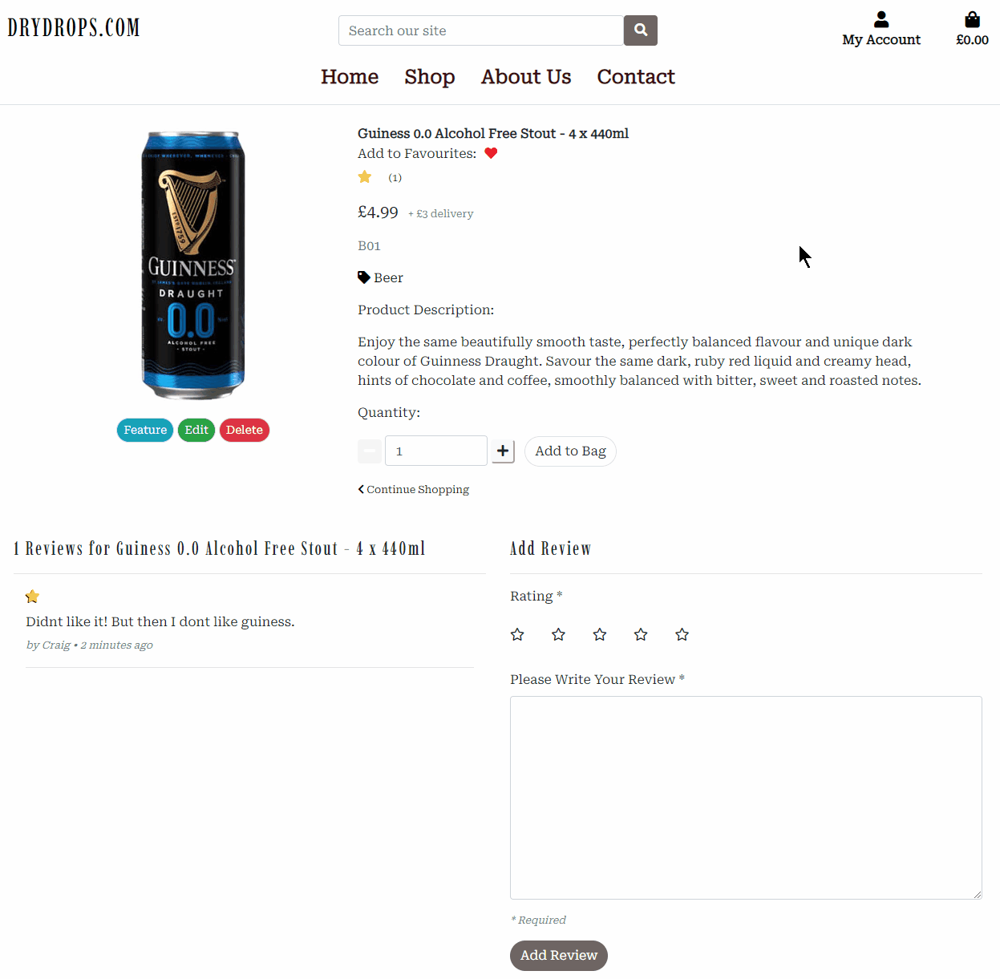

- #### Like Button
    Checked that:
    - The heart button renders as empty if either the user is signed out or the product is not liked by the user.
    - Liking a product fills in the heart and adds the product to the user's favourite items list on their profile page.
    - Unliking a product unfills the heart and removes the product from the user's favourite items list on their profile page.
    - A toast message informs the user when a product has been added or removed from the list of their favourite items.
    - If the heart is clicked when no user is signed in, an 'Account Required' modal pops up informing the user that they need to either sign in or create an account to use that feature.

    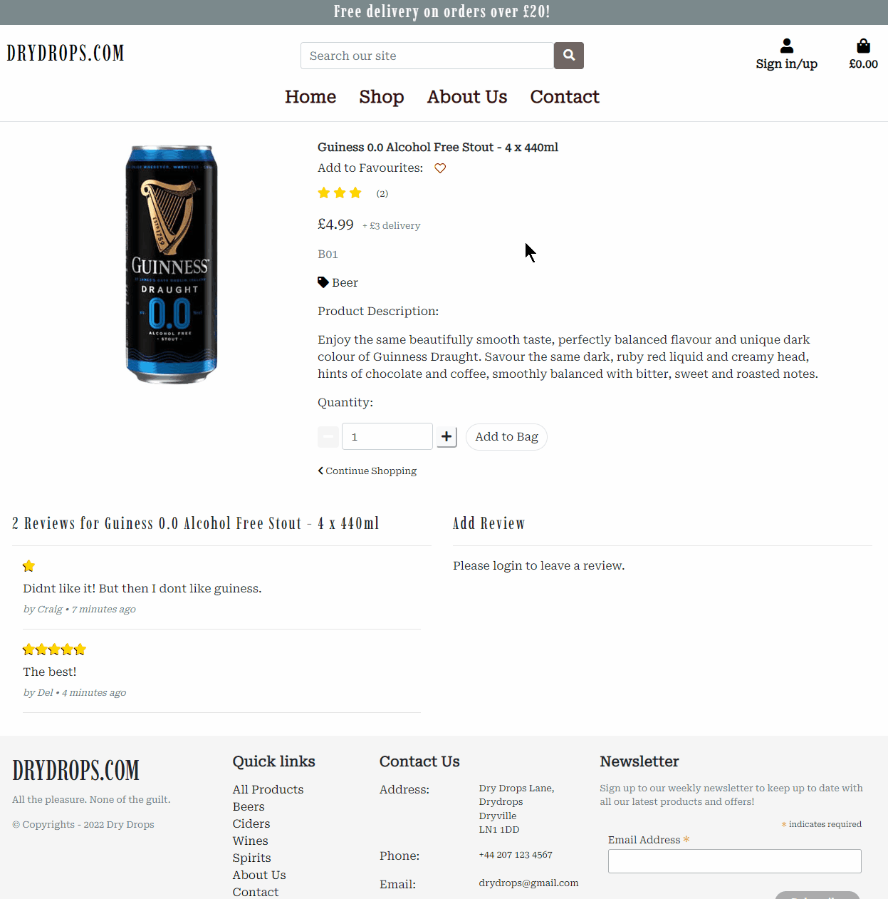

- #### Quantity Buttons
    Checked that:
    - The plus and minus buttons increase and decrease the input value. 
    - If the value is set to 1 the minus quantity will be disabled. Respectively if the value is set to 99 the plus button is disabled.
    - Clicking the 'Add to Bag' button takes the number in the input field and adds that amount of products to the bag.
    - Trying to add an amount less than one or above 99, renders an error message informing the user of the parameters needed to be successful.
    - Clicking the 'Add to Bag' button when the input is blank adds one item to the bag.
    - Underneath the input is a link that takes users back to the store.  

    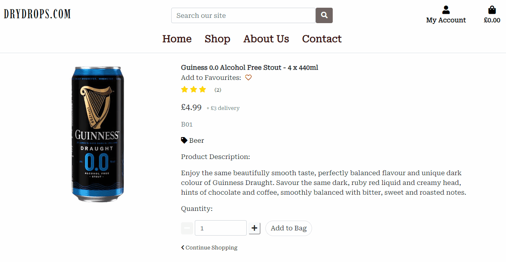

- #### Customer Reviews
    Checked that:
    - If the product has received any reviews they appear underneath the product details.
    - The reviews consist of the number of stars awarded by the user, their written comment, followed by the user name and how long ago the comment was left.
    - If the user is signed in and they have left a review on a product, that review will also have edit and delete buttons. 
    - Users can use these buttons to manage their reviews.

    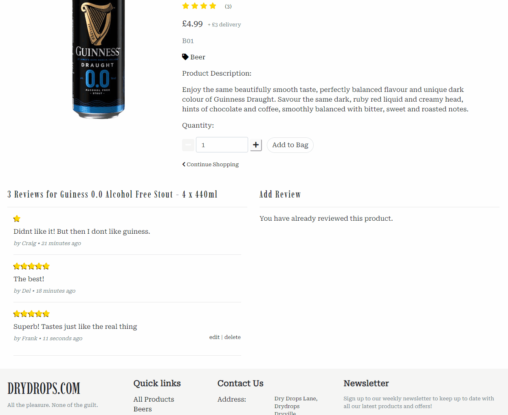

- #### Add Review
    Checked that:
    - Leaving out either the rating or the review notifies the user that the fields are required.  
    - The user can rate the product between 1 and 5 stars. Clicking a star fills the star and every star before it.
    - Any profanity in the review will cause the form to fail and a toast will inform the user.
    - The form only renders when no reviews for that product from that user exist.

    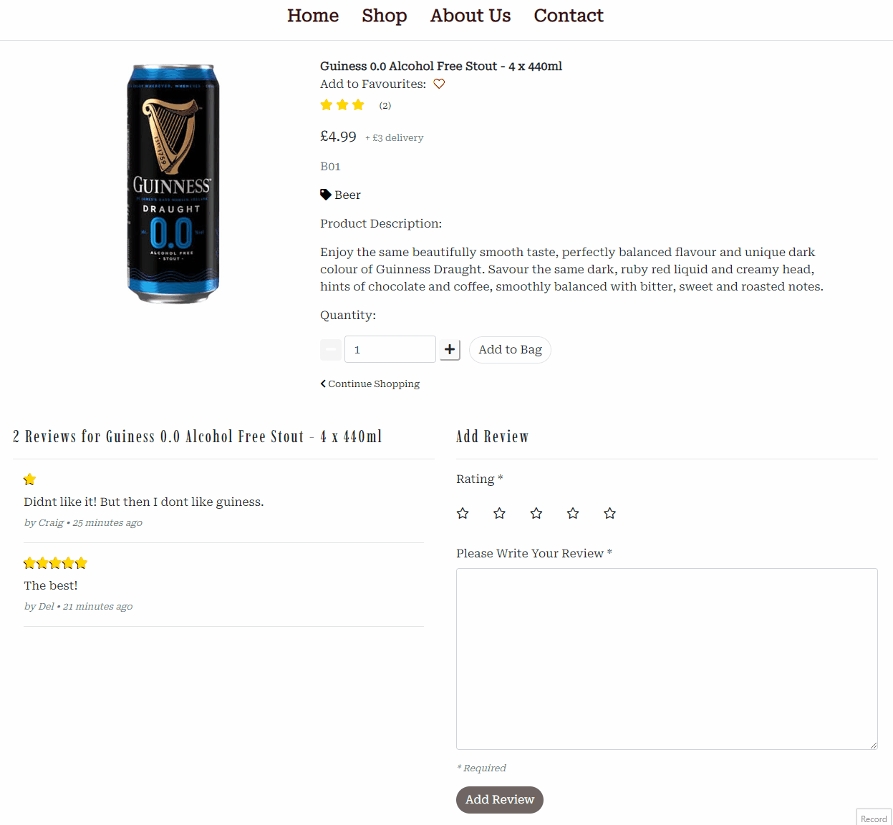

### Product Management

- #### Add Product
    Checked that:
    - The add product page is accessed by the account dropdown menu, under product management.
    - If the form is submitted with any of these fields left blank then an error message appears above that particular field, notifying the user of the issue.
    - An error message appears if an already existing SKU is attempted.
    - If a price is added with more than 6 digits the form fails and an error message appears under the price field.
    - If the featured checkbox is checked the item becomes featured.
    - If no image is chosen the default image is used.
    - Clicking the 'Add Product' button at the bottom of the form creates the product.
    - A toast message informs the user if the product is added successfully.

    

    
- #### Edit Product
    Checked that:
    - The Edit Product page can be accessed from two places. The bottom of the product's card and under the image on the product's detail page.
    - Accessing the page loads the add product page with the details of the product already filled in. 
    - The image field displays a thumbnail of the current image and has a checkbox option to remove it. Checking this will change the image to the default image.
    - Clicking the 'Update Product' button saves any changes made to the existing product.  

    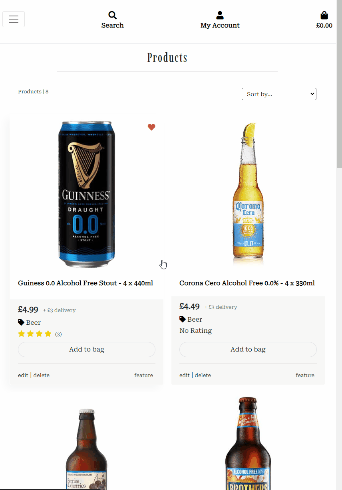

- #### Delete Product
    Checked that:
    - The Delete Product button can be found in two places. Next to the 'edit' button at the bottom of the product's card, and to the right of the 'edit' button on the product's detail page. 
    - Clicking either of the delete buttons brings up a warning modal, asking the user if they are sure they want to delete the product, and informing them that it is irreversible. 
    - Once the warning modal has been activated, the delete button deletes the product from the database. 
    - Pressing the cancel button closes the modal.
    - A toast message appears, informing the user that the product has been deleted.

    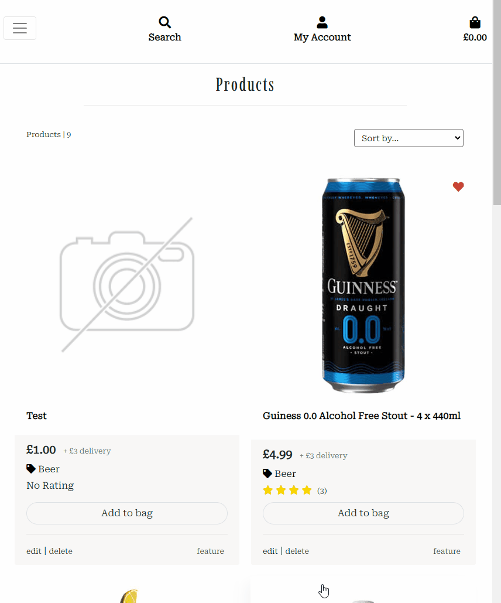

### Bag

- #### Items
    Checked that:
    - The bag page displays all items that the user has added to it. 
    - The page lists the items added, displaying it's image, followed by it's title and SKU.
    - Clicking either the image or the product's title will take you to that product's detail page. 
    - Adding an item to the bag triggers a toast message informing the user of their actions.

     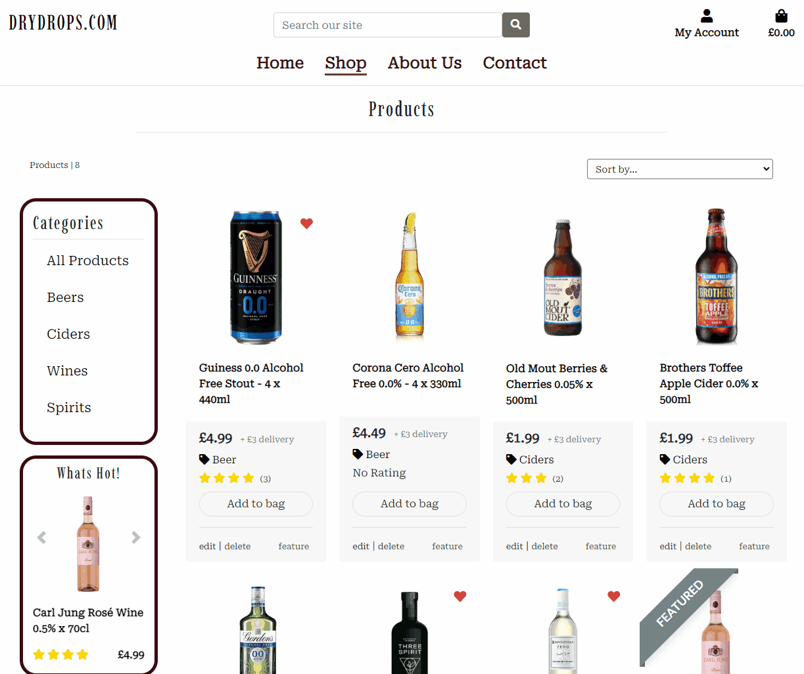

- #### Quantity and Price
    Checked that:
    - The quantity element has buttons either side and increases or decreases the total.
    - The minus quantity button will be disabled if the quantity of the item is one. Respectively the plus button will also be disabled if the quantity of the item is 99.
    - Clicking the 'update' button saves any changes to the quantity and updates the item's subtotal.
    - Clicking the red trash can icon removes the item completely from the user's bag. 
    - Manually inputting the number zero or anything below and clicking 'update' will remove the item from the bag. 
    - Manually inputting a number above 99 and clicking 'update' will result in an error message informing the user of the correct parameters. 

    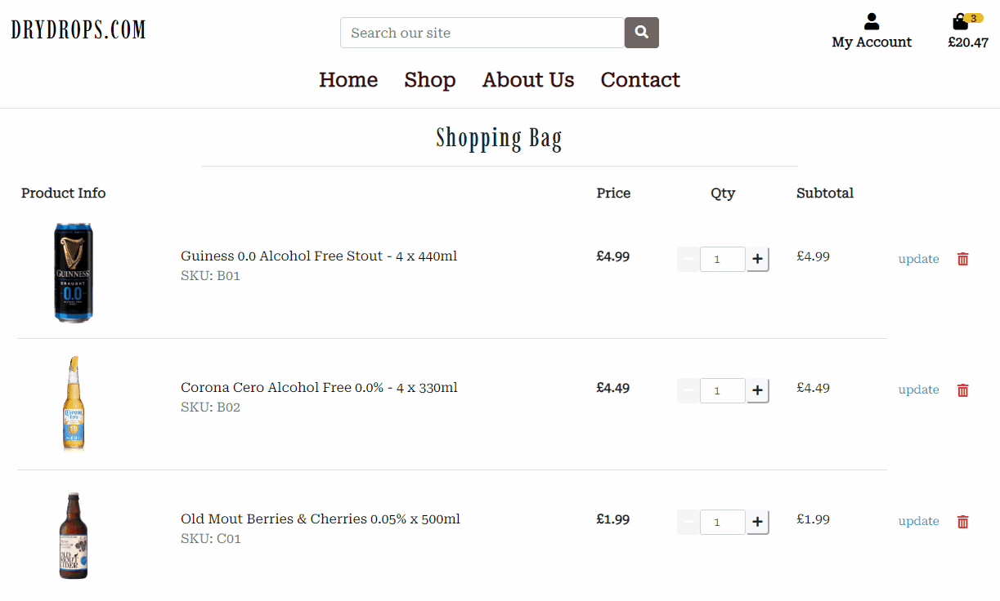
    
- #### Totals and messaging
    Checked that:
    - In between the bag total and the delivery total a message informing the user of how much more they need to spend to receive free delivery is visible.
    - The message shows how much delivery the user would have paid if they didn't receive the offer. 
    - If it's the user's first ever order, the message displays 'FREE DELIVERY on your first order!'. 
    - The checkout button takes the user to the checkout.
    - The 'Continue Shopping' link takes users back to the store.

    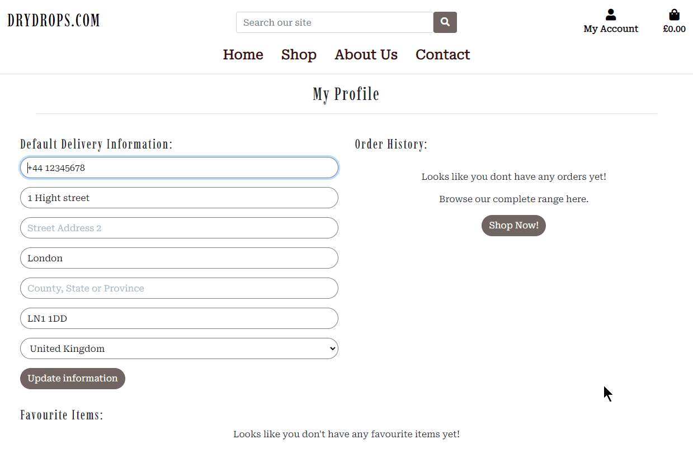

### Checkout

- #### Details
    Checked that:
    - If the user is anonymous, a link to create an account or login will be present.
    - If the user is signed in a checkbox to save the delivery information can be checked, and if checked the information is saved.
    - If the user is signed in and has delivery information saved, the delivery details and email address are automatically filled in. 

    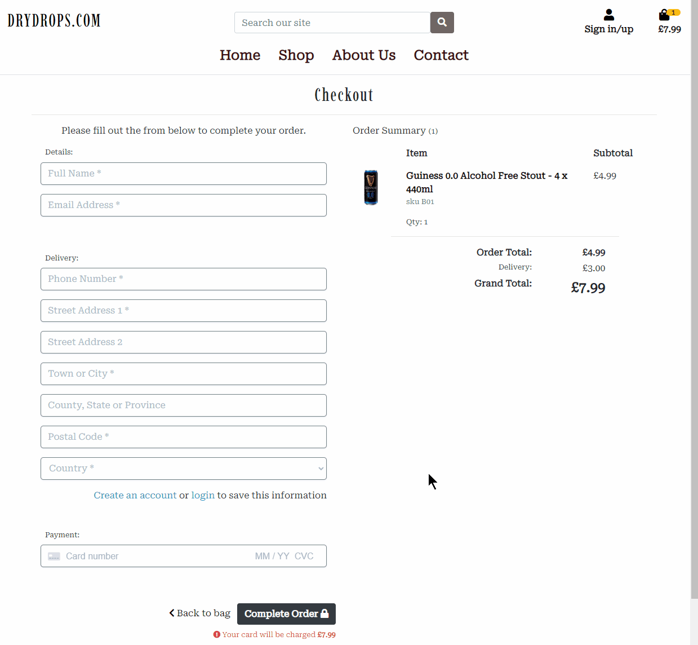

    - Any field with an Asterix is required. If a user tries to complete the form with any of these fields left blank the affected field is highlighted that it needs to be filled in.  

    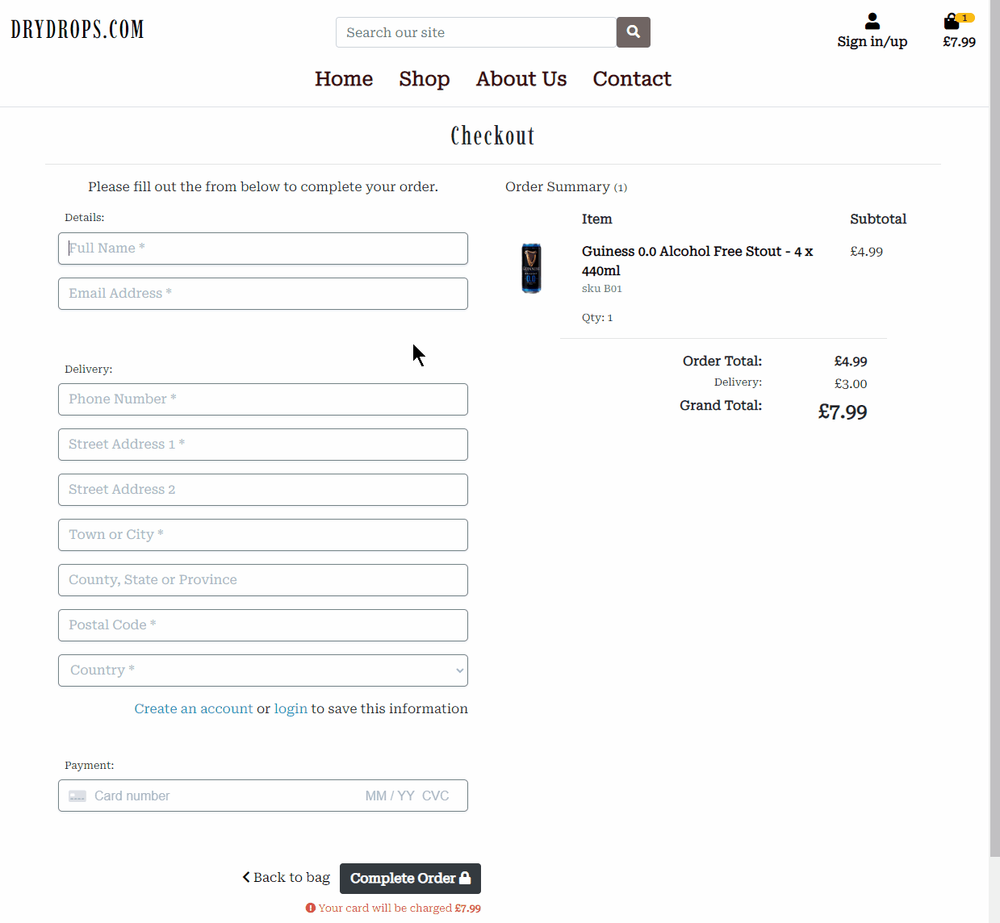

- #### Order Summary
    Checked that:
    - Clicking the image or title of any items in the summary takes the user to that product's detail page.
    - This section lists all the items about to be purchased, along with the quantity, subtotal and a grand total.
    - Next to the order summary title will be a number reflecting the total number of items that appear in the order.

    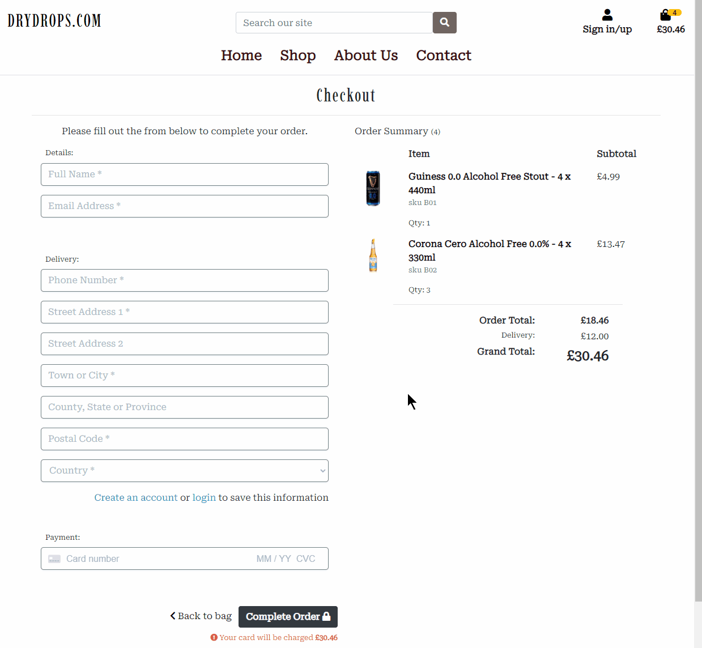

- #### Payment
    Checked that:
    - Only numbers can be entered into the card payment box. Incorrect card numbers automatically show an invalid card number error.
    - The site can be tested by using the dummy card number 4242 4242 4242 4242 with the expiry date 04/24 and the CVC code 242.
    - At the end of the section is a button to complete the order or to return back to the bag. 
    - There is a warning message informing the user of how much their card is about to be charged.

    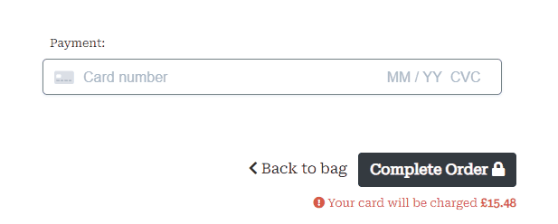

- #### Loading Spinner
    Checked that:
    - Upon clicking the complete order button, as long as the form is valid, a loading spinner renders until the information is processed completely.

    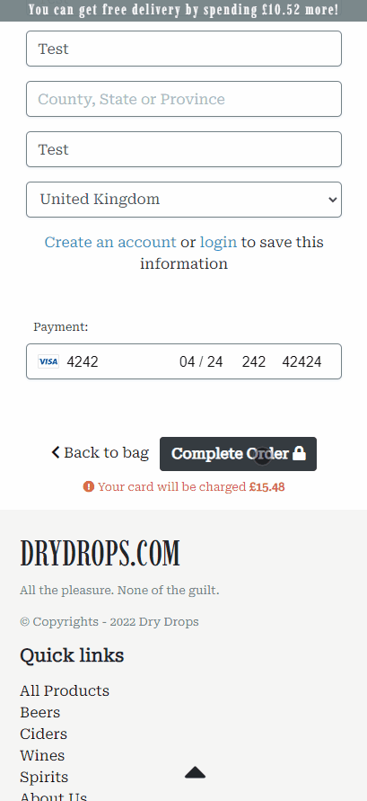 
    
- #### Confirmation
    Checked that: 
    - Once the order has been processed the user is taken to the checkout success page. 
    - A confirmation email is also sent to the email address provided, and this is noted at the top of the page. 
    - At the end of the summary is a button that the user can use to take them back to the main shop.

    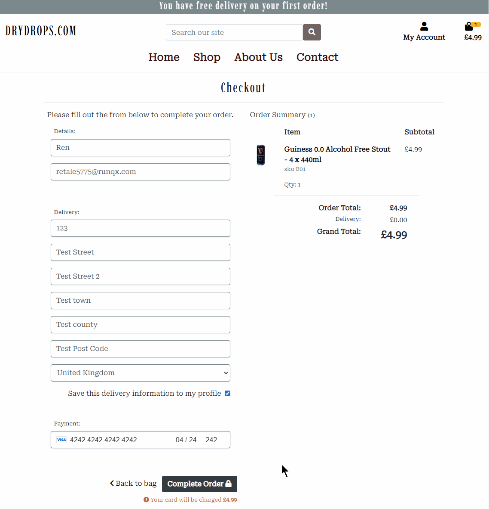

- #### Webhooks
    Checked that:
    - Once an order is placed, a webhook will search the database to confirm the order exists. 

    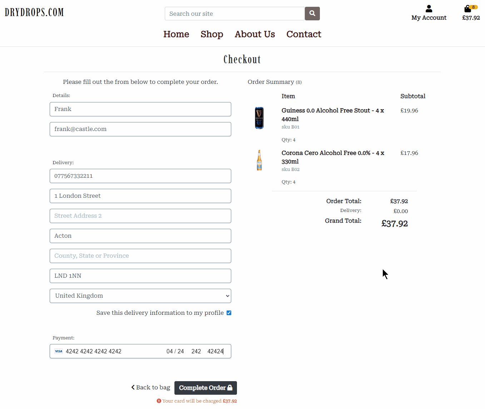

    - If it cannot find the original order, it will create one using the information provided by the user in the original instance.

    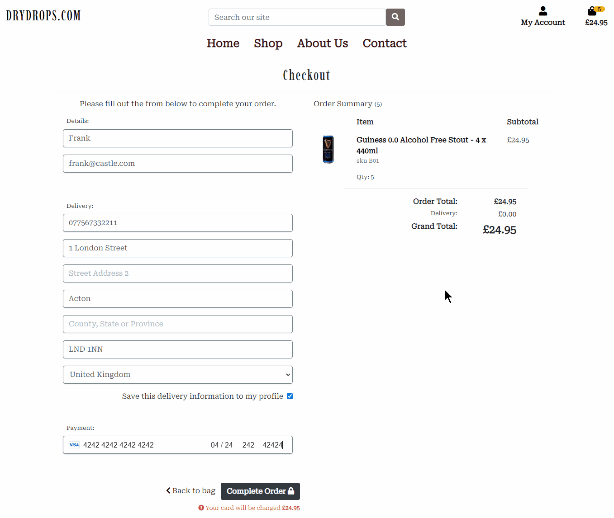
    
### About Us

- #### Image
    Checked that:
    - Underneath the image is a link to both the contact us page, and the products page.

    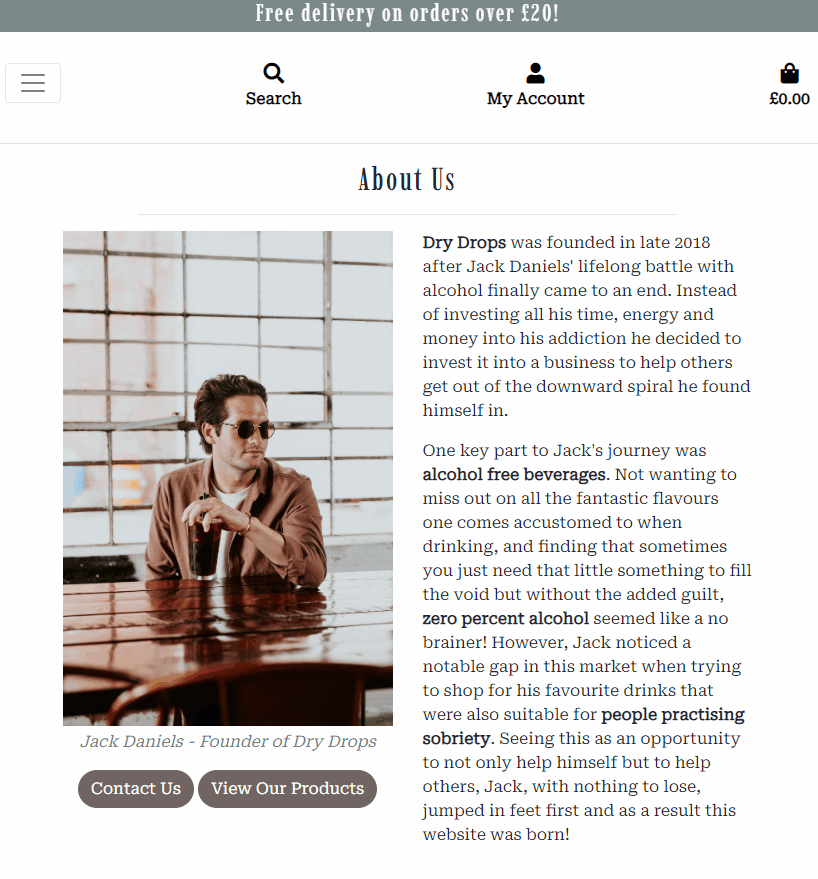

- #### Links
    Checked that:
    - Hovering over these links will lighten their appearance.
    - Clicking the links will open up the respective website in another tab.

     

### Contact

- #### Contact Info
    Checked that:
    - Hovering over the social media links changes their colour. Clicking the links takes you to the respective website which opens in a new tab.
    - The facebook link takes you to the website's business page on facebook. 

     

- #### Messaging
    Checked that:
    - All the fields are required. Failing to fill out any field results in a message highlighting which field has been left blank.
    - Once all the fields are completed, hitting the 'Send Message' button sends the message. 
    - Both Dry Drops and the user will receive an email on completion, laying out who sent the message and what they said.  

    

### Toasts and Pop-ups

- #### Toasts
    Checked that:
    - Toasts appear in the top right-hand corner of the display informing the user of any actions they have performed.
    - The bottom right corner of the toast box will change colour depending on whether the message is portraying a successful action, general info, warning, or an error. 

    

- #### Pop-ups
    Checked that:
    - If there is no user signed in, the session is new, and 8 seconds elapse, a pop-up will appear one time.

     
    
## Validators

### HTML

- All Pages were checked with the official [W3C validator](https://validator.w3.org/). 

#### Home Page

#### Products Page

#### Product Details

#### About Us

#### Contact

#### Bag

#### Checkout 

#### Checkout Success

#### Product Management 
- The add product page shows two errors. These are to do with the image upload widget and thus changing the code breaks the field.
    
#### Edit Review


### CSS

- All CSS was checked with the official [Jigsaw validator](https://jigsaw.w3.org/css-validator/). 

#### Base CSS

#### Checkout CSS

#### Profile CSS


### JSHINT

- All Javascript was passed through [Jshint](https://jshint.com/).

### Base

### Products

### Edit Review

### Bag 

### Quantity Btns

### Checkout

### Profile

### Scroll Arrow


### PEP8

- PEP8 only shows the type of errors that can be ignored.


### Lighthouse

- Lighthouse registered green in all areas.


## Bugs

### Fixed

- The total under the bag icon was displaying £5 when the bag was empty. This was happening because the logic was written so that if the total was less than the threshold amount to get free delivery, you have to pay a £5 delivery charge. This meant that even when the basket was ZERO it was adding £5 to the basket as a delivery charge. I fixed this by changing the logic to not include delivery if the bag total is £0.

- On the shopping bag page, when you hover over the quantity input box, the margins change. To stop this I hid the overflow from the body and html elements in CSS. This however conflicted with the script that enabled the arrow button to scroll to the top of the page. So I deleted the hidden overflow CSS and came to realise that it was a container div with the container-fluid class that was causing the input shake. I deleted the container and the problem was solved.

- When viewing the shopping bag with more than one item, only the last item's update button was working correctly. The reason this was happening was that the jquery script to locate the product's quantity form, was searching solely on their class name. This meant it always defaulted to the last form found, and because the items were generated from a for loop, it would always be the last item in the bag. That would explain why only the last items update button was working and not the rest. I fixed it by changing the jquery selector to work its way up the tree from the update button being clicked, ensuring that the right form was found.

- I had a problem where users were not being allowed access to delete or edit comments they had left. The reason this was happening was that the code 'user.id = review.user.id', was being used to determine whether the user and the owner of the review was the same person. When looking into the review model, I remembered that the user field was a foreign key to the profiles model and not the user model, so in fact what I needed was the code to read 'user.id = review.user.user.id'. Once corrected in both the template and the view it worked fine. 

- The review section was allowing users to leave more than one review. Upon inspection, I realised I had the filter to check if a review by that user already existed wrong. In the view, I was filtering by user=request.user.id, when I actually needed user=user_profile.id. 

- When submitting a review of 5 stars, random elements all over the page would turn yellow and stars would appear randomly. I realised I had accidentally pasted an i class element with no closing tags in the product-ratings html. 

- The quantity buttons on the product detail page were not responding - Somehow the qty-input class from the input box had been removed. As soon as I re-entered them, they began working.

- The message inside the toast for viewing previous orders wasn't showing the date but instead a placeholder. This was because I forgot to make the string an f string. Also, the date of the order was given to the millisecond so I formatted it to just show the day, month, year, hour, minute, second.

- Users not logged in couldn't view the products. The review section was looking for what user was logged in to check if they had left a review for that product. I needed to update the product detail view to check if the user was authenticated before adding the reviewed template filters. 

- When trying to delete a review, sometimes it would trigger the delete modal for the product and not the review. The product and review modal was using a template {{ product.id }} and {{ review.id }}, meaning that the modals could sometimes have the exact same ID. This is what was causing the incorrect modal to display. I renamed the modals so that they couldn't end up the same which fixed the issue.

- Modals on the products page were malfunctioning and rendering behind products. I figured out that it was the change of opacity when products were hovered over that was causing the issue. I was unsure about having a change in opacity in the first place so I decided to remove it and it fixed the issue.

- Top products were showing the lowest rated items first. I noticed this only happened when using Heroku, which was running Postgres, as the problem didn't exist when using a local server that was using SQlite. It turns out that Heroku was putting items with no rating ahead of results. So inside the view I changed the sort filter to exclude any with a rating of 'None'. 

- Free delivery on a new user's first order was displaying the delivery charge as 0 but was charging delivery. I realised I had written logic to work out delivery costs in the bag but not for the order model. I added a 'first_order' boolean field to the order model. This defaulted to false but updated to true if the user had no previous orders. I could then use that field to help work out the correct delivery charge.

- Clicking the subscribe button or social media links inside the footer on medium screens or below, causes the page to scroll to the top. This was because the box containing the arrow that is used to scroll users back to the top of the page, spanned the entire width of the screen. The subscribe button, and social media links lined up with the arrow box, meaning that wherever you pressed inside the box you were actually triggering the arrow. I reduced the width of the arrow box which solved the problem.

- When the scroll up arrow is clicked on the home page, nothing happens. I originally had the arrow box html and script on every page that I thought would need it. In the end I decided that it would actually be useful on every page so I wrote the code needed onto the base template and deleted all the code elsewhere. However in doing so, I forgot to delete the box and the script from the index page. Once I had removed that it worked fine.

- When trying to add products to the bag, or adjust the product's quantity, if putting a blank input instead of number you receive an error message - 'ValueError at /bag/add/1/, invalid literal for int() with base 10:'. I added ‘or 1’ to the bag's view when requesting the input value. This meant if the input was blank it would default to 1, thus solving the issue. 

- Webhooks were resulting in a 500 error, sometimes stating ERROR: Product matching query does not exist. This had me baffled for hours. I'm still not sure where the problem lied. Deleting all the webhooks secret codes and re-rolling them on stripes website, then saving the new codes fixed the issue. So it must have been something on their side. 
